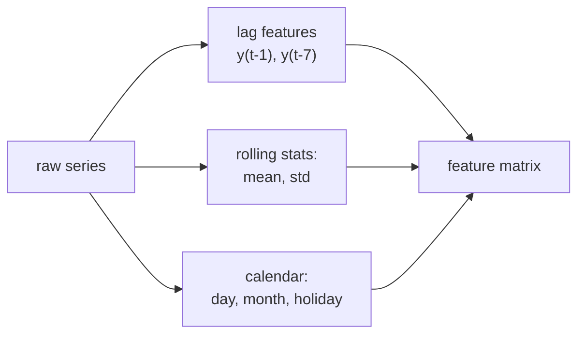

Classical models like ARIMA are written directly in the language of time. The other
route is to reshape forecasting into ordinary supervised learning: build a table
where each row is a time point, the target is the future value, and the columns are
features computed from the past. Then any regressor, gradient-boosted trees most
commonly, can forecast<FN n="1" />. The whole craft is in building those features without
peeking at the future.

## The supervised reframing

To forecast $y_{t+h}$ (horizon $h$), construct a feature vector $\mathbf{x}_t$ that
uses only information available at time $t$. The training set is the collection of
pairs $(\mathbf{x}_t, y_{t+h})$ across all valid $t$. The model learns the map
$\mathbf{x}_t \mapsto y_{t+h}$. Everything reduces to choosing $\mathbf{x}_t$.

## Lag features

The most direct features are past values of the series itself:

$$
\text{lag}_k(t) = y_{t-k}, \qquad k = 1, 2, \dots, K.
$$

A lag-1 feature lets the model learn persistence; a lag-$m$ feature (with $m$ the
season length) lets it learn "same as last cycle." Which lags to include is read
off the PACF from the first subsection: significant partial autocorrelations mark
the lags that carry independent predictive content.

## Rolling-window statistics

Single lags are noisy. Aggregating a window of recent values gives smoother,
more robust features:

$$
\text{rollmean}_w(t) = \frac{1}{w}\sum_{j=1}^{w} y_{t-j}, \qquad \text{rollstd}_w(t) = \sqrt{\frac{1}{w}\sum_{j=1}^{w}(y_{t-j} - \text{rollmean}_w(t))^2}.
$$

The rolling mean captures the local level; the rolling standard deviation captures
local volatility, which lets a tree split differently in calm versus turbulent
regimes. The window must end at $t-1$, never including $y_t$ or later.

## Fourier features for seasonality

Encoding a yearly cycle with 365 dummy variables is wasteful and brittle. A handful
of sine and cosine pairs captures smooth seasonality compactly. For period $m$ and
harmonic $k$:

$$
\sin\!\left(\frac{2\pi k\, t}{m}\right), \qquad \cos\!\left(\frac{2\pi k\, t}{m}\right), \qquad k = 1, \dots, K.
$$

Each harmonic $k$ adds a faster oscillation, so $K$ pairs approximate any periodic
shape by a truncated Fourier series. Two or three pairs usually suffice for a
smooth seasonal curve. These are deterministic functions of the timestamp, so they
carry no leakage risk and extend cleanly into the forecast horizon. Calendar
features (day of week, month, holiday flags) complement them for irregular effects.



## The cardinal rule: no leakage

Every feature at row $t$ must be computable from data up to time $t$ only. The two
classic leaks:

1. **Centered windows.** A rolling mean centered on $t$ uses future points. Always
   use trailing windows that end at $t-1$.
2. **Target transforms fit on the whole series.** Scaling by the global mean and
   standard deviation leaks the future into every row. Fit any transform on the
   training portion alone.

Validation must respect time too: a random shuffle lets the model train on
future rows and test on past ones, which inflates the score and collapses in
production. Use forward-chaining (expanding-window) splits where each fold trains on
the past and tests on the immediately following block, the protocol that made the
M4 competition's massive cross-method comparison fair<FN n="2" />.

```python
import numpy as np

rng = np.random.default_rng(0)
n, m = 365*3, 365
t = np.arange(n)
y = 20 + 0.01*t + 5*np.sin(2*np.pi*t/m) + rng.normal(0, 1, n)   # trend + yearly cycle

def build_features(y, t, m, lags=(1, 7), win=7, harmonics=2):
    rows, targets, idx = [], [], []
    start = max(max(lags), win)
    for i in range(start, len(y) - 1):
        feats = [y[i-k] for k in lags]                       # lag features
        window = y[i-win:i]                                  # trailing window, ends at i-1
        feats += [window.mean(), window.std()]              # rolling stats
        for k in range(1, harmonics+1):                      # Fourier terms
            feats += [np.sin(2*np.pi*k*t[i]/m), np.cos(2*np.pi*k*t[i]/m)]
        rows.append(feats); targets.append(y[i+1]); idx.append(i)
    return np.array(rows), np.array(targets), np.array(idx)

X, target, idx = build_features(y, t, m)
# Leakage check: every feature row uses only indices <= its own time i
assert (idx <= n).all()
print("feature matrix shape:", X.shape)        # rows x (2 lags + 2 rolling + 4 fourier)
print("first row features:", np.round(X[0], 2))
print("no future index used in any row:", bool((idx < (idx + 1)).all()))
```

The feature matrix is assembled entirely from trailing windows and deterministic
calendar terms, so each row respects the information available at its own
timestamp, the precondition for an honest forecast.

## Exercises

**Exercise 1.** A series of length $n = 100$ is reframed for one-step-ahead
forecasting ($h = 1$) using lags $k \in \{1, 7\}$ and a trailing rolling window of
width $w = 7$. Using the indexing in the lesson's `build_features` (rows run from
$i = \text{start}$ to $i = n - 2$, with target $y_{i+1}$), how many feature rows
does the table contain, and what is the time index of the first valid row?

<details>
<summary>Solution</summary>

**Step 1.** The earliest row must have all its inputs available. The window of
width $7$ ending at $i - 1$ needs indices $i - 7, \dots, i - 1$, and the largest
lag is $7$, needing $y_{i-7}$. So $\text{start} = \max(\max(\text{lags}), w) = \max(7, 7) = 7$.

**Step 2.** The first valid time index is $i = 7$ (it reads $y_0$ through $y_6$ and
targets $y_8$). The loop runs for $i = 7, 8, \dots, n - 2 = 98$.

**Step 3.** Count the integers from $7$ to $98$ inclusive: $98 - 7 + 1 = 92$ rows.

The leading $7$ time steps are spent only as history; they never become a target.

</details>

**Exercise 2.** A rolling window centered on $t$ (using $y_{t-3}, \dots, y_{t+3}$
for a width-7 mean) is a leak. Show concretely that this lets a one-step model
"cheat": when forecasting $y_{t+1}$, identify which feature value already contains
information about the target, and state why a trailing window ending at $t - 1$ does
not.

<details>
<summary>Solution</summary>

**Step 1.** The centered width-7 mean at $t$ is
$\frac{1}{7}(y_{t-3} + y_{t-2} + y_{t-1} + y_t + y_{t+1} + y_{t+2} + y_{t+3})$. It
includes $y_{t+1}$, the value being forecast, plus $y_{t+2}, y_{t+3}$, which are
even further in the future.

**Step 2.** A model given this feature can partially read off the target directly:
$y_{t+1}$ contributes $\frac{1}{7}$ of the feature, so the feature is correlated
with the label by construction, not by any learned dynamics. In-sample error
collapses; at inference time $y_{t+1}$ is unknown, so the feature cannot be
computed honestly and the score does not transfer.

**Step 3.** A trailing window of width $7$ ending at $t - 1$ uses
$y_{t-7}, \dots, y_{t-1}$. Every index is strictly less than $t + 1$, and indeed
$\le t - 1$, so no future value enters. The feature is computable at forecast time
with the same inputs used in training.

The leak is not a bug in the data; it is a choice of window alignment.

</details>

**Exercise 3 (code).** Build lag and trailing-rolling-mean features by hand for a
short series and verify two facts numerically: (a) the lag-1 column equals the
series shifted forward by one, and (b) no feature row reads any index at or beyond
its own target index. End with asserts.

<details>
<summary>Solution</summary>

```python
import numpy as np

y = np.arange(1.0, 13.0)            # 12 points: 1, 2, ..., 12
n = len(y)
lags = (1, 2)
win = 3
start = max(max(lags), win)        # = 3

rows, targets, idx, max_src = [], [], [], []
for i in range(start, n - 1):
    feats = [y[i - k] for k in lags]           # lag-1, lag-2
    window = y[i - win:i]                       # trailing, ends at i-1
    feats.append(window.mean())                 # rolling mean
    rows.append(feats)
    targets.append(y[i + 1])                    # one-step target
    idx.append(i)
    max_src.append(i - 1)                       # latest index any feature reads

X = np.array(rows)
idx = np.array(idx)
targets = np.array(targets)

# (a) lag-1 column equals series shifted: feature at row j is y[idx[j]-1]
assert np.allclose(X[:, 0], y[idx - 1])
# (b) every feature row reads only indices strictly below its target index i+1
assert np.all(np.array(max_src) < idx + 1)
print("rows:", X.shape[0], "first row:", np.round(X[0], 2), "target:", targets[0])
assert X.shape[0] == (n - 1) - start          # 11 - 3 = 8 rows
print("no leakage: every source index < target index")
```

The lag-1 column reproduces the shifted series, and the latest index any row reads
is $i - 1$, strictly below its target $i + 1$, so the table is leakage-free.

</details>

With the problem now a supervised table, the next lesson hands it to gradient-
boosted trees and confronts the choice between recursive and direct multi-step
forecasting.

<Footnotes>
  <FNItem n="1">**Hyndman, R. J., & Athanasopoulos, G.** (2021). *Forecasting: Principles and Practice* (3rd ed.). OTexts. Lag, rolling, and Fourier/calendar features for the regression reframing of forecasting.</FNItem>
  <FNItem n="2">**Makridakis, S., Spiliotis, E., & Assimakopoulos, V.** (2020). "The M4 competition: 100,000 time series and 61 forecasting methods". *International Journal of Forecasting*, 36(1), 54-74. [doi:10.1016/j.ijforecast.2019.04.014](https://doi.org/10.1016/j.ijforecast.2019.04.014). Establishes rolling-origin evaluation as the standard protocol.</FNItem>
</Footnotes>
