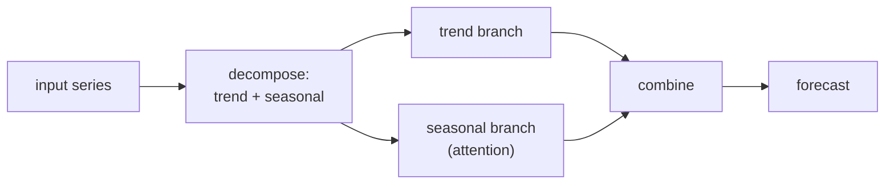

Standard self-attention costs $O(L^2)$ in the sequence length $L$, which is fatal
when forecasting hundreds or thousands of steps. A line of long-sequence
forecasting transformers attacks this from two angles: make attention cheaper, and
build the inductive bias of trend-and-seasonality decomposition into the
architecture so the model spends its capacity wisely.

## The long-horizon problem

For long-sequence time-series forecasting (LSTF), the input lookback and the
forecast horizon are both long. Vanilla attention has three costs that compound:
$O(L^2)$ memory for the attention matrix, $O(L^2)$ time per layer, and a slow
step-by-step decoder. Each model below removes one or more of these while keeping
accuracy.

## Informer: ProbSparse attention

Informer's observation is that the attention matrix is **sparse**: for most
queries the attention weights are nearly uniform (they contribute little), and only
a few queries are sharply peaked and carry the signal. Spending full compute on the
flat queries is waste.

**ProbSparse attention** measures how far each query's attention distribution is
from uniform, using a sparsity score (a query whose dot products with the keys vary
a lot is informative). It keeps only the top $u = O(\log L)$ most informative
queries for full attention and approximates the rest by the mean of the values.
This drops attention to $O(L \log L)$ time and memory. Informer also uses a
**generative decoder** that outputs the whole horizon in one forward pass instead
of step-by-step, removing the slow autoregressive rollout<FN n="1" />.

## Autoformer: decomposition plus auto-correlation

Autoformer builds the classical decomposition directly into the network. A
**series decomposition block** splits a signal into trend and seasonal parts using
a moving average:

$$
\mathbf{x}_{\text{trend}} = \text{AvgPool}_k(\mathbf{x}), \qquad \mathbf{x}_{\text{seasonal}} = \mathbf{x} - \mathbf{x}_{\text{trend}}.
$$

This block is interleaved through the encoder and decoder, so the model
progressively separates a smooth trend from a periodic remainder rather than
forecasting the raw mixture.

In place of dot-product attention, Autoformer uses an **auto-correlation**
mechanism. It computes the series' autocorrelation (efficiently via the FFT, the
spectral-analysis connection) to find the lags with the strongest periodic
dependency, then aggregates information by rolling the series to those lags and
weighting by correlation strength. This operates on sub-series at the period level,
which is both $O(L \log L)$ and better matched to seasonal data than pointwise
attention<FN n="2" />.

## FEDformer: mixing in the frequency domain

FEDformer pushes the frequency idea further. It transforms the sequence into the
Fourier (or wavelet) domain, performs attention on a small **randomly selected set
of frequency components**, and transforms back. The key fact: most of a time
series' energy concentrates in a few low frequencies (again the spectral lesson),
so keeping a random sample of modes captures the signal at $O(L)$ cost. FEDformer
keeps Autoformer's trend-seasonal decomposition and adds this frequency-enhanced
block, giving linear complexity with strong long-horizon accuracy.



## The shared lesson

All three encode a prior that classical analysis already knew: time series are
trend plus a few dominant periodicities, and attention over raw points wastes
capacity on the redundant rest. That decomposition prior is exactly what the next
generation (PatchTST, iTransformer) revisits when it questions whether elaborate
attention was needed at all.

```python
import numpy as np

rng = np.random.default_rng(0)
L = 512
t = np.arange(L)

# Autoformer's core: series decomposition by moving average (trend) + remainder (seasonal)
x = 0.01*t + 2*np.sin(2*np.pi*t/24) + rng.normal(0, 0.3, L)   # trend + daily cycle + noise

def series_decomp(x, k=25):
    pad = k // 2
    xp = np.pad(x, pad, mode="edge")
    trend = np.convolve(xp, np.ones(k)/k, mode="valid")[:len(x)]
    return trend, x - trend

trend, seasonal = series_decomp(x, k=25)
print(f"trend slope (fit): {np.polyfit(t, trend, 1)[0]:.4f}  (true 0.01)")
print(f"seasonal mean ~0: {seasonal.mean():.3f}   seasonal std: {seasonal.std():.2f}")

# Auto-correlation via FFT finds the dominant lag (should be the period, 24).
# Zero-pad to 2L so the inverse transform is the linear (not circular) ACF.
s = seasonal - seasonal.mean()
acf_full = np.fft.irfft(np.abs(np.fft.rfft(s, n=2*L))**2, n=2*L)[:L]   # Wiener-Khinchin
acf_full = acf_full / acf_full[0]
# Search past the lag-1 smoothness for the dominant periodicity.
best_lag = 2 + np.argmax(acf_full[2:60])
print(f"dominant auto-correlation lag: {best_lag}  (true period 24)")
```

The decomposition block recovers the trend slope and a zero-mean seasonal
remainder, and the FFT-based auto-correlation locates the period at lag 24, the two
operations Autoformer puts inside the network in place of raw attention.

## Exercises

**Exercise 1.** A lookback of $L = 1024$ steps is fed to a forecasting
transformer. Full self-attention costs $O(L^2)$; Informer's ProbSparse keeps
$u = O(\log_2 L)$ informative queries for $O(L \log_2 L)$ cost. Compute the full
$L^2$ count and the $L \log_2 L$ count, and the speedup ratio between them.

<details>
<summary>Solution</summary>

**Step 1.** Full attention forms an $L \times L$ score matrix, so its cost is
$L^2 = 1024^2 = 1{,}048{,}576$ operations.

**Step 2.** With $\log_2 L = \log_2 1024 = 10$, the ProbSparse cost is
$L \log_2 L = 1024 \cdot 10 = 10{,}240$ operations.

**Step 3.** The ratio is
$\frac{1{,}048{,}576}{10{,}240} = 102.4$, so ProbSparse is about $100\times$
cheaper at this length, and the gap widens as $L$ grows because $L / \log_2 L$
increases.

</details>

**Exercise 2.** Autoformer's series decomposition uses
$\mathbf{x}_{\text{trend}} = \text{AvgPool}_k(\mathbf{x})$ and
$\mathbf{x}_{\text{seasonal}} = \mathbf{x} - \mathbf{x}_{\text{trend}}$ with a
moving average of window $k$. Explain what happens to a pure seasonal component of
period $p$ when $k = p$ versus $k \ll p$, and why Autoformer interleaves several
such blocks rather than applying one.

<details>
<summary>Solution</summary>

**Step 1.** A moving average over a full period $k = p$ of a pure periodic signal
averages one complete cycle at each position, which is (close to) constant, so the
trend branch captures none of the cycle and the seasonal branch keeps it intact.
That is the intended split: the cycle stays in the seasonal remainder.

**Step 2.** With $k \ll p$ the window spans only a fraction of the cycle, so the
average still tracks the rising and falling shape of the season; part of the cycle
leaks into the trend branch and the seasonal remainder is no longer clean.

**Step 3.** One block only removes the smoothest part. Interleaving blocks through
encoder and decoder lets each stage subtract a freshly estimated trend from a
partly processed signal, so trend and season separate progressively instead of in
a single imperfect pass, which is why the architecture repeats the block.

</details>

**Exercise 3 (code).** Implement Autoformer's moving-average series decomposition
on a trend-plus-seasonal signal and verify it recovers the trend slope and leaves
a near-zero-mean seasonal remainder.

<details>
<summary>Solution</summary>

```python
import numpy as np

rng = np.random.default_rng(0)
L = 480
t = np.arange(L)
slope_true = 0.02
x = slope_true*t + 1.5*np.sin(2*np.pi*t/24) + rng.normal(0, 0.2, L)

def series_decomp(x, k):
    pad = k // 2
    xp = np.pad(x, pad, mode="edge")
    trend = np.convolve(xp, np.ones(k)/k, mode="valid")[:len(x)]
    return trend, x - trend

trend, seasonal = series_decomp(x, k=25)
slope = np.polyfit(t, trend, 1)[0]

print(f"recovered slope: {slope:.4f}  (true {slope_true})")
print(f"seasonal mean (|.|): {abs(seasonal.mean()):.4f}")
assert abs(slope - slope_true) < 0.003
assert abs(seasonal.mean()) < 0.05
```

The moving average recovers the trend slope within tolerance and the seasonal
remainder is near zero-mean, the decomposition block Autoformer interleaves
through the network in place of raw attention.

</details>

These models keep elaborate attention machinery. The next lesson covers PatchTST
and iTransformer, which strip it back and ask what the minimal effective transformer
for forecasting looks like.

<Footnotes>
  <FNItem n="1">**Zhou, H., et al.** (2021). "Informer: beyond efficient transformer for long sequence time-series forecasting". *AAAI*. [arXiv:2012.07436](https://arxiv.org/abs/2012.07436). ProbSparse attention and the one-pass generative decoder.</FNItem>
  <FNItem n="2">**Wu, H., Xu, J., Wang, J., & Long, M.** (2021). "Autoformer: decomposition transformers with auto-correlation for long-term series forecasting". *NeurIPS*. [arXiv:2106.13008](https://arxiv.org/abs/2106.13008). Series-decomposition blocks and the FFT-based auto-correlation mechanism.</FNItem>
</Footnotes>
