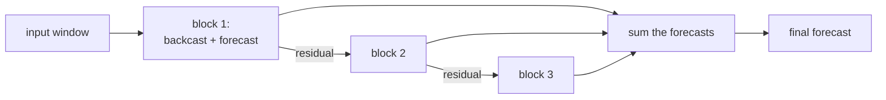

N-BEATS showed that a pure stack of fully connected layers, with no recurrence and
no attention, could beat the best statistical methods on the M4 competition<FN ns="1, 2" />. Its
trick is structural: each block both predicts a piece of the future (the forecast)
and reconstructs the piece of the past it has explained (the backcast), then passes
the unexplained residual to the next block. N-HiTS refines this to handle long
horizons cheaply.

## The block: backcast and forecast

A block takes a lookback window $\mathbf{x} \in \mathbb{R}^{L}$ (the last $L$
values) and runs it through a small MLP (the forward-pass lesson) to produce two
sets of expansion coefficients. These coefficients are mapped through fixed or
learned **basis** matrices into two outputs:

$$
\hat{\mathbf{x}} = V^{b}\, \boldsymbol{\theta}^{b} \quad (\text{backcast}), \qquad \hat{\mathbf{y}} = V^{f}\, \boldsymbol{\theta}^{f} \quad (\text{forecast}),
$$

where $\boldsymbol{\theta}^b, \boldsymbol{\theta}^f$ are the MLP outputs and
$V^b, V^f$ are basis matrices over the lookback and horizon respectively. The
backcast $\hat{\mathbf{x}}$ is the block's reconstruction of its input; the forecast
$\hat{\mathbf{y}}$ is its contribution to the prediction.

## Doubly residual stacking

Blocks are chained so each removes what it explains. Block $k$ receives the
residual left by block $k-1$:

$$
\mathbf{x}_k = \mathbf{x}_{k-1} - \hat{\mathbf{x}}_{k-1}, \qquad \hat{\mathbf{y}} = \sum_k \hat{\mathbf{y}}_k.
$$

The input residual shrinks down the stack as successive blocks subtract their
backcasts, while the forecasts add up. This is the **doubly residual** design:
residual on the backcast path (sequential refinement of the input) and summation on
the forecast path (additive prediction). It makes training stable and the final
forecast an interpretable sum of components.

## Interpretable basis: trend and seasonality

The basis matrices can be chosen to force a block to model a specific component.

**Trend block.** Use a low-degree polynomial basis: column $p$ of $V^f$ is
$(t/H)^p$ for $p = 0, 1, \dots, P$ over the horizon grid $t = 0, \dots, H-1$. The
forecast is then a smooth polynomial, capturing slow trend.

**Seasonality block.** Use a Fourier basis: columns are
$\cos(2\pi k t / H)$ and $\sin(2\pi k t / H)$, the same construction as the spectral
lesson. The forecast is a sum of harmonics, capturing periodic structure.

A stack with a trend block followed by a seasonality block decomposes the forecast
into a trend curve plus a seasonal curve, readable like an ETS decomposition. The
**generic** variant instead learns $V$ freely, trading interpretability for a bit
more accuracy.



## N-HiTS: multi-rate sampling for long horizons

N-BEATS treats every horizon step at full resolution, which is wasteful for long
horizons where the signal is dominated by low-frequency structure. **N-HiTS** adds
two ideas:

- **Multi-rate input pooling.** Each block first downsamples its input with average
  pooling at a block-specific rate. Blocks with heavy pooling see a coarse, smooth
  view and learn low-frequency components; blocks with light pooling see fine
  detail and learn high-frequency components.
- **Hierarchical interpolation.** Each block predicts at a reduced resolution, then
  interpolates up to the full horizon. A block specializing in slow components needs
  only a few control points, cutting parameters and compute.

Together these make different blocks responsible for different frequency bands, so
N-HiTS forecasts long horizons more accurately and far more cheaply than N-BEATS<FN n="3" />.

```python
import numpy as np

rng = np.random.default_rng(0)
H = 48
t = np.arange(H)

# A signal = polynomial trend + two harmonics; recover it by basis projection
true = 0.5 + 0.8*(t/H) - 0.3*(t/H)**2 + 1.5*np.cos(2*np.pi*1*t/H) + 0.7*np.sin(2*np.pi*2*t/H)
obs  = true + rng.normal(0, 0.1, H)

# Trend basis (polynomials up to degree 2)
Vt = np.stack([(t/H)**p for p in range(3)], axis=1)
# Seasonality basis (first 3 harmonics, cos+sin)
Vs = np.concatenate([np.stack([np.cos(2*np.pi*k*t/H) for k in range(1,4)], 1),
                     np.stack([np.sin(2*np.pi*k*t/H) for k in range(1,4)], 1)], axis=1)

# Block 1 (trend): least-squares fit, then take residual.  Block 2 (seasonality).
theta_t, *_ = np.linalg.lstsq(Vt, obs, rcond=None)
trend_fc = Vt @ theta_t
resid = obs - trend_fc                                    # doubly-residual: pass remainder on
theta_s, *_ = np.linalg.lstsq(Vs, resid, rcond=None)
seas_fc = Vs @ theta_s

forecast = trend_fc + seas_fc                             # additive forecast path
rmse = np.sqrt(((forecast - true)**2).mean())
print(f"trend+seasonality basis RMSE vs clean signal: {rmse:.3f}  (noise std 0.1)")
```

The trend block absorbs the polynomial part, passes its residual to the
seasonality block, and the summed forecast reconstructs the clean signal to the
noise floor, the doubly-residual basis mechanism in miniature.

N-BEATS and N-HiTS are basis-projection models. The next lesson brings attention
into forecasting with the Temporal Fusion Transformer, which mixes static
covariates, known-future inputs, and observed history under one architecture.

<Footnotes>
  <FNItem n="1">**Oreshkin, B. N., Carpov, D., Chapados, N., & Bengio, Y.** (2020). "N-BEATS: neural basis expansion analysis for interpretable time series forecasting". *ICLR*. [arXiv:1905.10437](https://arxiv.org/abs/1905.10437). The doubly-residual block stack and interpretable trend/seasonality bases.</FNItem>
  <FNItem n="2">**Makridakis, S., Spiliotis, E., & Assimakopoulos, V.** (2020). "The M4 competition: 100,000 time series and 61 forecasting methods". *International Journal of Forecasting*, 36(1), 54-74. [doi:10.1016/j.ijforecast.2019.04.014](https://doi.org/10.1016/j.ijforecast.2019.04.014). The benchmark N-BEATS was measured against.</FNItem>
  <FNItem n="3">**Challu, C., Olivares, K. G., et al.** (2023). "N-HiTS: neural hierarchical interpolation for time series forecasting". *AAAI*. [arXiv:2201.12886](https://arxiv.org/abs/2201.12886). Multi-rate pooling and hierarchical interpolation for cheap long-horizon forecasts.</FNItem>
</Footnotes>
