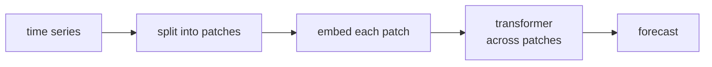

After a wave of increasingly elaborate forecasting transformers, two simpler
designs took the lead by rethinking what a "token" should be. PatchTST tokenizes
*subseries* instead of individual time steps; iTransformer tokenizes whole
*variates* instead of time steps. Both are minimal changes with outsized effects.

## What is a token in a time series?

The earlier transformers treated each time step as a token and attended across
steps. Two problems follow: a single step carries almost no information (unlike a
word), and step-level attention scales badly with the lookback length. PatchTST and
iTransformer each redefine the token to fix this.

## PatchTST: subseries patches

PatchTST borrows patching from vision transformers. The univariate series is cut
into (optionally overlapping) **patches** of $P$ consecutive steps, and each patch
becomes one token:

$$
\text{number of tokens} = \left\lfloor \frac{L - P}{S} \right\rfloor + 1,
$$

for lookback $L$, patch length $P$, and stride $S$. A length-512 series with
$P = 16, S = 8$ collapses to about 64 tokens instead of 512.

Two consequences:

- **Local semantics.** A patch holds a short pattern (a small trend or bump), so a
  token carries real information, like a word does.
- **Quadratic cost drops.** Attention is now over $\sim L/S$ tokens, cutting the
  $O(L^2)$ cost by a factor of $S^2$.

PatchTST also uses **channel independence**: in a multivariate problem each variate
(channel) is forecast by the *same* shared transformer applied independently, with
no cross-channel attention. Counterintuitively this beats channel-mixing models,
because it regularizes against spurious cross-series correlations and lets the
shared weights learn universal temporal patterns<FN n="1" />.

## iTransformer: invert the axes

iTransformer makes a one-line change with a different philosophy. Where standard
models embed each time step (mixing all variates at one time) and attend across
time, iTransformer **inverts** this: it embeds each *variate's whole series* into a
single token and attends across variates.

So the token is one variate's full lookback, and the attention matrix is
$N \times N$ over the $N$ variates rather than $L \times L$ over time. The
feed-forward network then operates along the time dimension within each variate
token. The payoff:

- **Attention captures multivariate correlations** explicitly, since variates are
  what attend to each other, which is what you want for related series.
- **Cost depends on the number of variates, not the lookback**, so long lookbacks
  are cheap.
- **No architecture change**, just a transposed application of the same transformer
  block, which is why it slots into existing code trivially<FN n="2" />.



## The takeaway

Both results carry the same message as the previous lesson's decomposition models,
sharpened: the gains came from getting the *representation* right (what a token is)
rather than from more complex attention. A plain transformer with the right
tokenization outperforms the elaborate variants on standard benchmarks.

```python
import numpy as np

rng = np.random.default_rng(0)
L, P, S = 512, 16, 8

# PatchTST patching: turn a length-L series into overlapping patch tokens
x = np.sin(2*np.pi*np.arange(L)/24) + rng.normal(0, 0.1, L)
n_patches = (L - P)//S + 1
patches = np.stack([x[i*S : i*S + P] for i in range(n_patches)])
print(f"series length {L} -> {patches.shape[0]} patch tokens of dim {patches.shape[1]}")
print(f"attention cost cut by ~ S^2 = {S**2}x vs per-step tokens")

# iTransformer view: multivariate series, one token per variate (attend across variates)
N = 5
series = rng.normal(size=(N, L))
series[1] = 0.9*series[0] + 0.1*rng.normal(size=L)     # variate 1 correlated with 0
tokens = series                                         # each row (whole series) is a token
# variate-level attention starts from the cross-variate similarity (N x N)
z = (tokens - tokens.mean(1, keepdims=True)) / tokens.std(1, keepdims=True)
corr = z @ z.T / L
print("cross-variate correlation matrix shape:", corr.shape)        # N x N, not L x L
print(f"detected corr between variate 0 and 1: {corr[0,1]:.2f}  (built as ~0.9)")
```

Patching reduces a 512-step series to 64 tokens (an $S^2 = 64\times$ attention
saving), and the inverted view yields an $N \times N$ cross-variate matrix that
surfaces the planted correlation between variates 0 and 1, the two tokenization
moves these models are built on.

## Exercises

**Exercise 1.** A PatchTST model has lookback $L = 336$, patch length $P = 16$,
and stride $S = 8$. Compute the number of patch tokens. Then compute it again for
non-overlapping patches ($S = P = 16$), and state the factor by which attention
cost drops relative to per-step tokens in the non-overlapping case.

<details>
<summary>Solution</summary>

**Step 1.** The token count is
$\big\lfloor \frac{L - P}{S} \big\rfloor + 1$. With overlap:
$\big\lfloor \frac{336 - 16}{8} \big\rfloor + 1 = \lfloor 40 \rfloor + 1 = 41$
tokens.

**Step 2.** Non-overlapping, $S = P = 16$:
$\big\lfloor \frac{336 - 16}{16} \big\rfloor + 1 = 20 + 1 = 21$ tokens.

**Step 3.** Attention is quadratic in the token count. Per-step tokens give
$L = 336$ tokens at cost $\propto 336^2$; non-overlapping patches give $21$ tokens
at cost $\propto 21^2$. The ratio is $(336/21)^2 = 16^2 = 256$, matching the
$S^2$ rule for stride $S = 16$.

</details>

**Exercise 2.** PatchTST uses channel independence: the same transformer is
applied to each variate separately with no cross-channel attention, yet it often
beats channel-mixing models. iTransformer does the opposite, attending across
variates. Explain in trade-off terms when each design is the better bet.

<details>
<summary>Solution</summary>

**Step 1.** Channel independence shares one set of weights across variates and
forbids cross-series attention, so it cannot fit spurious correlations between
variates; this regularizes and helps when series are many, noisy, or only weakly
related, and it lets the shared weights learn universal temporal patterns.

**Step 2.** iTransformer's cross-variate attention explicitly models how variates
co-move, so it is the better bet when the variates are genuinely and stably
correlated (related sensors, linked markets) and capturing that structure
outweighs the risk of fitting noise.

**Step 3.** The trade-off is regularization against expressiveness: weak or
unstable cross-series links favor channel independence; strong, real multivariate
dependence favors attending across variates.

</details>

**Exercise 3 (code).** Implement PatchTST patching for $L = 336,\ P = 16,\ S = 8$
and confirm the token count, then build a multivariate set with one planted
cross-variate correlation and confirm the $N \times N$ correlation matrix recovers
it (the iTransformer view).

<details>
<summary>Solution</summary>

```python
import numpy as np

rng = np.random.default_rng(0)
L, P, S = 336, 16, 8

# PatchTST patching
x = np.sin(2*np.pi*np.arange(L)/24) + rng.normal(0, 0.1, L)
n_patches = (L - P)//S + 1
patches = np.stack([x[i*S : i*S + P] for i in range(n_patches)])
print(f"tokens: {patches.shape[0]} of dim {patches.shape[1]}")
assert patches.shape == (41, 16)

# iTransformer view: plant a correlation rho between variate 0 and 2
N = 4
rho = 0.8
series = rng.normal(size=(N, L))
series[2] = rho*series[0] + np.sqrt(1 - rho**2)*rng.normal(size=L)
z = (series - series.mean(1, keepdims=True)) / series.std(1, keepdims=True)
corr = z @ z.T / L
print(f"corr matrix shape {corr.shape}, detected corr(0,2)={corr[0,2]:.2f} (built {rho})")
assert corr.shape == (N, N)
assert abs(corr[0, 2] - rho) < 0.06
```

The patching yields exactly $41$ tokens, and the cross-variate matrix is
$N \times N$ (not $L \times L$) and recovers the planted correlation, the two
tokenization moves PatchTST and iTransformer are built on.

</details>

These models are still trained per dataset. The next lesson reaches the frontier:
foundation models pretrained on huge corpora that forecast a new series zero-shot.

<Footnotes>
  <FNItem n="1">**Nie, Y., Nguyen, N. H., Sinthong, P., & Kalagnanam, J.** (2023). "A time series is worth 64 words: long-term forecasting with transformers (PatchTST)". *ICLR*. [arXiv:2211.14730](https://arxiv.org/abs/2211.14730). Subseries patching and channel independence.</FNItem>
  <FNItem n="2">**Liu, Y., et al.** (2024). "iTransformer: inverted transformers are effective for time series forecasting". *ICLR*. [arXiv:2310.06625](https://arxiv.org/abs/2310.06625). Treating each variate's whole series as a token and attending across variates.</FNItem>
</Footnotes>
