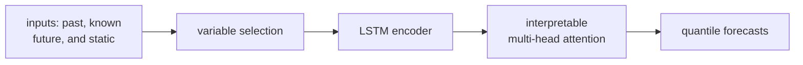

Real forecasting problems mix three kinds of inputs: static metadata (a store's
location), known-future covariates (next week's promotions, the calendar), and
observed past values. The Temporal Fusion Transformer (TFT) is designed to ingest
all three, decide which matter, and produce quantile forecasts that come with a
readable explanation of what drove them<FN n="1" />.

## Three input types, handled separately

TFT routes inputs by type:

- **Static covariates** are encoded once and used to condition every other
  component (through context vectors that initialize states and bias variable
  selection).
- **Past inputs** ($t \le$ now) include the target's history and any observed
  covariates.
- **Known-future inputs** ($t >$ now) are covariates known ahead of time, fed into
  the decoder so the model can anticipate scheduled effects.

## Variable selection networks

Rather than treating all features equally, TFT learns a soft importance weight per
feature at each time step. Given the transformed feature vectors, a small network
outputs a softmax over features:

$$
\mathbf{v}_t = \text{softmax}\big(\text{MLP}([\,\boldsymbol{\xi}_{t,1}, \dots, \boldsymbol{\xi}_{t,F}\,], c_s)\big) \in \Delta^{F},
$$

conditioned on the static context $c_s$. The selected representation is the
weighted sum $\sum_f v_{t,f}\, \tilde{\boldsymbol{\xi}}_{t,f}$. Because $\mathbf{v}_t$
is a probability vector over features, inspecting it tells you which inputs the
model relied on, and it suppresses noise features by giving them near-zero weight.

## Gated residual networks

The repeating computational unit is the **gated residual network** (GRN), which
lets the model skip nonlinearity when it is not needed. For input $\mathbf{a}$:

$$
\text{GRN}(\mathbf{a}) = \text{LayerNorm}\big(\mathbf{a} + \text{GLU}(\eta)\big), \qquad \eta = W_2\,\text{ELU}(W_1 \mathbf{a} + b_1) + b_2,
$$

where the **gated linear unit** $\text{GLU}(\eta) = (W_g \eta + b_g) \odot \sigma(W_v \eta + b_v)$
multiplies a linear transform by a sigmoid gate. When the gate is near zero the GRN
passes its input through almost unchanged, so the network can learn to apply
processing only where it helps, which matters when data is small.

## Temporal processing: LSTM plus interpretable attention

TFT first runs a sequence-to-sequence LSTM over the selected inputs for local
processing, then applies **interpretable multi-head attention** across time. The
attention is the transformer-block mechanism, modified so the heads *share* their
value projection and their weights are averaged, which makes a single attention
map you can read as "which past time steps influenced this forecast." That map is
the model's temporal explanation.



## Training with the quantile (pinball) loss

To produce prediction intervals directly, TFT outputs a set of quantiles (for
example the 10th, 50th, 90th percentiles) and trains each with the **pinball
loss**. For target $y$, prediction $\hat{q}$, and quantile level $\tau \in (0,1)$:

$$
\mathcal{L}_\tau(y, \hat{q}) = \max\big(\tau (y - \hat{q}),\; (\tau - 1)(y - \hat{q})\big).
$$

**Why this targets the quantile.** The loss is asymmetric: under-prediction
($y > \hat{q}$) costs $\tau$ per unit, over-prediction costs $1-\tau$ per unit.
Setting the expected subgradient to zero gives $P(y \le \hat{q}) = \tau$, so the
minimizer is exactly the $\tau$-quantile. Summing $\mathcal{L}_\tau$ over the chosen
levels and the horizon gives forecasts whose stated intervals have the right
coverage by construction<FN n="2" />.

```python
import numpy as np

rng = np.random.default_rng(0)

# 1. The pinball loss is minimized at the true quantile of the data.
y = rng.normal(5.0, 2.0, 200_000)          # target distribution
def pinball(q, y, tau):
    e = y - q
    return np.maximum(tau*e, (tau-1)*e).mean()

for tau in (0.1, 0.5, 0.9):
    grid = np.linspace(0, 10, 2001)
    qhat = grid[np.argmin([pinball(q, y, tau) for q in grid])]
    true_q = np.quantile(y, tau)
    print(f"tau={tau}: pinball-min q={qhat:.2f}  empirical quantile={true_q:.2f}")

# 2. Variable selection: a softmax over features gives readable importances.
feat_scores = np.array([0.2, 3.1, -0.4, 1.0])      # raw relevance logits
weights = np.exp(feat_scores) / np.exp(feat_scores).sum()
print("variable-selection weights:", np.round(weights, 3), " sum:", round(weights.sum(), 3))
```

The pinball minimizer lands on the empirical 10/50/90 percentiles, confirming the
loss recovers quantiles, and the softmax variable-selection weights form a readable
importance distribution over features, the two ingredients that make TFT both
probabilistic and interpretable.

TFT keeps an LSTM for local processing. The next lesson follows the line of
attention-only forecasters built specifically for long horizons: Informer,
Autoformer, and FEDformer.

<Footnotes>
  <FNItem n="1">**Lim, B., Arik, S. O., Loeff, N., & Pfister, T.** (2021). "Temporal Fusion Transformers for interpretable multi-horizon time series forecasting". *International Journal of Forecasting*, 37(4), 1748-1764. [arXiv:1912.09363](https://arxiv.org/abs/1912.09363). Variable selection, gated residual networks, and interpretable multi-head attention.</FNItem>
  <FNItem n="2">**Hyndman, R. J., & Athanasopoulos, G.** (2021). *Forecasting: Principles and Practice* (3rd ed.). OTexts. Quantile (pinball) scoring and the coverage of prediction intervals.</FNItem>
</Footnotes>
