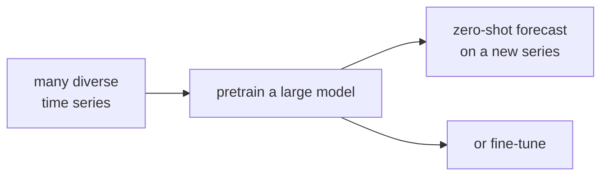

Every model so far is trained on the series it forecasts. Foundation models break
that: a single network is pretrained on millions of time series from many domains,
then forecasts a brand-new series **zero-shot**, with no fitting at all<FN n="1" />. This is the
same shift that large language models brought to text, transplanted to time series.

## Why a foundation model can transfer

Time series across domains share structure: trends, seasonality, sharp regime
changes, mean reversion. A model that has seen enough of them learns these patterns
as reusable primitives, the way an LLM learns syntax that transfers across topics.
The bet is that the space of temporal patterns is small enough that pretraining
covers it, so a new series is mostly a recombination of patterns already seen.

## Chronos: forecasting as language modelling

Chronos makes the analogy literal: it reuses an LLM architecture (a T5-style
encoder-decoder) unchanged and adapts only the input/output by **tokenizing
values**.

**Step 1, scale.** Divide the series by its mean absolute value so series of any
magnitude land in a common range.

**Step 2, quantize.** Bin the scaled values into a fixed vocabulary of $B$ tokens.
Each real value maps to the index of its bin, turning the numeric series into a
sequence of discrete tokens exactly like text.

**Step 3, model.** Train the transformer with the ordinary next-token
cross-entropy loss to predict the next value-token. At inference it autoregressively
generates token sequences; sampling many gives a predictive distribution, and
de-quantizing plus un-scaling returns real-valued forecasts.

The striking result: a language-model recipe, with values as tokens, matches or
beats specialized forecasters zero-shot<FN n="2" />. The decoder-only generation loop is the
same one from the LLM lessons.

## TimeGPT and Lag-Llama

**TimeGPT** is a large encoder-decoder transformer pretrained on a very large
proprietary corpus, offered as an API. It forecasts and detects anomalies
zero-shot, with optional fine-tuning, and was the first productized time-series
foundation model.

**Lag-Llama** is an open decoder-only (LLaMA-style) model built for univariate
probabilistic forecasting. Its distinctive input is **lag features**: at each step
it sees the value plus its values at a fixed set of lags (for example 1, 7, 24,
168, chosen to span common seasonalities), so the autoregressive model is handed
the periodic context directly rather than having to rediscover it. It outputs the
parameters of a distribution per step, like DeepAR, and is trained across many
datasets for zero-shot transfer.



## What scaling buys, and the open questions

As with LLMs, accuracy improves predictably with more pretraining data, more
diverse domains, and larger models, which is what makes zero-shot competitive with
trained baselines<FN n="1" />. The open issues are specific to time series: covariates and
exogenous regressors are awkward to inject, very long horizons remain hard, and a
well-tuned classical model on a clean stationary series can still win. The practical
value is as a **strong default**: a good forecast on a new series with zero
engineering, to beat or build on.

```python
import numpy as np

rng = np.random.default_rng(0)

# Chronos-style tokenization: mean-scale, then quantize into a fixed vocabulary.
series = 50 + 10*np.sin(2*np.pi*np.arange(200)/24) + rng.normal(0, 1, 200)

# Step 1: mean (absolute) scaling
scale = np.mean(np.abs(series))
scaled = series / scale

# Step 2: quantize into B bins over the observed range -> integer tokens
B = 256
lo, hi = scaled.min(), scaled.max()
edges = np.linspace(lo, hi, B + 1)
tokens = np.clip(np.digitize(scaled, edges) - 1, 0, B - 1)
print("first 10 value-tokens:", tokens[:10])
print(f"vocabulary size: {B},  distinct tokens used: {len(np.unique(tokens))}")

# De-tokenize (bin centers) and un-scale: reconstruction error is the quantization floor
centers = 0.5*(edges[:-1] + edges[1:])
recon = centers[tokens] * scale
rmse = np.sqrt(((recon - series)**2).mean())
print(f"round-trip RMSE from tokenization: {rmse:.3f}  (set by bin width)")
```

Mean-scaling followed by quantization turns the real-valued series into a sequence
of integer tokens with only quantization-level reconstruction error, which is the
representation that lets a plain language-model architecture forecast time series.

Deep models excel at forecasting the expected path. The next subsection turns to a
different question: detecting when a series departs from its normal behaviour,
starting with classical statistical anomaly tests.

<Footnotes>
  <FNItem n="1">**Das, A., Kong, W., Sen, R., & Zhou, Y.** (2024). "A decoder-only foundation model for time-series forecasting (TimesFM)". *ICML*. [arXiv:2310.10688](https://arxiv.org/abs/2310.10688). A pretrained decoder-only model that forecasts unseen series zero-shot, with scaling that drives transfer.</FNItem>
  <FNItem n="2">**Ansari, A. F., et al.** (2024). "Chronos: learning the language of time series". *TMLR*. [arXiv:2403.07815](https://arxiv.org/abs/2403.07815). Value tokenization that lets an LLM architecture forecast time series.</FNItem>
</Footnotes>
