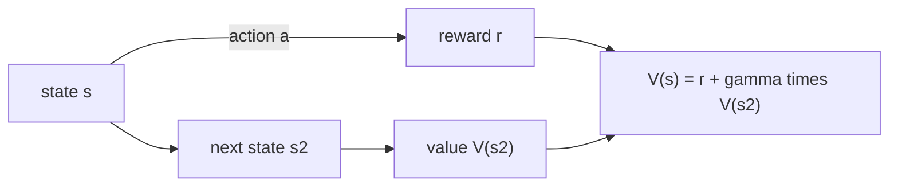

The value function $V^\pi(s) = \mathbb{E}_\pi[G_t \mid S_t = s]$ is defined as an
expectation over an infinite future, which is not something you can compute
directly. The way out is the one structural fact from the last lesson: the return
unrolls one step, $G_t = r_{t+1} + \gamma G_{t+1}$. Pushing that recursion through
the expectation turns an infinite sum into a finite equation relating each
state's value to its neighbors. That equation is named after Richard Bellman<FN n="1" />.

## The Bellman expectation equation for $V^\pi$

Start from the definition and substitute the one-step unrolling of the return.

**Step 1, unroll the return inside the expectation.** Using $G_t = r_{t+1} + \gamma G_{t+1}$,

$$
V^\pi(s) = \mathbb{E}_\pi\!\left[ r_{t+1} + \gamma\, G_{t+1} \mid S_t = s \right]
= \mathbb{E}_\pi[r_{t+1} \mid S_t = s] + \gamma\, \mathbb{E}_\pi[G_{t+1} \mid S_t = s],
$$

by linearity of expectation.

**Step 2, the immediate-reward term.** The agent first draws $a \sim \pi(\cdot \mid s)$,
and the expected reward for that action is $R(s,a)$, so

$$
\mathbb{E}_\pi[r_{t+1} \mid S_t = s] = \sum_a \pi(a \mid s)\, R(s, a).
$$

**Step 3, the future term, using the Markov property.** Condition on the action
$a$ and the next state $s'$. The action is drawn from $\pi$, the next state from
$P(\cdot \mid s,a)$, and once at $s'$ the expected future return is by definition
$V^\pi(s')$ (the Markov property makes the future depend only on $s'$, not on how
the agent arrived):

$$
\mathbb{E}_\pi[G_{t+1} \mid S_t = s] = \sum_a \pi(a \mid s) \sum_{s'} P(s' \mid s, a)\, V^\pi(s').
$$

**Step 4, assemble.** Combining the two terms gives the **Bellman expectation
equation**:

$$
V^\pi(s) = \sum_a \pi(a \mid s)\left[ R(s,a) + \gamma \sum_{s'} P(s' \mid s,a)\, V^\pi(s') \right].
$$

A two-state cycle makes the equation concrete. Under a fixed policy with
$\gamma = 0.9$, state $A$ pays reward $1$ and always moves to $B$; state $B$ pays
$0$ and always moves back to $A$. The expectation equation collapses to two coupled
lines, $V_A = 1 + 0.9\,V_B$ and $V_B = 0 + 0.9\,V_A$. Substituting the second into
the first gives $V_A = 1 + 0.81\,V_A$, so $V_A = 1/(1-0.81) \approx 5.26$ and
$V_B = 0.9\,V_A \approx 4.74$. The two values differ by the reward $A$ collects one
step sooner: both states ride the same alternating reward cycle, but $A$ collects a
$1$ on the very next step while $B$ has to wait one step for its first $1$, and the
discounting makes that earlier payout worth more.
The equation has turned an infinite discounted sum into a $2 \times 2$ solve.

The same derivation applied to the action-value function, where the first action
$a$ is fixed rather than sampled, gives

$$
Q^\pi(s,a) = R(s,a) + \gamma \sum_{s'} P(s' \mid s,a) \sum_{a'} \pi(a' \mid s')\, Q^\pi(s', a').
$$

## Matrix form and existence

Fix the policy and write $r^\pi(s) = \sum_a \pi(a\mid s) R(s,a)$ and the induced
transition $P^\pi(s, s') = \sum_a \pi(a \mid s) P(s' \mid s, a)$. The expectation
equation becomes one linear system over the value vector $V^\pi \in \mathbb{R}^{|\mathcal{S}|}$:

$$
V^\pi = r^\pi + \gamma P^\pi V^\pi \quad\Longrightarrow\quad (I - \gamma P^\pi)\, V^\pi = r^\pi.
$$

Because $P^\pi$ is a stochastic matrix its eigenvalues have modulus at most $1$,
so $\gamma P^\pi$ has spectral radius at most $\gamma < 1$, the matrix
$I - \gamma P^\pi$ is invertible, and the value function exists and is unique:

$$
V^\pi = (I - \gamma P^\pi)^{-1} r^\pi.
$$

This is the closed form used as ground truth in the previous lesson. Solving an
$|\mathcal{S}| \times |\mathcal{S}|$ system is fine for small MDPs and hopeless
for large ones, which is why the next lesson iterates instead of inverting.

## From evaluation to optimality

Evaluating a *given* policy is only half the goal; the agent wants the *best*
policy. Define the **optimal value functions** as the best achievable over all
policies,

$$
V^*(s) = \max_\pi V^\pi(s), \qquad Q^*(s,a) = \max_\pi Q^\pi(s,a).
$$

An optimal policy never gains from randomizing: in each state it can put all its
mass on an action of maximal $Q^*$. Replacing the policy-average
$\sum_a \pi(a\mid s)(\cdot)$ in the expectation equation with a maximum over
actions gives the **Bellman optimality equations**<FN n="2" />:

$$
V^*(s) = \max_a \left[ R(s,a) + \gamma \sum_{s'} P(s' \mid s,a)\, V^*(s') \right],
$$

$$
Q^*(s,a) = R(s,a) + \gamma \sum_{s'} P(s' \mid s,a)\, \max_{a'} Q^*(s', a').
$$

The optimality equations are nonlinear because of the $\max$, so there is no
matrix inverse this time. But once $Q^*$ is known the optimal policy is immediate:
act **greedily**, $\pi^*(s) = \arg\max_a Q^*(s,a)$. The next lesson solves these
fixed-point equations by iteration.



## Worked check: the expectation equation holds residual-free

Compute $V^\pi$ by the matrix inverse, then plug it back into the right-hand side
of the Bellman expectation equation. If the derivation is right, the two sides
agree to machine precision (the **Bellman residual** is zero). Compare that to a
deliberately wrong value vector, whose residual is large.

```python
import numpy as np

rng = np.random.default_rng(1)
nS, nA = 4, 2
gamma = 0.9

# Random MDP: transitions per (state, action), and rewards R(s,a).
P = rng.dirichlet(np.ones(nS), size=(nS, nA))   # P[s,a] is a distribution over s'
R = rng.normal(size=(nS, nA))
pi = rng.dirichlet(np.ones(nA), size=nS)         # stochastic policy pi[s] over actions

# Induced reward and transition for this policy.
r_pi = np.einsum("sa,sa->s", pi, R)
P_pi = np.einsum("sa,sap->sp", pi, P)
V = np.linalg.solve(np.eye(nS) - gamma * P_pi, r_pi)

# Bellman expectation residual: V(s) - sum_a pi(a|s)[R + gamma sum_s' P V].
rhs = np.einsum("sa,sa->s", pi, R + gamma * np.einsum("sap,p->sa", P, V))
residual = V - rhs
bogus = V + np.array([1.0, -1.0, 0.5, -0.5])     # a wrong value vector
rhs_bogus = np.einsum("sa,sa->s", pi, R + gamma * np.einsum("sap,p->sa", P, bogus))

print("max |residual| for V^pi:", float(np.max(np.abs(residual))))
print("max |residual| for bogus V:", float(np.max(np.abs(bogus - rhs_bogus))))
```

The residual for the solved $V^\pi$ is at the level of floating-point noise while
the bogus vector leaves a residual of order one, confirming the Bellman
expectation equation is an identity satisfied by $V^\pi$ and by nothing else.

## Exercises

**Exercise 1.** A two-state cycle with $\gamma = 0.8$ under a fixed policy: state
$A$ pays reward $2$ and always moves to $B$; state $B$ pays reward $1$ and always
moves back to $A$. Solve the Bellman expectation equations for $V_A$ and $V_B$ by
hand.

<details>
<summary>Solution</summary>

**Step 1.** Write the two coupled equations. Each state's value is its immediate
reward plus the discounted value of where it lands:

$$
V_A = 2 + 0.8\, V_B, \qquad V_B = 1 + 0.8\, V_A.
$$

**Step 2.** Substitute the second into the first and solve for $V_A$:

$$
V_A = 2 + 0.8(1 + 0.8\, V_A) = 2.8 + 0.64\, V_A \;\Longrightarrow\; V_A = \frac{2.8}{1 - 0.64} = \frac{2.8}{0.36} \approx 7.778.
$$

**Step 3.** Back-substitute: $V_B = 1 + 0.8 \cdot 7.778 \approx 7.222$. State $A$
is worth more because it collects its larger reward one step sooner, and the
discount makes that earlier payout count for more.

</details>

**Exercise 2.** A single state $s_0$ has two actions under $\gamma = 0.9$. Action
"stay" pays reward $1$ and returns to $s_0$; action "leave" pays reward $3$ and
ends the episode (the terminal state has value $0$). Use the Bellman optimality
equation to find $V^*(s_0)$ and the optimal action.

<details>
<summary>Solution</summary>

**Step 1.** Write the optimality equation as a max over the two actions. The
"stay" branch loops back to $s_0$ itself, so its value references $V^*(s_0)$:

$$
V^*(s_0) = \max\Big(\underbrace{1 + 0.9\, V^*(s_0)}_{\text{stay}},\ \underbrace{3 + 0.9 \cdot 0}_{\text{leave}}\Big).
$$

**Step 2.** Suppose "stay" is optimal. Then $V^*(s_0) = 1 + 0.9\, V^*(s_0)$, giving
$V^*(s_0) = 1/(1 - 0.9) = 10$.

**Step 3.** Check consistency: with $V^*(s_0) = 10$ the stay backup is
$1 + 0.9 \cdot 10 = 10$ while leave gives $3$, so the max picks "stay" and the
guess is self-consistent. The optimal action is to stay, harvesting the $1$
forever, worth more than the one-time $3$.

</details>

**Exercise 3 (code).** The optimality operator
$(T^*V)(s) = \max_a [R(s,a) + \gamma \sum_{s'} P(s'\mid s,a) V(s')]$ is a
$\gamma$-contraction in the max-norm. On a random MDP, verify
$\lVert T^*U - T^*V\rVert_\infty \le \gamma \lVert U - V\rVert_\infty$ for two
random value vectors, and that iterating $T^*$ reaches a fixed point.

<details>
<summary>Solution</summary>

```python
import numpy as np

rng = np.random.default_rng(7)
nS, nA, gamma = 4, 3, 0.85
P = rng.dirichlet(np.ones(nS), size=(nS, nA))      # P[s,a] over s'
R = rng.normal(size=(nS, nA))

def T_star(V):
    return (R + gamma * np.einsum("sap,p->sa", P, V)).max(axis=1)

U, V = rng.normal(size=nS), rng.normal(size=nS)
assert np.max(np.abs(T_star(U) - T_star(V))) <= gamma * np.max(np.abs(U - V)) + 1e-12

W = np.zeros(nS)                                    # iterate to the fixed point
for _ in range(500):
    W = T_star(W)
assert np.allclose(W, T_star(W), atol=1e-8)         # W = T* W, so W is V*
print("V*:", np.round(W, 3))
```

The contraction bound holds for the random pair, and iterating $T^*$ lands on a
vector left unchanged by another backup, which is the optimal value function.

</details>

With the equations in hand, the next lesson turns them into algorithms: policy
iteration and value iteration, each a contraction that converges to the optimal
value function.

<Footnotes>
  <FNItem n="1">**Bellman, R.** (1957). *Dynamic Programming.* Princeton University Press. Introduces the principle of optimality and the recursive value equations that bear his name.</FNItem>
  <FNItem n="2">**Sutton, R. S., & Barto, A. G.** (2018). *Reinforcement Learning: An Introduction* (2nd ed.). MIT Press. Chapters 3 and 4 develop the Bellman expectation and optimality equations.</FNItem>
</Footnotes>
