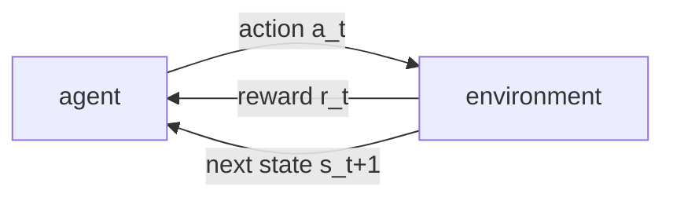

Supervised learning is given the right answer for each input. Reinforcement
learning is not: an **agent** takes actions in an environment, the environment
responds with a scalar **reward** and a new situation, and the agent must figure
out which actions pay off in the long run from this feedback alone. A move that
looks good now (grab the nearest reward) can strand the agent later. The first
job is a language precise enough to say what "pay off in the long run" means.
That language is the Markov decision process.

## The Markov decision process

A **Markov decision process** (MDP) is a tuple $(\mathcal{S}, \mathcal{A}, P, R, \gamma)$:

- $\mathcal{S}$ is the set of **states**, the situations the agent can be in.
- $\mathcal{A}$ is the set of **actions** available to the agent.
- $P(s' \mid s, a)$ is the **transition kernel**: the probability of landing in
  state $s'$ after taking action $a$ in state $s$.
- $R(s, a)$ is the **reward function**: the expected immediate reward for taking
  $a$ in $s$. The realized reward at time $t$ is written $r_{t+1}$.
- $\gamma \in [0, 1]$ is the **discount factor**, defined below.

The defining assumption is the **Markov property**: the transition and reward
depend only on the current state and action, not on the history that led there,

$$
P(S_{t+1} = s' \mid S_t = s, A_t = a, S_{t-1}, A_{t-1}, \dots) = P(s' \mid s, a).
$$

The state is whatever you must remember; if the past matters, fold it into the
state until the Markov property holds. This is the same conditional-independence
structure as a [Markov chain](A2/markov-chains), with an action now steering the
transition.

## The return: what the agent maximizes

The agent acts at times $t = 0, 1, 2, \dots$, producing a trajectory
$S_0, A_0, r_1, S_1, A_1, r_2, \dots$. It does not maximize the next reward; it
maximizes the **return**, the total reward accumulated from time $t$ onward,
discounted by how far in the future it arrives:

$$
G_t = r_{t+1} + \gamma\, r_{t+2} + \gamma^2 r_{t+3} + \dots = \sum_{k=0}^{\infty} \gamma^k r_{t+k+1}.
$$

The discount $\gamma$ does two jobs. Mathematically, if rewards are bounded by
$r_{\max}$, the geometric series is bounded by $r_{\max}/(1-\gamma)$, so $G_t$ is
finite even over an infinite horizon whenever $\gamma < 1$. Behaviorally, $\gamma$
sets how far the agent looks ahead: $\gamma$ near $0$ is myopic, $\gamma$ near $1$
is far-sighted.

The single most useful fact about the return is that it unrolls one step at a
time. Splitting off the first term,

$$
G_t = r_{t+1} + \gamma\big(r_{t+2} + \gamma\, r_{t+3} + \dots\big) = r_{t+1} + \gamma\, G_{t+1}.
$$

This **recursive** form is the seed of every algorithm in this pillar.

## Policies

The agent's behavior is a **policy** $\pi(a \mid s)$, a distribution over actions
in each state. A **deterministic** policy is the special case that puts all mass
on one action, written $a = \pi(s)$. Fixing a policy in an MDP collapses it to a
Markov chain over states: the agent samples $A_t \sim \pi(\cdot \mid S_t)$, the
environment samples $S_{t+1} \sim P(\cdot \mid S_t, A_t)$, and the reward stream
follows.

## Value functions

Because actions and transitions are random, the return $G_t$ is a random
variable. The agent cares about its expectation under a policy. The
**state-value function** of a policy $\pi$ is the expected return from a state:

$$
V^\pi(s) = \mathbb{E}_\pi\!\left[ G_t \mid S_t = s \right],
$$

where $\mathbb{E}_\pi$ averages over actions drawn from $\pi$ and states drawn from
$P$. The **action-value function** (or **Q-function**) is the expected return
after committing to a specific action $a$ in $s$ and following $\pi$ thereafter:

$$
Q^\pi(s, a) = \mathbb{E}_\pi\!\left[ G_t \mid S_t = s, A_t = a \right].
$$

The two are tied together by averaging $Q$ over the policy's action choice,

$$
V^\pi(s) = \sum_{a} \pi(a \mid s)\, Q^\pi(s, a),
$$

and conversely $Q^\pi(s,a)$ is the immediate reward plus the discounted value of
where you land,
$Q^\pi(s,a) = R(s,a) + \gamma \sum_{s'} P(s' \mid s,a) V^\pi(s')$.
Turning these identities into solvable equations is the next lesson; here the
point is that $V^\pi$ and $Q^\pi$ are *defined* as expected returns.



## Worked check: value equals expected return

A fixed policy turns the MDP into a Markov reward process with effective
transition matrix $P^\pi$ and reward vector $r^\pi$. The value vector then solves
the linear system $V^\pi = r^\pi + \gamma P^\pi V^\pi$ (next lesson derives this),
which gives a ground truth to test the *definition* against: simulate many
episodes, average the discounted return from each start state, and the Monte
Carlo estimate should converge to that $V^\pi$.

```python
import numpy as np

rng = np.random.default_rng(0)
gamma = 0.9
nS = 3
# A fixed policy already folded into a state-to-state chain P_pi and reward r_pi.
P_pi = np.array([[0.1, 0.7, 0.2],
                 [0.3, 0.3, 0.4],
                 [0.5, 0.1, 0.4]])
r_pi = np.array([1.0, -0.5, 2.0])           # expected immediate reward per state

# Ground truth: solve V = r + gamma P V  ->  (I - gamma P) V = r
V_true = np.linalg.solve(np.eye(nS) - gamma * P_pi, r_pi)

# Monte Carlo: average the discounted return G_0 over many episodes per start state.
def episode_return(s, H=400):
    G, disc = 0.0, 1.0
    for _ in range(H):
        G += disc * r_pi[s]
        disc *= gamma
        s = rng.choice(nS, p=P_pi[s])
    return G

N = 20_000
V_mc = np.array([np.mean([episode_return(s) for _ in range(N)]) for s in range(nS)])

print("V_true:", np.round(V_true, 3))
print("V_mc:  ", np.round(V_mc, 3))
print("max abs error:", round(np.max(np.abs(V_true - V_mc)), 3))
```

The Monte Carlo averages of the discounted return land on the analytic $V^\pi$
within sampling error, which is exactly the claim $V^\pi(s) = \mathbb{E}_\pi[G_t \mid S_t = s]$:
the value function *is* the expected return.

The recursion $G_t = r_{t+1} + \gamma G_{t+1}$ used above to define the return is
about to become the recursion that the value functions themselves obey, the
Bellman equations of the next lesson.
