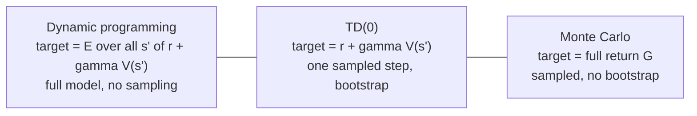

Monte Carlo waits until an episode ends to learn anything, because it needs the
full return $G_t$. Dynamic programming updates every step but needs the model to
compute the expectation. **Temporal-difference** (TD) learning combines the best
of each: it updates every step, like DP, but from sampled experience, like Monte
Carlo. It is the central idea of modern reinforcement learning<FN n="1" />.

## The bootstrap: estimate from an estimate

Monte Carlo replaces $V^\pi(s) = \mathbb{E}[G_t]$ with a sampled $G_t$, a full
return. TD instead replaces the tail of that return with the current value
estimate. Start from the recursive form $G_t = r_{t+1} + \gamma G_{t+1}$ and take
the conditional expectation, which is just the Bellman expectation equation for a
sampled transition:

$$
V^\pi(S_t) = \mathbb{E}_\pi[r_{t+1} + \gamma\, V^\pi(S_{t+1}) \mid S_t].
$$

A single observed transition $(S_t, r_{t+1}, S_{t+1})$ gives one sample of the
quantity inside that expectation. Plugging in the *current* estimate $V$ for the
unknown $V^\pi$ produces the **TD target**

$$
y_t = r_{t+1} + \gamma\, V(S_{t+1}).
$$

Estimating the target using your own current estimate $V(S_{t+1})$ is called
**bootstrapping**. It is what lets the update happen immediately, before the
episode ends, because the future is summarized by one value lookup instead of a
full rollout.

## The TD(0) update

The estimate is nudged toward the target by the difference between them. Define
the **TD error**

$$
\delta_t = \underbrace{r_{t+1} + \gamma\, V(S_{t+1})}_{\text{target}} - V(S_t),
$$

and update with step size (learning rate) $\alpha \in (0,1]$:

$$
V(S_t) \leftarrow V(S_t) + \alpha\, \delta_t.
$$

This is the **TD(0)** rule. It is a stochastic-approximation step: $\delta_t$ is a
noisy sample of how far the current estimate sits from satisfying the Bellman
equation, and the running average implied by repeated small $\alpha$ steps drives
the residual to zero. Under the usual Robbins-Monro conditions on $\alpha$
($\sum \alpha = \infty$, $\sum \alpha^2 < \infty$), TD(0) converges to $V^\pi$ for
a fixed policy<FN n="2" />.

## TD as sampled dynamic programming

Compare the three updates for the value of a state, all targeting the same
$V^\pi$:



DP takes the expectation over next states exactly but needs the model. MC samples
the entire future but does not bootstrap. TD sits between: it **samples** the next
state (like MC, so no model needed) and **bootstraps** the rest (like DP, so it
can update immediately). TD is dynamic programming with the expectation replaced
by a sample.

## The bias-variance tradeoff

The two sampling choices land MC and TD at opposite ends of a bias-variance axis:

- **Monte Carlo target $G_t$** is unbiased ($\mathbb{E}[G_t \mid S_t] = V^\pi(S_t)$
  by definition) but high variance, since it accumulates the randomness of every
  reward and transition over the whole episode.
- **TD target $r_{t+1} + \gamma V(S_{t+1})$** is biased while $V$ is wrong (it uses
  the imperfect estimate $V$ in place of $V^\pi$) but low variance, since it
  depends on the randomness of a single step.

Lower variance usually wins in practice: TD typically learns faster than MC, and
because it does not need episodes to terminate it also works on continuing tasks.

## Worked check: TD(0) recovers $V^\pi$ on a random walk

A symmetric random walk over states $1, \dots, 5$ with terminals on each end has a
known linear value function under the uniform policy: with reward $1$ for exiting
right and $0$ for exiting left, $V^\pi(s) = s/6$. Run TD(0) from sampled walks and
confirm it converges to that line, comparing against a first-visit Monte Carlo
estimate from the same number of episodes.

```python
import numpy as np

rng = np.random.default_rng(4)
# States 0..6; 0 and 6 are terminal. Reward 1 only on stepping into state 6.
true_V = np.array([0, 1, 2, 3, 4, 5, 0]) / 6.0   # known V^pi for interior states 1..5

def walk():
    s, traj = 3, []
    while s not in (0, 6):
        s_next = s + rng.choice([-1, 1])
        r = 1.0 if s_next == 6 else 0.0
        traj.append((s, r, s_next))
        s = s_next
    return traj

def run_td(episodes, alpha=0.02, gamma=1.0):
    V = np.full(7, 0.5); V[0] = V[6] = 0.0
    for _ in range(episodes):
        for s, r, s_next in walk():
            V[s] += alpha * (r + gamma * V[s_next] - V[s])
    return V

def run_mc(episodes, gamma=1.0):
    V, N = np.zeros(7), np.zeros(7)
    for _ in range(episodes):
        traj = walk(); G = 0.0; seen = set()
        for s, r, s_next in reversed(traj):
            G = r + gamma * G
            if s not in seen:
                seen.add(s); N[s] += 1; V[s] += (G - V[s]) / N[s]
    return V

V_td = run_td(20000)
V_mc = run_mc(20000)
print("true V[1..5]:", np.round(true_V[1:6], 3))
print("TD   V[1..5]:", np.round(V_td[1:6], 3))
print("MC   V[1..5]:", np.round(V_mc[1:6], 3))
print("TD max error:", round(np.max(np.abs(V_td[1:6] - true_V[1:6])), 3))
```

Both estimates track the exact line $V^\pi(s) = s/6$, with TD reaching it from
purely one-step bootstrapped updates that never waited for, nor summed, a full
return.

## Exercises

**Exercise 1.** The current estimates are $V(S_t) = 0.5$ and $V(S_{t+1}) = 0.8$.
The agent observes a transition with reward $r_{t+1} = 1$. With $\gamma = 0.9$ and
step size $\alpha = 0.1$, compute the TD error $\delta_t$ and the updated
$V(S_t)$.

<details>
<summary>Solution</summary>

**Step 1.** The TD error is target minus current estimate, with the target
bootstrapping off $V(S_{t+1})$:

$$
\delta_t = r_{t+1} + \gamma\, V(S_{t+1}) - V(S_t) = 1 + 0.9 \cdot 0.8 - 0.5 = 1.72 - 0.5 = 1.22.
$$

**Step 2.** Nudge the estimate by $\alpha\, \delta_t$:

$$
V(S_t) \leftarrow 0.5 + 0.1 \cdot 1.22 = 0.622.
$$

The positive error moved $V(S_t)$ up toward the higher target, a single
stochastic-approximation step.

</details>

**Exercise 2.** Explain why the Monte Carlo target $G_t$ is unbiased but high
variance, while the TD target $r_{t+1} + \gamma V(S_{t+1})$ is biased (while $V$ is
wrong) but low variance. Tie each property to where the randomness enters.

<details>
<summary>Solution</summary>

**Step 1.** Unbiasedness of MC: by definition $\mathbb{E}[G_t \mid S_t] = V^\pi(S_t)$,
so averaging full returns targets the right quantity with no systematic offset. Its
variance is high because $G_t$ accumulates the randomness of every reward and
transition across the whole episode, and these add up.

**Step 2.** The TD target replaces the random tail $\gamma G_{t+1}$ with
$\gamma V(S_{t+1})$. While $V \neq V^\pi$ this substitution makes the target
biased, since it injects the current estimate's error. But it depends on only one
step of randomness ($r_{t+1}$ and $S_{t+1}$), so its variance is far lower.

**Step 3.** The trade is bias for variance. Lower variance usually wins in
practice, which is why TD often learns faster than MC, and the bias vanishes as
$V \to V^\pi$.

</details>

**Exercise 3 (code).** Apply TD(0) as policy evaluation on a fixed three-state
Markov reward process (a continuing task, no terminal state). Compare the TD
estimate against the analytic value $V = (I - \gamma P)^{-1} r$.

<details>
<summary>Solution</summary>

```python
import numpy as np

rng = np.random.default_rng(14)
gamma = 0.9
P = np.array([[0.1, 0.7, 0.2],
              [0.3, 0.3, 0.4],
              [0.5, 0.1, 0.4]])
r = np.array([1.0, -0.5, 2.0])                      # expected reward per state
V_true = np.linalg.solve(np.eye(3) - gamma * P, r)  # analytic ground truth

V, alpha, s = np.zeros(3), 0.01, 0
for _ in range(300_000):
    s_next = rng.choice(3, p=P[s])
    V[s] += alpha * (r[s] + gamma * V[s_next] - V[s])  # TD(0) update
    s = s_next

assert np.max(np.abs(V - V_true)) < 0.1
print("TD V:", np.round(V, 3), " analytic:", np.round(V_true, 3))
```

TD(0) reaches the analytic value from one-step bootstrapped updates on a
never-terminating stream, where Monte Carlo could not run at all because no
episode ever ends.

</details>

TD(0) as written evaluates a *fixed* policy. The next lesson turns it into control
by learning action-values: Q-learning and SARSA bootstrap the same way but over
state-action pairs, and choose how to handle the action in the target.

<Footnotes>
  <FNItem n="1">**Sutton, R. S.** (1988). "Learning to predict by the methods of temporal differences". *Machine Learning*, 3(1), 9-44. [doi:10.1007/BF00115009](https://doi.org/10.1007/BF00115009)</FNItem>
  <FNItem n="2">**Sutton, R. S., & Barto, A. G.** (2018). *Reinforcement Learning: An Introduction* (2nd ed.). MIT Press. Chapter 6 derives TD(0), the bias-variance comparison with Monte Carlo, and its convergence.</FNItem>
</Footnotes>
