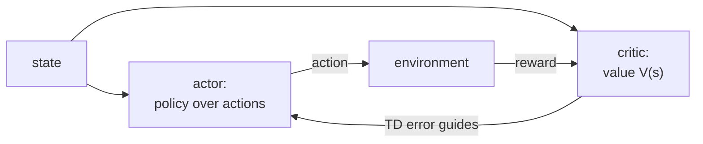

REINFORCE weights each action by the Monte Carlo return $G_t$, which is unbiased
but high variance and needs the episode to finish. The previous lesson showed that
subtracting a baseline helps, and that the best baseline is the state value
$V(s)$. **Actor-critic** methods take that idea to its conclusion: learn $V$ with a
second network and use it both to center the return and to bootstrap it. The result
is the standard policy-gradient template behind A2C, A3C, and PPO<FN n="2" />.

## Two networks: actor and critic

An actor-critic agent keeps two parameterized functions:

- The **actor** $\pi_\theta(a \mid s)$, the policy, updated by the policy gradient.
- The **critic** $V_\phi(s)$, an estimate of the state value, updated by
  semi-gradient TD as in the function-approximation lesson.

The critic supplies the baseline and the bootstrap; the actor uses the critic's
signal to decide which actions to make more likely.

## The advantage

The policy gradient with the value baseline weights $\nabla_\theta \log \pi_\theta(a\mid s)$
by $G_t - V(s_t)$. Replacing the Monte Carlo return $G_t$ by its bootstrapped
one-step estimate $r_{t+1} + \gamma V(s_{t+1})$ turns that weight into

$$
A(s_t, a_t) \approx r_{t+1} + \gamma V_\phi(s_{t+1}) - V_\phi(s_t) = \delta_t,
$$

the TD error. This quantity is the **advantage**: it measures how much better
action $a_t$ did than the policy's average behavior from $s_t$, since
$A^\pi(s,a) = Q^\pi(s,a) - V^\pi(s)$. A positive advantage means "this action beat
the baseline, make it more likely"; a negative one means the opposite. The
**advantage actor-critic** update is

$$
\theta \leftarrow \theta + \alpha_\theta\, \delta_t\, \nabla_\theta \log \pi_\theta(a_t \mid s_t), \qquad \phi \leftarrow \phi + \alpha_\phi\, \delta_t\, \nabla_\phi V_\phi(s_t).
$$

The same TD error $\delta_t$ drives both: it tells the critic how to correct its
value estimate and tells the actor which way to shift its action probabilities<FN ns="1, 2" />.

## The bias-variance dial, again

Using the one-step TD advantage $\delta_t$ is low variance but biased (it trusts
the imperfect critic after one step). Using the full Monte Carlo advantage
$G_t - V(s_t)$ is unbiased but high variance. These are the two ends of the same
axis from the TD lesson, now for the advantage. An $n$-step advantage sits between
them, and **generalized advantage estimation** averages over all $n$ at once.

## Generalized advantage estimation

GAE forms an exponentially weighted sum of future TD errors with a decay
$\lambda \in [0,1]$:

$$
A^{\text{GAE}(\gamma,\lambda)}_t = \sum_{l=0}^{\infty} (\gamma\lambda)^l\, \delta_{t+l}, \qquad \delta_{t+l} = r_{t+l+1} + \gamma V(s_{t+l+1}) - V(s_{t+l}).
$$

The two limits recover the endpoints exactly:

- **$\lambda = 0$**: only the $l = 0$ term survives, so
  $A^{\text{GAE}}_t = \delta_t$, the one-step (low-variance, biased) advantage.
- **$\lambda = 1$**: the weights become $\gamma^l$ and the sum **telescopes**.
  Writing out $\sum_l \gamma^l \delta_{t+l}$, the $+\gamma^{l+1} V(s_{t+l+1})$ in
  each term cancels the $-\gamma^{l+1} V(s_{t+l+1})$ in the following term, so all
  value terms collapse except the initial $-V(s_t)$, leaving
  $\sum_l \gamma^l r_{t+l+1} - V(s_t) = G_t - V(s_t)$, the Monte Carlo
  (unbiased, high-variance) advantage.

So $\lambda$ is a single knob from pure bootstrapping to pure sampling. In practice
$\lambda \approx 0.95$ keeps most of the variance reduction while accepting a small
bias. The advantages are computed in one backward pass via the recursion
$A_t = \delta_t + \gamma\lambda\, A_{t+1}$.



## Worked check: GAE interpolates between TD and Monte Carlo

Take a random trajectory with arbitrary rewards and value estimates, compute the
GAE advantages by the backward recursion at $\lambda = 0$ and $\lambda = 1$, and
confirm they match the TD error and the Monte Carlo advantage respectively.

```python
import numpy as np
rng = np.random.default_rng(2)

T, gamma = 8, 0.95
rewards = rng.normal(size=T)
V = rng.normal(size=T + 1)        # critic estimates; V[T] is the bootstrap at the end
V[T] = 0.0                        # treat end of trajectory as terminal

delta = rewards + gamma * V[1:] - V[:T]          # TD errors delta_t

def gae(lam):
    A, acc = np.zeros(T), 0.0
    for t in reversed(range(T)):
        acc = delta[t] + gamma * lam * acc       # A_t = delta_t + gamma*lam*A_{t+1}
        A[t] = acc
    return A

# Monte Carlo advantage G_t - V(s_t).
G, g = np.zeros(T), 0.0
for t in reversed(range(T)):
    g = rewards[t] + gamma * g
    G[t] = g
mc_adv = G - V[:T]

print("GAE(lambda=0) == TD error delta:", np.allclose(gae(0.0), delta))
print("GAE(lambda=1) == Monte Carlo advantage G - V:", np.allclose(gae(1.0), mc_adv))
```

At $\lambda = 0$ the GAE advantages equal the one-step TD errors and at
$\lambda = 1$ they equal the full Monte Carlo advantages, the two endpoints the
$\lambda$ dial slides between.

## Exercises

**Exercise 1.** A critic estimates $V_\phi(s_t) = 3$ and $V_\phi(s_{t+1}) = 5$.
The agent takes action $a_t$, receives reward $r_{t+1} = 1$, and uses
$\gamma = 0.9$. Compute the TD error $\delta_t$, which is the one-step advantage,
and state whether the actor should make $a_t$ more or less likely.

<details>
<summary>Solution</summary>

**Step 1.** The one-step advantage is the TD error
$\delta_t = r_{t+1} + \gamma V_\phi(s_{t+1}) - V_\phi(s_t)$:

$$
\delta_t = 1 + 0.9 \cdot 5 - 3 = 1 + 4.5 - 3 = 2.5.
$$

**Step 2.** The actor update is
$\theta \leftarrow \theta + \alpha_\theta\, \delta_t\, \nabla_\theta \log \pi_\theta(a_t \mid s_t)$.
With $\delta_t = 2.5 > 0$, the action did better than the critic's baseline value
of $s_t$, so the update raises $\log \pi_\theta(a_t \mid s_t)$: make $a_t$ more
likely. The same $\delta_t$ drives the critic toward the higher target $3 + 2.5 = 5.5$.

</details>

**Exercise 2.** Prove the $\lambda = 1$ limit of GAE telescopes to the Monte Carlo
advantage $G_t - V(s_t)$, where $G_t = \sum_{l \ge 0} \gamma^l r_{t+l+1}$.

<details>
<summary>Solution</summary>

**Step 1.** At $\lambda = 1$ the weights are $\gamma^l$, so

$$
A^{\text{GAE}(\gamma, 1)}_t = \sum_{l=0}^{\infty} \gamma^l \delta_{t+l}, \qquad \delta_{t+l} = r_{t+l+1} + \gamma V(s_{t+l+1}) - V(s_{t+l}).
$$

**Step 2.** Split each $\delta_{t+l}$ and group the value terms. The reward part
sums to $\sum_l \gamma^l r_{t+l+1} = G_t$. The value part is

$$
\sum_{l=0}^{\infty} \gamma^l \big(\gamma V(s_{t+l+1}) - V(s_{t+l})\big) = \sum_{l=0}^{\infty} \gamma^{l+1} V(s_{t+l+1}) - \sum_{l=0}^{\infty} \gamma^l V(s_{t+l}).
$$

**Step 3.** Reindex the first sum with $m = l + 1$: it becomes
$\sum_{m=1}^{\infty} \gamma^m V(s_{t+m})$. The second sum is
$\sum_{l=0}^{\infty} \gamma^l V(s_{t+l})$. They cancel term by term for all
$m = l \ge 1$, leaving only the $l = 0$ term of the second sum, $-V(s_t)$.

**Step 4.** Adding the reward part back:

$$
A^{\text{GAE}(\gamma, 1)}_t = G_t - V(s_t),
$$

the Monte Carlo advantage. The intermediate value estimates telescope away, which
is why $\lambda = 1$ trusts only sampled rewards (unbiased, high variance).

</details>

**Exercise 3 (code).** Implement GAE by the backward recursion
$A_t = \delta_t + \gamma\lambda A_{t+1}$ and verify two endpoints on a random
trajectory: at $\lambda = 0$ it equals the TD errors, and at $\lambda = 0.5$ each
advantage equals the explicit finite-horizon sum $\sum_l (\gamma\lambda)^l \delta_{t+l}$.

<details>
<summary>Solution</summary>

```python
import numpy as np
rng = np.random.default_rng(3)

T, gamma = 6, 0.95
delta = rng.normal(size=T)                  # arbitrary TD errors

def gae_recursion(lam):
    A, acc = np.zeros(T), 0.0
    for t in reversed(range(T)):
        acc = delta[t] + gamma * lam * acc
        A[t] = acc
    return A

def gae_explicit(lam):                       # direct sum sum_l (gl)^l delta_{t+l}
    A = np.zeros(T)
    for t in range(T):
        A[t] = sum((gamma * lam) ** l * delta[t + l] for l in range(T - t))
    return A

assert np.allclose(gae_recursion(0.0), delta)            # lambda=0 -> TD error
assert np.allclose(gae_recursion(0.5), gae_explicit(0.5))  # recursion == sum
print("lambda=0 equals TD error:", np.allclose(gae_recursion(0.0), delta))
print("recursion matches explicit sum at lambda=0.5:",
      np.allclose(gae_recursion(0.5), gae_explicit(0.5)))
```

The backward recursion reproduces the TD errors at $\lambda = 0$ and matches the
explicit exponentially-weighted sum at intermediate $\lambda$, so the one-pass
recursion computes the full GAE without ever forming the sum directly.

</details>

Actor-critic with GAE gives a low-variance gradient, but nothing stops a single
update from changing the policy so much that performance collapses. The next lesson
constrains the step size: trust-region methods and PPO keep each policy update
close to the last.

<Footnotes>
  <FNItem n="1">**Sutton, R. S., & Barto, A. G.** (2018). *Reinforcement Learning: An Introduction* (2nd ed.). MIT Press. Actor-critic methods (Ch. 13).</FNItem>
  <FNItem n="2">**Mnih, V., et al.** (2016). "Asynchronous methods for deep reinforcement learning". *ICML*. Introduces A3C, the deep advantage actor-critic. [arXiv:1602.01783](https://arxiv.org/abs/1602.01783)</FNItem>
</Footnotes>
