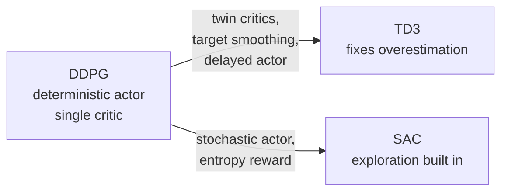

Q-learning's target $\max_{a'} Q(s', a')$ is a search over actions. With finitely
many actions that is one $\arg\max$; with a continuous action vector (a robot's
joint torques) it is an optimization inside every update, which is intractable.
The off-policy continuous-control family avoids it by learning a separate actor
that *outputs* the maximizing action, then refining that idea to fix the
overestimation and exploration problems that arise.

## DDPG: a deterministic actor for the max

**Deep deterministic policy gradient** (DDPG) keeps a critic $Q_\phi(s,a)$ and adds
a deterministic actor $\mu_\theta(s)$ whose job is to produce the action that
maximizes the critic. Then $\max_{a'} Q(s',a')$ is approximated by
$Q_\phi(s', \mu_\theta(s'))$, no search needed. The critic trains by the usual
DQN-style bootstrap with target networks; the actor trains to maximize the critic's
value at its own action via the **deterministic policy gradient**, the chain rule
through the critic:

$$
\nabla_\theta J = \mathbb{E}_s\big[ \nabla_a Q_\phi(s, a)\big|_{a = \mu_\theta(s)}\; \nabla_\theta \mu_\theta(s) \big].
$$

In words: ask the critic which direction in action space increases value
($\nabla_a Q$), then move the actor's parameters to shift its output that way
($\nabla_\theta \mu$). DDPG is off-policy (replay buffer, target networks) and
explores by adding noise to the actor's output. It works but is brittle, mostly
because the critic overestimates, exactly the maximization bias from the
Double-DQN lesson, now feeding the actor.

## TD3: three fixes for a stable critic

**Twin delayed DDPG** (TD3) adds three corrections:

1. **Clipped double Q-learning.** Keep two critics $Q_{\phi_1}, Q_{\phi_2}$ and use
   the **smaller** of the two in the target,
   $y = r + \gamma \min_{i} Q_{\phi_i^-}(s', \tilde{a})$. Taking the min
   counteracts the upward bias of bootstrapped value estimates: a critic that
   happens to overestimate is overruled by the other.
2. **Target policy smoothing.** Add clipped noise to the target action
   $\tilde{a} = \mu_{\theta^-}(s') + \mathrm{clip}(\epsilon, -c, c)$, so the critic
   cannot exploit a sharp, spurious peak in its own value surface. This regularizes
   the target to be smooth in the action.
3. **Delayed policy updates.** Update the actor (and target networks) less often
   than the critic, so the actor chases a critic that has had time to settle.

The headline fix is the twin-critic minimum, which converts DDPG's systematic
overestimation into a mild, harmless underestimation.

## SAC: maximize reward and entropy

**Soft actor-critic** (SAC) takes a different angle on exploration. Instead of
injecting external action noise, it changes the objective to reward **entropy**, so
a high-entropy (more random, more exploratory) policy is intrinsically preferred
whenever it does not cost return:

$$
J(\pi) = \mathbb{E}\Big[ \sum_t \gamma^t \big( r_{t+1} + \alpha\, \mathcal{H}(\pi(\cdot \mid s_t)) \big) \Big],
$$

where $\mathcal{H}$ is the [entropy](A2/entropy) and the temperature $\alpha$ trades
reward against exploration (and is usually auto-tuned). SAC uses a **stochastic**
actor, reparameterized so the policy gradient flows through sampled actions, plus
twin critics as in TD3. The entropy term keeps exploration alive throughout
training and makes SAC one of the most sample-efficient and robust continuous-
control algorithms.



## Worked check: the deterministic policy gradient finds the optimal action map

Take a contextual continuous bandit with a known differentiable critic
$Q(s,a) = -(a - 0.5\,s)^2$, whose optimal action map is $a^*(s) = 0.5\,s$. Train a
linear deterministic actor $\mu_w(s) = w\,s$ by the deterministic policy gradient
(ascending the critic's action-gradient) and confirm it recovers $w = 0.5$, so the
actor reproduces the optimal action at every state.

```python
import numpy as np
rng = np.random.default_rng(0)

# Known critic Q(s,a) = -(a - 0.5 s)^2; optimal action a*(s) = 0.5 s.
def dQ_da(s, a):
    return -2.0 * (a - 0.5 * s)            # critic gradient w.r.t. the action

w, lr = 0.0, 0.05                          # linear actor mu(s) = w s
for _ in range(4000):
    s = rng.normal(size=256)
    a = w * s                              # actor's chosen action
    grad = np.mean(dQ_da(s, a) * s)        # dQ/da * dmu/dw, averaged over states
    w += lr * grad

s_test = np.linspace(-2, 2, 5)
print("learned actor slope w:", round(w, 4), " optimal: 0.5")
print("actor a(s):   ", np.round(w * s_test, 3))
print("optimal a*(s):", np.round(0.5 * s_test, 3))
```

The actor's slope converges to $0.5$ and its action map lands exactly on
$a^*(s) = 0.5\,s$, ascending the critic's gradient with no search over actions,
which is the deterministic policy gradient that DDPG, TD3, and SAC all build on.

This closes the model-free toolbox: value-based, policy-gradient, and continuous-
control methods all learn purely from sampled transitions. The next subsection asks
whether learning a *model* of the environment can make the agent far more
sample-efficient, starting with Dyna-Q.
