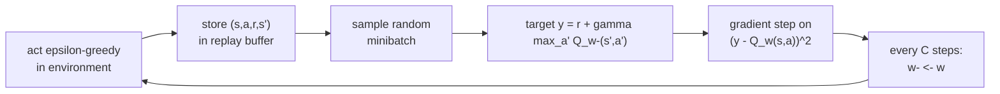

Semi-gradient Q-learning with a neural network sits squarely inside the deadly
triad: approximation, bootstrapping, and off-policy data, all three at once. Run
it naively on Atari pixels and the weights diverge. The 2015 **deep Q-network**
(DQN) made it work, not by removing any leg of the triad but by re-engineering the
two things that make the triad dangerous: correlated data and a moving target. Two
mechanisms, experience replay and a target network, were enough to learn Atari
from raw pixels.

## The DQN objective

Parameterize the action-value $Q_w(s,a)$ as a neural network mapping a state to one
output per action. The loss is the squared TD error of the Bellman optimality
equation, sampled over transitions $(s, a, r, s')$:

$$
L(w) = \mathbb{E}_{(s,a,r,s')}\Big[\big(\underbrace{r + \gamma \max_{a'} Q_{w^-}(s', a')}_{\text{target } y} - Q_w(s, a)\big)^2\Big].
$$

The gradient is the semi-gradient from the previous lesson, computed by
[backprop](D1/backprop) through $Q_w(s,a)$ only, with the target $y$ held fixed.
Two design choices, encoded in that formula, do the stabilizing.

## Experience replay

A naive agent updates on each transition the instant it occurs. Consecutive
transitions are highly correlated (the agent moves smoothly through state space),
which violates the i.i.d. assumption behind stochastic gradient descent and lets
the network overfit to whatever it is seeing right now, then forget it.

**Experience replay** stores transitions $(s,a,r,s')$ in a buffer and trains on
*random minibatches* sampled from it. This does two things: it breaks the temporal
correlation, so each gradient step sees a decorrelated batch, and it reuses each
transition many times, improving data efficiency. The buffer is a sliding window
of the most recent transitions.

## The target network

In plain semi-gradient Q-learning the target $r + \gamma \max_{a'} Q_w(s',a')$ uses
the *same* weights $w$ being updated. Every gradient step moves the prediction and
the target together, a feedback loop that amplifies errors, the moving-target
problem.

The fix is a **target network**: a second copy of the weights $w^-$ used only to
compute the target. It is held fixed for $C$ steps, then refreshed to the current
$w$. The notation $Q_{w^-}$ in the loss is exactly this: the bootstrap target is
computed against frozen weights, so over each window of $C$ steps the regression
has a stationary label and behaves like supervised learning. Slowing the target
down does not remove the triad, but it stops the target from chasing the
prediction tick for tick, which is what made divergence likely.

## The training loop



Putting it together: act $\varepsilon$-greedily with respect to $Q_w$, store each
transition, sample a minibatch, regress $Q_w(s,a)$ toward the frozen-target label,
and periodically copy $w$ into $w^-$.

## Worked check: replay + target net learn a control policy

A faithful DQN uses a neural network and PyTorch, which the in-browser runtime
cannot load. The same two mechanisms work with a *linear* value head over fixed
features, which numpy can run, so the check below keeps the full DQN loop, replay
buffer and target network included, and swaps only the network for a linear
$Q_w(s,a) = w_a^\top \phi(s)$. The task is a continuous 1D corridor where the
optimal policy always moves right toward the goal.

```python
import numpy as np
rng = np.random.default_rng(0)

# Continuous corridor: position in [0,1.5], start 0.0, goal at >=1.0.
# Actions: 0 = left (-0.08), 1 = right (+0.08). Reward -1 per step, 0 at goal.
centers = np.linspace(0, 1, 11)
sigma = 0.08
def feat(x):
    f = np.exp(-((x - centers) ** 2) / (2 * sigma ** 2))
    return np.append(f, 1.0)                       # RBF features + bias
d = len(centers) + 1

def step(x, a):
    x2 = np.clip(x + (0.08 if a == 1 else -0.08), 0.0, 1.5)
    done = x2 >= 1.0
    return x2, (0.0 if done else -1.0), done

W = np.zeros((2, d))                                # Q(s,a) = W[a] . feat(s)
W_targ = W.copy()                                   # the frozen target network
def Q(x, Wm): return np.array([Wm[a] @ feat(x) for a in range(2)])

buf, alpha, gamma, eps, C, t = [], 0.05, 0.98, 0.2, 200, 0
for ep in range(800):
    x = 0.0
    for _ in range(60):
        a = rng.integers(2) if rng.random() < eps else int(np.argmax(Q(x, W)))
        x2, r, done = step(x, a)
        buf.append((x, a, r, x2, done))
        if len(buf) > 5000: buf.pop(0)
        if len(buf) >= 32:                          # minibatch replay update
            for j in rng.integers(0, len(buf), size=32):
                xs, as_, rs, x2s, ds = buf[j]
                target = rs + (0.0 if ds else gamma * np.max(Q(x2s, W_targ)))
                W[as_] += alpha * (target - W[as_] @ feat(xs)) * feat(xs)
        t += 1
        if t % C == 0: W_targ = W.copy()            # refresh target network
        x = x2
        if done: break

x, steps, acts = 0.0, 0, []
for _ in range(60):
    a = int(np.argmax(Q(x, W))); acts.append(a)
    x, r, done = step(x, a); steps += 1
    if done: break
print("greedy policy always moves right:", all(a == 1 for a in acts))
print("steps to goal:", steps, " optimal:", int(np.ceil(1.0 / 0.08)))
```

The greedy policy learned from replayed, target-network-stabilized updates moves
right at every position and reaches the goal in the optimal number of steps. The
only change to make this a true DQN is to replace the linear $W$ with a network
and the manual update with a backprop step; replay and the target network stay
exactly as written.

DQN learns good policies but systematically overestimates action values, and its
single value head wastes effort in states where the action barely matters. The
next lesson fixes both with Double, Dueling, and Prioritized DQN, the components
that compose Rainbow.
