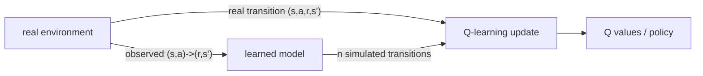

Model-free Q-learning learns one thing from each real step: a single value update.
Real steps are expensive (a robot moving, a game played), so squeezing more
learning out of each is valuable. If the agent also builds a **model** of the
environment, it can replay remembered transitions in its head, doing many extra
value updates between real steps. **Dyna-Q** is the minimal architecture that does
this, and it makes the model-based versus model-free split concrete.

## Learning a model from experience

A **model** predicts the consequences of actions: given $(s, a)$, it returns the
reward $r$ and next state $s'$. In a deterministic environment the model is just a
table that memorizes the last observed outcome of each $(s,a)$,

$$
\text{Model}(s, a) \;\mapsto\; (r, s'),
$$

filled in as the agent experiences transitions. (Stochastic environments store
counts and sample, but the deterministic case carries the idea.) This is **direct**
model learning: supervised memorization of observed dynamics, no planning involved
yet.

## Planning as replayed updates

The key realization is that a Q-learning update does not care whether its
transition $(s, a, r, s')$ came from the real environment or from the model. Both
produce the same kind of TD update. **Planning** in Dyna-Q is exactly this: sample
a previously observed $(s, a)$, query the model for its $(r, s')$, and apply a
standard Q-learning update as if the transition had just happened.



## The Dyna-Q loop

Each real step drives both the model and a burst of planning:

1. **Act and learn.** In state $s$, pick $a$ ($\varepsilon$-greedy in $Q$), execute
   it, observe $(r, s')$, and apply the Q-learning update.
2. **Update the model.** Store $\text{Model}(s,a) \leftarrow (r, s')$.
3. **Plan.** Repeat $n$ times: sample a random previously seen $(s, a)$, look up
   $(r, s') = \text{Model}(s,a)$, and apply the same Q-learning update.

The planning parameter $n$ is the dial between pure model-free ($n = 0$, plain
Q-learning) and heavy planning ($n$ large). With $n > 0$, a single real transition
that first reaches the goal can be propagated backward through the whole visited
state space in one batch of planning steps, instead of waiting for many real
episodes to carry the signal back one step at a time. That is the source of the
sample-efficiency gain.

## Worked check: planning slashes the real steps needed

Run Dyna-Q on a small walled maze, once with $n = 0$ (model-free Q-learning) and
once with $n = 50$ planning steps per real step. Measure the average number of real
steps per episode over early episodes: the planning agent should reach near the
optimal path length far sooner, because it reuses each real transition dozens of
times.

```python
import numpy as np
rng = np.random.default_rng(0)

H, W = 6, 9
walls = {(1,2),(2,2),(3,2),(4,5),(0,7),(1,7),(2,7)}
start, goal = (2,0), (0,8)
moves = {0:(-1,0), 1:(1,0), 2:(0,-1), 3:(0,1)}
def step(s, a):
    r, c = s; dr, dc = moves[a]
    nr, nc = min(max(r+dr,0),H-1), min(max(c+dc,0),W-1)
    if (nr, nc) in walls: nr, nc = r, c          # walls block movement
    ns = (nr, nc)
    return ns, (1.0 if ns == goal else 0.0), ns == goal

def greedy(Q, s):
    qs = np.array([Q.get((s,k), 0.0) for k in range(4)])
    return int(rng.choice(np.flatnonzero(qs == qs.max())))   # random tie-break

def run(n_plan, episodes=50, alpha=0.1, gamma=0.95, eps=0.1):
    Q, model, per_ep = {}, {}, []
    q = lambda s, a: Q.get((s,a), 0.0)
    for ep in range(episodes):
        s, steps = start, 0
        while s != goal and steps < 8000:
            a = rng.integers(4) if rng.random() < eps else greedy(Q, s)
            ns, r, done = step(s, a)
            Q[(s,a)] = q(s,a) + alpha*(r + gamma*max(q(ns,k) for k in range(4)) - q(s,a))
            model[(s,a)] = (r, ns)
            keys = list(model.keys())
            for _ in range(n_plan):                # planning: replay model transitions
                ps, pa = keys[rng.integers(len(keys))]
                pr, pns = model[(ps,pa)]
                Q[(ps,pa)] = q(ps,pa) + alpha*(pr + gamma*max(q(pns,k) for k in range(4)) - q(ps,pa))
            s, steps = ns, steps + 1
        per_ep.append(steps)
    return per_ep

q0, q50 = run(0), run(50)
print("optimal path length:", 2 + 8)
print("plain Q-learning, avg real steps/episode (ep 2-10):", round(np.mean(q0[1:10]), 1))
print("Dyna-Q n=50,      avg real steps/episode (ep 2-10):", round(np.mean(q50[1:10]), 1))
```

Plain Q-learning still wanders for hundreds of steps per episode while Dyna-Q has
already collapsed to near the optimal path length, learning the same task from far
fewer real interactions because planning reused every transition many times.

Dyna-Q plans by replaying one-step model lookups. When the model is a perfect
simulator and the action space is large, a smarter use of the model is to search
forward through it. The next lesson does that with Monte Carlo tree search and the
self-play loop of AlphaZero.
