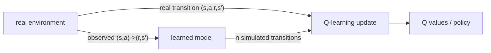

Model-free Q-learning learns one thing from each real step: a single value update.
Real steps are expensive (a robot moving, a game played), so squeezing more
learning out of each is valuable. If the agent also builds a **model** of the
environment, it can replay remembered transitions in its head, doing many extra
value updates between real steps. **Dyna-Q** is the minimal architecture that does
this, and it makes the model-based versus model-free split concrete<FN ns="1, 2" />.

## Learning a model from experience

A **model** predicts the consequences of actions: given $(s, a)$, it returns the
reward $r$ and next state $s'$. In a deterministic environment the model is just a
table that memorizes the last observed outcome of each $(s,a)$,

$$
\text{Model}(s, a) \;\mapsto\; (r, s'),
$$

filled in as the agent experiences transitions. (Stochastic environments store
counts and sample, but the deterministic case carries the idea.) This is **direct**
model learning: supervised memorization of observed dynamics, no planning involved
yet.

## Planning as replayed updates

The key realization is that a Q-learning update does not care whether its
transition $(s, a, r, s')$ came from the real environment or from the model. Both
produce the same kind of TD update. **Planning** in Dyna-Q is exactly this: sample
a previously observed $(s, a)$, query the model for its $(r, s')$, and apply a
standard Q-learning update as if the transition had just happened<FN n="2" />.



## The Dyna-Q loop

Each real step drives both the model and a burst of planning:

1. **Act and learn.** In state $s$, pick $a$ ($\varepsilon$-greedy in $Q$), execute
   it, observe $(r, s')$, and apply the Q-learning update.
2. **Update the model.** Store $\text{Model}(s,a) \leftarrow (r, s')$.
3. **Plan.** Repeat $n$ times: sample a random previously seen $(s, a)$, look up
   $(r, s') = \text{Model}(s,a)$, and apply the same Q-learning update.

The planning parameter $n$ is the dial between pure model-free ($n = 0$, plain
Q-learning) and heavy planning ($n$ large). With $n > 0$, a single real transition
that first reaches the goal can be propagated backward through the whole visited
state space in one batch of planning steps, instead of waiting for many real
episodes to carry the signal back one step at a time. That is the source of the
sample-efficiency gain.

## Worked check: planning slashes the real steps needed

Run Dyna-Q on a small walled maze, once with $n = 0$ (model-free Q-learning) and
once with $n = 50$ planning steps per real step. Measure the average number of real
steps per episode over early episodes: the planning agent should reach near the
optimal path length far sooner, because it reuses each real transition dozens of
times.

```python
import numpy as np
rng = np.random.default_rng(0)

H, W = 6, 9
walls = {(1,2),(2,2),(3,2),(4,5),(0,7),(1,7),(2,7)}
start, goal = (2,0), (0,8)
moves = {0:(-1,0), 1:(1,0), 2:(0,-1), 3:(0,1)}
def step(s, a):
    r, c = s; dr, dc = moves[a]
    nr, nc = min(max(r+dr,0),H-1), min(max(c+dc,0),W-1)
    if (nr, nc) in walls: nr, nc = r, c          # walls block movement
    ns = (nr, nc)
    return ns, (1.0 if ns == goal else 0.0), ns == goal

def greedy(Q, s):
    qs = np.array([Q.get((s,k), 0.0) for k in range(4)])
    return int(rng.choice(np.flatnonzero(qs == qs.max())))   # random tie-break

def run(n_plan, episodes=50, alpha=0.1, gamma=0.95, eps=0.1):
    Q, model, per_ep = {}, {}, []
    q = lambda s, a: Q.get((s,a), 0.0)
    for ep in range(episodes):
        s, steps = start, 0
        while s != goal and steps < 8000:
            a = rng.integers(4) if rng.random() < eps else greedy(Q, s)
            ns, r, done = step(s, a)
            Q[(s,a)] = q(s,a) + alpha*(r + gamma*max(q(ns,k) for k in range(4)) - q(s,a))
            model[(s,a)] = (r, ns)
            keys = list(model.keys())
            for _ in range(n_plan):                # planning: replay model transitions
                ps, pa = keys[rng.integers(len(keys))]
                pr, pns = model[(ps,pa)]
                Q[(ps,pa)] = q(ps,pa) + alpha*(pr + gamma*max(q(pns,k) for k in range(4)) - q(ps,pa))
            s, steps = ns, steps + 1
        per_ep.append(steps)
    return per_ep

q0, q50 = run(0), run(50)
print("optimal path length:", 2 + 8)
print("plain Q-learning, avg real steps/episode (ep 2-10):", round(np.mean(q0[1:10]), 1))
print("Dyna-Q n=50,      avg real steps/episode (ep 2-10):", round(np.mean(q50[1:10]), 1))
```

Plain Q-learning still wanders for hundreds of steps per episode while Dyna-Q has
already collapsed to near the optimal path length, learning the same task from far
fewer real interactions because planning reused every transition many times.

## Exercises

**Exercise 1.** A deterministic chain has states $s_0 \to s_1 \to s_2 \to G$,
each transition taken by action $a$, with reward $0$ on every step except
$r(s_2, a) = 1$ on entering the goal $G$ (terminal, $V(G) = 0$). Use
$\alpha = 1$, $\gamma = 0.9$, and all $Q$ initialized to $0$. The agent runs one
real episode $s_0 \to s_1 \to s_2 \to G$, applying the Q-learning update at each
real step. Compute $Q(s_0, a)$, $Q(s_1, a)$, $Q(s_2, a)$ after that one episode,
then show how three planning sweeps (replaying the three stored transitions in
the order $(s_2, a), (s_1, a), (s_0, a)$) propagate the goal value back to
$s_0$.

<details>
<summary>Solution</summary>

**Step 1.** The Q-learning update with $\alpha = 1$ is
$Q(s,a) \leftarrow r + \gamma \max_{a'} Q(s', a')$. During the real episode the
agent updates each visited transition once, front to back.

**Step 2.** Real updates in order. At $(s_0, a) \to s_1$:
$Q(s_0, a) = 0 + 0.9 \cdot \max_{a'} Q(s_1, a') = 0$, since $Q(s_1, \cdot) = 0$
still. At $(s_1, a) \to s_2$: $Q(s_1, a) = 0 + 0.9 \cdot 0 = 0$. At
$(s_2, a) \to G$: $Q(s_2, a) = 1 + 0.9 \cdot 0 = 1$. Only the last state learned
anything; the reward signal sits one step back from the goal.

**Step 3.** Planning replays stored model transitions. Sweep $(s_2, a)$:
$Q(s_2, a) = 1 + 0.9 \cdot 0 = 1$ (unchanged). Sweep $(s_1, a)$:
$Q(s_1, a) = 0 + 0.9 \cdot \max_{a'} Q(s_2, a') = 0.9 \cdot 1 = 0.9$. Sweep
$(s_0, a)$: $Q(s_0, a) = 0 + 0.9 \cdot Q(s_1, a) = 0.9 \cdot 0.9 = 0.81$.

**Step 4.** After three planning sweeps $Q(s_0, a) = 0.81$, $Q(s_1, a) = 0.9$,
$Q(s_2, a) = 1$, matching the true discounted values $\gamma^2, \gamma^1,
\gamma^0$. One real episode plus a single backward planning pass carried the
goal signal the whole way to the start, work that pure Q-learning would spread
across three separate episodes.

</details>

**Exercise 2.** In Dyna-Q the planning step samples a *previously observed*
$(s, a)$ uniformly at random. Explain why this uniform sampling wastes
computation on a large maze just after the goal is first reached, and describe
the one change (prioritized sweeping) that fixes it, stating the rule for which
$(s, a)$ pairs deserve a planning update.

<details>
<summary>Solution</summary>

**Step 1.** Right after the first goal-reaching transition, exactly one stored
$Q$ value has changed: the predecessor of the goal. Every other $Q(s, a)$ is
still at its initial value, and replaying those transitions changes nothing,
because their target $r + \gamma \max_{a'} Q(s', a')$ has not moved.

**Step 2.** Uniform sampling over all observed pairs spends most of its $n$
planning updates on these zero-effect transitions. On a maze with hundreds of
visited pairs, only the handful that lead into the recently changed state would
actually update; the rest are wasted.

**Step 3.** Prioritized sweeping fixes this by keeping a queue ordered by the
magnitude of the would-be TD error. When a state's value changes by more than a
threshold, its *predecessors* (the $(s, a)$ whose model points to it) are pushed
onto the queue. Planning pops the highest-priority pair, updates it, and if that
update moves its value, enqueues its predecessors in turn.

**Step 4.** The result is that planning effort flows backward from the goal
along exactly the transitions whose targets just changed, instead of being
sprinkled uniformly. The same number of planning updates propagates the signal
much farther.

</details>

**Exercise 3 (code).** Run Dyna-Q on the deterministic chain of Exercise 1
($s_0 \to s_1 \to s_2 \to G$, reward $1$ only on entering $G$, $\gamma = 0.9$,
$\alpha = 1$). Drive a single real episode, then perform planning by repeatedly
sampling stored transitions at random. Verify that after enough planning sweeps
the learned $Q(s_0, a)$ converges to the analytic $\gamma^2 = 0.81$ even though
only one real episode was run.

<details>
<summary>Solution</summary>

```python
import numpy as np
rng = np.random.default_rng(0)

gamma, alpha = 0.9, 1.0
# states 0,1,2 with single action a=0; entering goal (state 3) pays 1.
nxt = {0: 1, 1: 2, 2: 3}                      # deterministic transitions
rew = {0: 0.0, 1: 0.0, 2: 1.0}               # reward on entering next state
Q = np.zeros((3, 1))                          # Q[s, a]
model = {}

def update(s):
    s2 = nxt[s]
    target = rew[s] + (gamma * Q[s2, 0] if s2 < 3 else 0.0)   # goal is terminal
    Q[s, 0] += alpha * (target - Q[s, 0])

# one real episode, front to back, recording the model
for s in (0, 1, 2):
    update(s)
    model[s] = (rew[s], nxt[s])

# planning: replay random stored transitions
seen = list(model.keys())
for _ in range(500):
    s = seen[rng.integers(len(seen))]
    update(s)

assert np.isclose(Q[0, 0], gamma**2)          # 0.81
assert np.isclose(Q[1, 0], gamma**1)          # 0.9
assert np.isclose(Q[2, 0], 1.0)
print("Q(s0,a) =", round(float(Q[0, 0]), 4), "  target gamma^2 =", round(gamma**2, 4))
```

Planning replays the three stored transitions until the goal value has
propagated all the way back to $s_0$, giving $Q(s_0, a) = 0.81$ from a single
real episode, the sample-efficiency gain Dyna-Q buys by reusing its model.

</details>

Dyna-Q plans by replaying one-step model lookups. When the model is a perfect
simulator and the action space is large, a smarter use of the model is to search
forward through it. The next lesson does that with Monte Carlo tree search and the
self-play loop of AlphaZero.

<Footnotes>
  <FNItem n="1">**Sutton, R. S., & Barto, A. G.** (2018). *Reinforcement Learning: An Introduction* (2nd ed.). MIT Press. Chapter 8 develops Dyna and the unification of planning and learning.</FNItem>
  <FNItem n="2">**Sutton, R. S.** (1990). "Integrated architectures for learning, planning, and reacting based on approximating dynamic programming (Dyna)". *ICML*. The original Dyna architecture.</FNItem>
</Footnotes>
