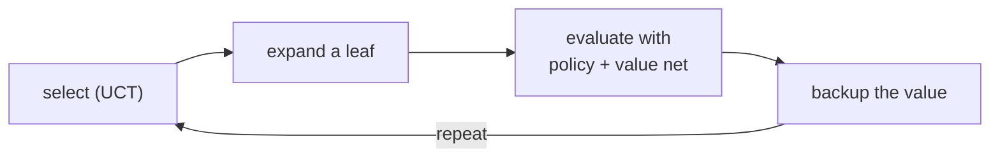

When the model is a perfect simulator, like the rules of Go or chess, the agent
can look ahead by searching the game tree. The tree is astronomically large, so
exhaustive search is out. **Monte Carlo tree search** (MCTS) grows a small,
asymmetric tree biased toward promising lines, and AlphaZero replaces its hand-built
heuristics with neural networks trained entirely by self-play.

## The four phases of MCTS

MCTS builds a search tree one simulation at a time. Each node is a state; each
holds a visit count $N$ and an accumulated value $W$ (with mean $Q = W/N$). One
simulation runs four phases:

1. **Selection.** From the root, descend by repeatedly choosing the child that
   maximizes a selection rule, until reaching a node with unexpanded children.
2. **Expansion.** Add one new child for an untried action.
3. **Simulation (rollout).** From the new node, play to the end with a default
   (e.g. random) policy and observe the outcome.
4. **Backpropagation.** Walk back up the path, incrementing each node's $N$ and
   adding the outcome to its $W$, from the perspective of the player who moved into
   that node.

After a budget of simulations, the agent plays the root's **most visited** child;
visit count is a robust choice because good moves get explored the most.

## UCT: bandit selection in the tree

The selection rule is the crux. Treat the children of a node as arms of a
[multi-armed bandit](H4/bandits-exploration): pick the child that balances high
value against being under-explored. **UCT** (upper confidence bounds for trees)
applies the UCB1 formula at each node,

$$
\text{UCT}(s, a) = \underbrace{Q(s, a)}_{\text{exploit}} + c\,\underbrace{\sqrt{\frac{\ln N(s)}{N(s, a)}}}_{\text{explore}},
$$

where $N(s)$ is the parent's visit count and $N(s,a)$ the child's. The first term
favors moves that have done well; the second inflates the score of rarely tried
moves and shrinks as they are visited, so the search concentrates on good lines
without ever fully abandoning the rest. The constant $c$ sets the trade-off.

## AlphaZero: learned priors and values

MCTS with random rollouts is strong but slow: random play is a noisy value
estimate. **AlphaZero** replaces the two heuristic pieces of MCTS with a single
neural network $f_\theta(s) = (\mathbf{p}, v)$<FN n="1" /> that outputs a **policy prior**
$\mathbf{p}$ over moves and a **value** $v \in [-1, 1]$ estimating the game outcome
from $s$. Two changes follow:

- The rollout is gone. The value $v$ from the network replaces the random playout,
  so each leaf is evaluated in one network call.
- Selection uses **PUCT**, which folds the prior into the exploration term:
  $Q(s,a) + c\, \mathbf{p}(a)\, \frac{\sqrt{N(s)}}{1 + N(s,a)}$, so the network's
  prior guides which moves are explored first.

**The self-play loop.** AlphaZero learns with no human data. It plays games against
itself using MCTS; the search's visit distribution $\boldsymbol{\pi}$ at each move
is a *better* policy than the raw network prior (search improved it), and the game
result $z$ is a value target. The network is trained to match both:

$$
\ell(\theta) = (z - v)^2 - \boldsymbol{\pi}^\top \log \mathbf{p} + \lambda \lVert \theta \rVert^2.
$$

This is policy iteration in disguise: MCTS is the policy-improvement operator (it
turns the current network into a stronger search policy), and the network training
is the policy-evaluation-and-distillation step that folds the improvement back in.
The two reinforce each other from random initialization up to superhuman play<FN n="2" />.



## Worked check: bare MCTS finds wins and never loses at tic-tac-toe

Implement UCT MCTS with random rollouts (the pre-AlphaZero version) on
tic-tac-toe. Verify two things: handed a position with an immediate winning move,
it returns that move; and playing as X against a random opponent over many games,
it never loses, because tic-tac-toe is a draw under reasonable play and MCTS finds
at least that.

```python
import numpy as np, math
rng = np.random.default_rng(0)

WINS = [(0,1,2),(3,4,5),(6,7,8),(0,3,6),(1,4,7),(2,5,8),(0,4,8),(2,4,6)]
def winner(b):
    for a,c,d in WINS:
        if b[a] != 0 and b[a] == b[c] == b[d]: return b[a]
    return 0
def moves(b): return [i for i in range(9) if b[i] == 0]
def terminal(b): return winner(b) != 0 or not moves(b)

def rollout(b, player):                       # random playout to the end
    b = list(b)
    while not terminal(b):
        b[int(rng.choice(moves(b)))] = player; player = -player
    return winner(b)

def mcts(root, player, iters=200, c=1.4):
    N, Q, kids = {}, {}, {}                    # visit counts, mean-value sums, children
    key = lambda b, p: (tuple(b), p)
    def expand(b, p):
        kids[key(b,p)] = []
        for m in moves(b):
            nb = list(b); nb[m] = p
            kids[key(b,p)].append((m, tuple(nb)))
            N[key(nb,-p)] = 0; Q[key(nb,-p)] = 0.0
    N[key(root,player)] = 0; Q[key(root,player)] = 0.0; expand(root, player)
    for _ in range(iters):
        b, p, path = list(root), player, []
        while key(b,p) in kids and not terminal(b):          # selection by UCT
            parentN = max(N[key(b,p)], 1)
            def uct(it):
                _, nb = it; k = key(nb, -p)
                if N[k] == 0: return float("inf")
                return Q[k]/N[k] + c*math.sqrt(math.log(parentN)/N[k])
            m, nb = max(kids[key(b,p)], key=uct)
            path.append((key(b,p), key(nb,-p))); b, p = list(nb), -p
        if not terminal(b) and key(b,p) not in kids:         # expansion
            expand(b, p)
        w = rollout(b, p)                                    # simulation
        for parent, child in path:                           # backpropagation
            mover = parent[1]
            N[child] += 1
            Q[child] += 1.0 if w == mover else (-1.0 if w == -mover else 0.0)
        N[key(root,player)] += 1
    return max(kids[key(root,player)], key=lambda it: N[key(it[1], -player)])[0]

# (a) immediate winning move: X has 0 and 1, playing 2 completes the top row.
board = [1,1,0, 0,-1,0, 0,-1,0]
print("winning move found (expect 2):", mcts(board, 1, iters=1500))

# (b) MCTS (X) vs random (O) over 100 games: count losses.
losses = 0
for _ in range(100):
    b, p = [0]*9, 1
    while not terminal(b):
        m = mcts(b, 1, iters=200) if p == 1 else int(rng.choice(moves(b)))
        b[m] = p; p = -p
    losses += winner(b) == -1
print("MCTS losses to random over 100 games:", losses)
```

MCTS returns the immediate win and loses zero games to random play, all from a
generic tree search with random rollouts and the UCT rule, no game-specific
knowledge beyond the rules.

MCTS and AlphaZero need the true rules as a simulator. The next lesson removes even
that: MuZero learns its own latent model of the dynamics and plans inside it,
searching a game whose rules it was never told.

<Footnotes>
  <FNItem n="1">**Silver, D., et al.** (2017). "Mastering the game of Go without human knowledge (AlphaGo Zero)". *Nature*, 550, 354-359. [doi:10.1038/nature24270](https://doi.org/10.1038/nature24270). Introduces the single policy-value network and tabula-rasa self-play.</FNItem>
  <FNItem n="2">**Silver, D., et al.** (2018). "A general reinforcement learning algorithm that masters chess, shogi, and Go through self-play (AlphaZero)". *Science*, 362(6419), 1140-1144. [doi:10.1126/science.aar6404](https://doi.org/10.1126/science.aar6404). Generalizes the self-play loop across games.</FNItem>
</Footnotes>
