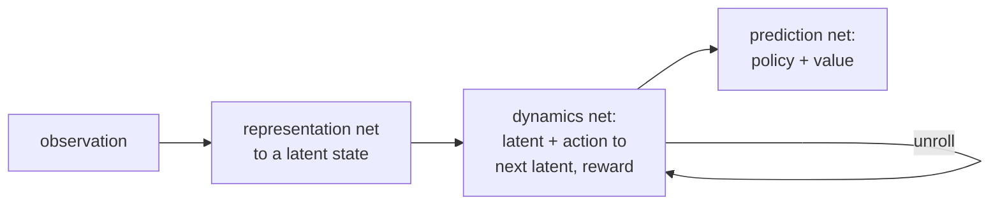

AlphaZero plans with MCTS, but its search needs the true rules as a simulator: it
must know that this move leads to that board. In Atari, or any environment where
the agent only sees pixels and rewards, those rules are not available. **MuZero**
keeps AlphaZero's search and self-play but learns its own model, and the surprising
design choice is *what* that model is trained to get right<FN n="1" />.

## Three learned functions

MuZero never models the environment in observation space. It learns three networks
that operate on an abstract **latent state** $z$:

- **Representation** $h$: encode the observation history into an initial latent,
  $z^0 = h(o)$.
- **Dynamics** $g$: given a latent and an action, predict the next latent and the
  immediate reward, $(z^{k+1}, r^{k+1}) = g(z^k, a^k)$.
- **Prediction** $f$: from a latent, predict a policy and a value,
  $(\mathbf{p}^k, v^k) = f(z^k)$.

MCTS then runs entirely in latent space: the root is $h(o)$, edges are unrolled by
$g$, and leaves are evaluated by $f$. No environment simulator is queried inside
the search.

## The training signal: predict returns, not observations

The defining choice is the loss. A naive learned model would be trained to
reconstruct the next observation, forcing the latent to encode everything on the
screen. MuZero does **not** do this. It unrolls the model $K$ steps from a real
trajectory and trains only three heads to match quantities tied to *return*:

$$
\ell(\theta) = \sum_{k=0}^{K} \Big[ (r^k - u^k)^2 + (v^k - z^k_{\text{target}})^2 - (\boldsymbol{\pi}^k)^\top \log \mathbf{p}^k \Big],
$$

where $u^k$ is the observed reward, the value target comes from the search /
bootstrapped return, and $\boldsymbol{\pi}^k$ is the MCTS visit policy (the same
AlphaZero targets). There is no term tying $z^k$ to the true state. The latent is
free to discard anything (textures, irrelevant objects) that does not affect
reward, value, or policy.

## Value equivalence: why a "wrong" model still plans correctly

If the model is never asked to reproduce observations, in what sense is it correct?
The answer is **value equivalence**: a model is good enough for planning if its
Bellman backups produce the right values, even when its internal transitions do not
match the real environment. Two models that disagree about the mechanics of the
world but agree on every value and reward along the way will yield identical
plans. MuZero exploits this: its latent dynamics need only be value-equivalent to
the environment, which is a far weaker (and more learnable) requirement than
predicting the future observation.

A direct consequence is that the latent can be much **smaller** than the true
state, collapsing observations that behave identically into one latent. Planning in
that compact model gives the same answer as planning in the full one.



## Worked check: a compact value-equivalent model plans identically

Construct a true environment whose states come in behaviorally identical pairs (two
observations that always yield the same rewards and transition the same way). A
compact model over the *pairs* (half as many latent states) is value-equivalent to
the full model. Run value iteration in both and confirm the compact model recovers
the true optimal values and policy exactly, the principle that lets MuZero plan in a
learned latent rather than in observation space.

```python
import numpy as np
rng = np.random.default_rng(3)
gamma = 0.9
nG, nA = 4, 2                                   # compact latent model: 4 states

P_abs = rng.dirichlet(np.ones(nG), size=(nG, nA))   # latent transitions
R_abs = rng.normal(size=(nG, nA))                    # latent rewards

def value_iteration(P, R, n):
    V = np.zeros(n)
    for _ in range(2000):
        Q = R + gamma * np.einsum("sap,p->sa", P, V)
        Vn = Q.max(1)
        if np.max(np.abs(Vn - V)) < 1e-12: break
        V = Vn
    return V, Q.argmax(1)

V_abs, pi_abs = value_iteration(P_abs, R_abs, nG)

# True environment: each latent state splits into 2 identical observation states.
# Reward/dynamics depend only on the latent group (s // 2); destinations land
# uniformly on the two copies of the target group.
nS = 2 * nG
P = np.zeros((nS, nA, nS)); R = np.zeros((nS, nA))
for s in range(nS):
    g = s // 2
    for a in range(nA):
        R[s, a] = R_abs[g, a]
        for gp in range(nG):
            P[s, a, 2*gp] = P[s, a, 2*gp+1] = P_abs[g, a, gp] * 0.5

V_true, pi_true = value_iteration(P, R, nS)
V_lifted = V_abs[np.arange(nS) // 2]            # lift latent values to observations

print("latent V* (4 states):", np.round(V_abs, 4))
print("true V* equals lifted latent V*:", np.allclose(V_true, V_lifted))
print("optimal policy matches:", np.array_equal(pi_true, pi_abs[np.arange(nS) // 2]))
```

The compact four-state model reproduces the eight-state environment's optimal
values and policy exactly, despite being half the size and never representing
individual observations, which is the value-equivalence that justifies planning in
MuZero's learned latent<FN n="1" />.

## Exercises

**Exercise 1.** MuZero unrolls its dynamics network $K$ steps from a real
trajectory and trains three heads against reward, value, and policy targets,
with no term tying the latent $z^k$ to the true observation. Consider an Atari
frame containing a scrolling starfield in the background that never affects
reward or the player's options. Explain, using the value-equivalence principle,
why MuZero's learned latent is free to discard the starfield entirely, and why a
model trained to reconstruct the observation could not.

<details>
<summary>Solution</summary>

**Step 1.** Value equivalence says a model is good enough for planning if its
Bellman backups produce the right values and rewards along every path, even if
its internal transitions do not match the real dynamics in detail. Two models
that agree on all rewards and values yield identical plans.

**Step 2.** The starfield never enters any reward $u^k$, value target, or MCTS
policy target $\boldsymbol{\pi}^k$, since it does not change what the player can
do or earn. So a latent that drops it still reproduces every reward and value
along the trajectory; it is value-equivalent to the true dynamics. The MuZero
loss has no term penalizing this omission.

**Step 3.** A reconstruction-trained model carries a decoder term like
$\lVert \hat{o}^k - o^k \rVert^2$. To drive that error down it must encode the
starfield's pixels in the latent, because the decoder is graded on reproducing
them. The latent is forced to waste capacity on reward-irrelevant detail, the
exact cost MuZero avoids by training only return-tied heads.

**Step 4.** The consequence is that MuZero's latent can be far smaller than the
observation and collapse behaviorally identical observations (same rewards,
transitions, options) into one latent, which is the simplification the worked
check demonstrated with its identical-pair states.

</details>

**Exercise 2.** Take a two-state environment with one action. The true model has
states $\{s_0, s_1\}$, reward $r(s_0) = 0$, $r(s_1) = 2$, and the action moves
$s_0 \to s_1$ and $s_1 \to s_1$ (absorbing), $\gamma = 0.5$. Now consider a
"wrong" latent model that relabels the states and claims the transition
$s_0 \to s_1$ takes *two* internal latent steps through an intermediate latent
$\tilde{z}$ with reward $0$, before reaching the $r = 2$ latent. Compute $V(s_0)$
under both models, show that the fictitious delay step breaks value equivalence,
and state the condition on the wrong model that restores it.

<details>
<summary>Solution</summary>

**Step 1.** True model. $V(s_1) = r(s_1) + \gamma V(s_1) = 2 + 0.5\, V(s_1)$, so
$V(s_1) = 2 / (1 - 0.5) = 4$. Then
$V(s_0) = r(s_0) + \gamma V(s_1) = 0 + 0.5 \cdot 4 = 2$.

**Step 2.** Wrong (relabeled) model. The chain from $s_0$ is
$s_0 \xrightarrow{r=0} \tilde{z} \xrightarrow{r=0} (\text{absorbing } r=2)$. The
absorbing latent has value $2 + 0.5 \cdot V = V \Rightarrow V = 4$, same as
before.

**Step 3.** Back the value up through the extra intermediate latent:
$V(\tilde{z}) = 0 + 0.5 \cdot 4 = 2$, then
$V(s_0) = 0 + 0.5 \cdot V(\tilde{z}) = 0.5 \cdot 2 = 1$.

**Step 4.** The two values disagree ($2$ versus $1$), which shows the relabeling
must be set up so the *discounted number of steps to reward matches*. Correcting
it: for value equivalence the wrong model must reach the $r = 2$ latent in the
same discounted horizon. Collapsing the spurious intermediate step (one latent
transition, as in the true model) restores $V(s_0) = 0 + 0.5 \cdot 4 = 2$. The
lesson is precise: a learned model is value-equivalent only when its backups
reproduce the true values, and inserting fictitious reward-zero delay steps
breaks that unless the discounting is matched. MuZero's loss enforces exactly
this by training $r^k$ and $v^k$ against the real returns at each unroll depth.

</details>

**Exercise 3 (code).** Build a tiny environment whose states split into
behaviorally identical pairs, run value iteration in both the full model and a
compact model over the pairs, and assert that the compact optimal values, lifted
back to the full state space, equal the full model's optimal values exactly.
This is the value-equivalence check at the heart of the lesson.

<details>
<summary>Solution</summary>

```python
import numpy as np
rng = np.random.default_rng(1)
gamma = 0.9
nG, nA = 3, 2                                  # compact: 3 latent groups

P_abs = rng.dirichlet(np.ones(nG), size=(nG, nA))   # latent transitions
R_abs = rng.normal(size=(nG, nA))                    # latent rewards

def value_iteration(P, R, n):
    V = np.zeros(n)
    for _ in range(3000):
        Q = R + gamma * np.einsum("sap,p->sa", P, V)
        Vn = Q.max(1)
        if np.max(np.abs(Vn - V)) < 1e-12:
            break
        V = Vn
    return V, Q.argmax(1)

V_abs, pi_abs = value_iteration(P_abs, R_abs, nG)

# Full model: each group splits into 2 identical observation states.
nS = 2 * nG
P = np.zeros((nS, nA, nS)); R = np.zeros((nS, nA))
for s in range(nS):
    g = s // 2
    for a in range(nA):
        R[s, a] = R_abs[g, a]
        for gp in range(nG):
            P[s, a, 2*gp] = P[s, a, 2*gp+1] = P_abs[g, a, gp] * 0.5

V_full, pi_full = value_iteration(P, R, nS)
lift = np.arange(nS) // 2                       # map each full state to its group

assert np.allclose(V_full, V_abs[lift])         # values match exactly
assert np.array_equal(pi_full, pi_abs[lift])    # so does the optimal policy
print("compact V* lifted == full V*:", bool(np.allclose(V_full, V_abs[lift])))
```

The three-group compact model reproduces the six-state environment's optimal
values and policy after lifting, confirming value equivalence: a smaller model
that agrees on rewards and transitions of the groups plans identically to the
full one.

</details>

MuZero still plans with an explicit tree search. The next lesson learns a model of
quite different character: a generative world model of pixels that an agent can
dream inside, training its policy on imagined rollouts.

<Footnotes>
  <FNItem n="1">**Schrittwieser, J., et al.** (2020). "Mastering Atari, Go, chess and shogi by planning with a learned model (MuZero)". *Nature*, 588, 604-609. [arXiv:1911.08265](https://arxiv.org/abs/1911.08265). Introduces the learned latent model and value-equivalent planning.</FNItem>
</Footnotes>
