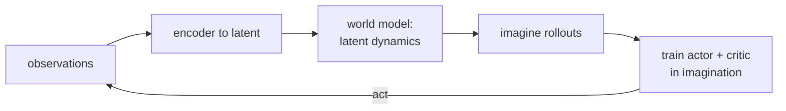

MuZero plans with an explicit tree search at decision time. A different model-based
strategy learns a **generative** model of the world, then trains a policy by
*dreaming*: rolling the model forward in imagination and optimizing the policy on
those synthetic trajectories, never touching the real environment during policy
learning. This is the World Models / **Dreamer** line, and its defining trick is
that the model is differentiable, so returns can be backpropagated straight into
the policy.

## A latent generative world model

Pixels are high-dimensional and most of what they show is irrelevant to control.
World models compress them. An encoder maps each observation to a compact latent
$z_t$, exactly a [VAE](D4/vae)-style bottleneck, and a recurrent latent dynamics
model predicts how $z$ evolves:

- **Encoder** $q(z_t \mid o_t)$: observation to latent, as in a VAE.
- **Latent transition** $p(z_{t+1} \mid z_t, a_t)$: a learned, differentiable
  dynamics in latent space (Dreamer's recurrent state-space model).
- **Reward and decoder heads**: predict the reward $\hat{r}_t$ from $z_t$, and
  optionally reconstruct $o_t$ to shape the latent.

Once trained from logged experience, this model is a fast, differentiable simulator
the agent can run forward without the real environment.

## Learning in imagination

The payoff is **imagination**: starting from latents encoded from real states, roll
the latent transition forward under the current policy to produce synthetic
trajectories $z_t, a_t, \hat{r}_t$, and train actor and critic on those. Because
every step of the rollout, the dynamics, the reward head, and the policy, is
differentiable, the discounted imagined return is a differentiable function of the
policy parameters. Dreamer optimizes the policy by **backpropagating the return
through the rollout** (an analytic policy gradient), rather than by the
score-function estimator REINFORCE uses. Gradients that flow through the dynamics
carry much more information per sample than reward-weighted log-probabilities, so
learning is dramatically more sample-efficient.

A critic bootstraps the value beyond the imagination horizon, so short dreamed
rollouts still estimate long-horizon return, the same bootstrap idea from TD
learning, now inside the model.

The one hazard is that backpropagating through long rollouts of an unstable system
makes gradients explode (the same exploding-gradient problem as deep recurrent
nets), which is why Dreamer uses stable latent dynamics, short imagination
horizons, and gradient clipping.



## Worked check: backprop a return through a model to learn a controller

The mechanism in isolation: a differentiable latent model and a policy trained
purely by differentiating the imagined return. Use a linear latent model
$x_{t+1} = A x_t + B u_t$ with per-step reward $-(x_t^2 + \rho u_t^2)$ and a linear
policy $u = -Kx$. Backprop the imagined return through the rollout by hand (the
manual reverse pass below is what an autodiff library would do), train $K$ entirely
on imagined trajectories, and confirm it converges to the analytic optimum and that
the hand-derived gradient matches a finite-difference check.

```python
import numpy as np
rng = np.random.default_rng(0)

# Differentiable latent world model (stands in for a learned one):
# x' = A x + B u, reward = -(x^2 + rho u^2). Linear policy u = -K x.
A, B, rho, gamma, H = 0.9, 0.5, 0.1, 0.95, 25

def rollout(K, x0):                                  # forward pass in imagination
    x, xs, us, G, disc = x0, [], [], 0.0, 1.0
    for _ in range(H):
        u = -K * x
        G += disc * (-(x**2 + rho * u**2)); xs.append(x); us.append(u)
        x = A * x + B * u; disc *= gamma
    return G, xs, us

def dG_dK(K, x0):                                    # backprop return through rollout
    _, xs, us = rollout(K, x0)
    ax, grad, disc = 0.0, 0.0, gamma**(H - 1)
    for t in reversed(range(H)):
        x, u = xs[t], us[t]
        d_x = disc * (-(2*x) - rho*2*u*(-K))          # reward's direct x-dependence
        d_K = disc * (-rho*2*u*(-x))                  # reward's direct K-dependence
        new_ax = d_x + ax * (A - B*K)                 # add future via x' = (A - BK)x
        grad += d_K + ax * (-B * x)                   # future via x' depends on K
        ax, disc = new_ax, disc / gamma
    return grad

# Train the policy ENTIRELY in imagination (ascend the imagined return).
K = 0.0
for _ in range(3000):
    g = np.mean([dG_dK(K, x0) for x0 in rng.normal(size=64)])
    K += 0.02 * g

# Ground truth: maximize the closed-form imagined return J(K) over a fine grid.
def J(K): return -(1 + rho*K**2) * sum((gamma * (A - B*K)**2)**t for t in range(H))
grid = np.linspace(-1, 3, 4001)
K_star = float(grid[int(np.argmax([J(k) for k in grid]))])

fd = (rollout(0.6 + 1e-5, 1.0)[0] - rollout(0.6 - 1e-5, 1.0)[0]) / 2e-5
print("manual grad vs finite-difference at K=0.6:", round(dG_dK(0.6, 1.0), 4), round(fd, 4))
print("K learned in imagination:", round(K, 3), " analytic optimum:", round(K_star, 3))
```

The hand-derived gradient matches the finite-difference estimate, and the policy
trained only on imagined rollouts converges to the analytic optimal gain,
controlling a system it learned about purely by differentiating through a model.

This closes model-based RL. The next subsection steps back to a problem every
method so far has assumed away: how an agent should explore, starting from the
clean setting of the multi-armed bandit.
