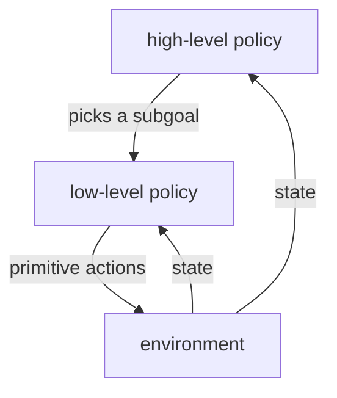

Flat RL chooses a primitive action every step. On long-horizon tasks (navigate a
building, then open a door, then fetch an object) that means propagating reward back
across thousands of steps, which is slow and brittle. Humans plan with **temporal
abstraction**: "go to the kitchen" is one decision that unfolds into hundreds of
muscle commands. **Hierarchical RL** gives agents the same abstraction, and the
options framework makes it precise.

## Options: temporally-extended actions

An **option** is a closed-loop behavior that runs for many steps. Formally it is a
triple $(\mathcal{I}, \pi, \beta)$:

- **Initiation set** $\mathcal{I} \subseteq \mathcal{S}$: the states where the option
  can be started.
- **Intra-option policy** $\pi(a \mid s)$: how the option acts while it runs.
- **Termination condition** $\beta(s) \in [0,1]$: the probability the option ends in
  state $s$.

A primitive action is the special case of an option that lasts exactly one step. A
"go to the doorway" option starts anywhere in a room, follows a navigation policy,
and terminates at the doorway. The high-level policy then chooses among options
rather than primitive actions, deciding far less often.

## The semi-MDP

Because options take variable amounts of time, the high-level decision process is no
longer an MDP but a **semi-Markov decision process** (SMDP): the time between
decisions is itself random. The Bellman equation generalizes to discount by the
option's actual duration. If an option started in $s$ runs for $k$ steps,
collecting rewards $r_1, \dots, r_k$ and landing in $s'$, its value backup is

$$
Q(s, o) \leftarrow Q(s, o) + \alpha\Big[ \underbrace{r_1 + \gamma r_2 + \dots + \gamma^{k-1} r_k}_{\text{accumulated discounted reward}} + \gamma^k \max_{o'} Q(s', o') - Q(s, o) \Big].
$$

The single discount $\gamma$ of the MDP becomes $\gamma^k$, raised to the option's
duration. This is the whole reason hierarchy accelerates learning: one option backup
can carry reward across $k$ states at once, instead of $k$ separate one-step backups
on $k$ separate episodes. **Intra-option** methods additionally update the option's
own policy from the same experience, so the option improves while it is used.

## Feudal and goal-conditioned hierarchies

The options framework provides the options up front. Modern hierarchical RL **learns**
them. **Feudal** architectures split the agent into a **manager** and a **worker**:
the manager, running at a slow timescale, emits a **subgoal** (a target state or a
direction in a latent space); the worker, running every step, is rewarded for
reaching that subgoal. The worker's reward is intrinsic (distance to the subgoal),
the manager's is the real task reward. This is the same idea as **goal-conditioned**
RL, where a single policy $\pi(a \mid s, g)$ is trained to reach any goal $g$, and a
higher level chooses which goals to pursue. The hierarchy is learned end to end, no
hand-designed options required.



## Worked check: an option propagates reward in one episode

Compare value propagation on a length-$L$ corridor with the goal at the end. Flat
Q-learning over primitive left/right actions needs reward to seep one cell per
episode back to the start. A single "run to the goal" option, backed up over its
full $k$-step duration with $\gamma^k$, gives the start its correct value after one
episode.

```python
import numpy as np
rng = np.random.default_rng(0)

L, gamma = 12, 0.9                    # corridor 0..L-1, goal at L-1 with reward 1
opt_value = gamma ** (L - 2)          # optimal value at the start (reward L-1 steps away)

def greedy(q): return int(rng.choice(np.flatnonzero(q == q.max())))   # random tie-break

def flat(episodes, alpha=0.5, eps=0.1):                # primitive Q-learning
    Q = np.zeros((L, 2))
    for _ in range(episodes):
        s, steps = 0, 0
        while s != L - 1 and steps < 5000:
            a = rng.integers(2) if rng.random() < eps else greedy(Q[s])
            ns = min(max(s + (1 if a == 1 else -1), 0), L - 1)
            r = 1.0 if ns == L - 1 else 0.0
            Q[s, a] += alpha * (r + (0 if ns == L-1 else gamma * Q[ns].max()) - Q[s, a])
            s, steps = ns, steps + 1
    return Q[0].max()

def options(episodes, alpha=1.0):                      # one "run to goal" option
    Qo = np.zeros(L)
    for _ in range(episodes):
        k, disc_r, cur = 0, 0.0, 0
        while cur != L - 1:                            # execute the option to termination
            cur += 1
            disc_r += (gamma ** k) * (1.0 if cur == L - 1 else 0.0); k += 1
        Qo[0] += alpha * (disc_r + (gamma ** k) * 0.0 - Qo[0])   # SMDP backup, gamma^k
    return Qo[0]

print("optimal start value:        ", round(opt_value, 4))
print("flat Q after 1 episode:     ", round(flat(1), 4))
print("options Q after 1 episode:  ", round(options(1), 4))
print("flat Q after 200 episodes:  ", round(flat(200), 4))
```

The option backup gives the start its exact optimal value after a single episode,
while flat Q-learning leaves it at zero and only reaches the same value after
hundreds of episodes, the acceleration that temporal abstraction and the $\gamma^k$
semi-MDP backup buy.

This closes the "beyond standard RL" subsection. The final subsection turns to where
reinforcement learning meets large language models: the RL framing of fine-tuning,
verifier rewards, and reward hacking.
