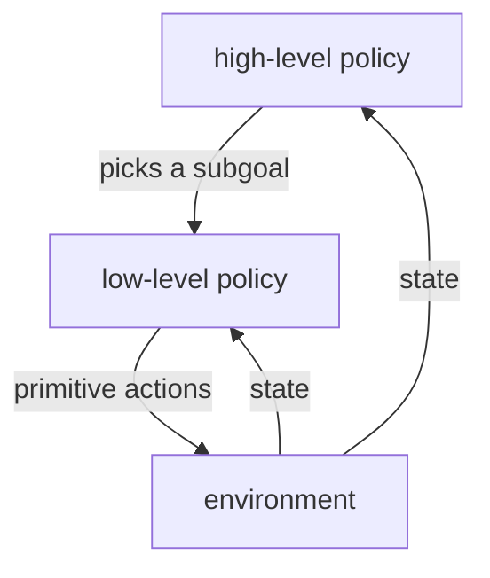

Flat RL chooses a primitive action every step. On long-horizon tasks (navigate a
building, then open a door, then fetch an object) that means propagating reward back
across thousands of steps, which is slow and brittle. Humans plan with **temporal
abstraction**: "go to the kitchen" is one decision that unfolds into hundreds of
muscle commands. **Hierarchical RL** gives agents the same abstraction, and the
options framework makes it precise<FN ns="1, 2" />.

## Options: temporally-extended actions

An **option** is a closed-loop behavior that runs for many steps. Formally it is a
triple $(\mathcal{I}, \pi, \beta)$:

- **Initiation set** $\mathcal{I} \subseteq \mathcal{S}$: the states where the option
  can be started.
- **Intra-option policy** $\pi(a \mid s)$: how the option acts while it runs.
- **Termination condition** $\beta(s) \in [0,1]$: the probability the option ends in
  state $s$.

A primitive action is the special case of an option that lasts exactly one step. A
"go to the doorway" option starts anywhere in a room, follows a navigation policy,
and terminates at the doorway. The high-level policy then chooses among options
rather than primitive actions, deciding far less often.

## The semi-MDP

Because options take variable amounts of time, the high-level decision process is no
longer an MDP but a **semi-Markov decision process** (SMDP): the time between
decisions is itself random. The Bellman equation generalizes to discount by the
option's actual duration<FN n="1" />. If an option started in $s$ runs for $k$ steps,
collecting rewards $r_1, \dots, r_k$ and landing in $s'$, its value backup is

$$
Q(s, o) \leftarrow Q(s, o) + \alpha\Big[ \underbrace{r_1 + \gamma r_2 + \dots + \gamma^{k-1} r_k}_{\text{accumulated discounted reward}} + \gamma^k \max_{o'} Q(s', o') - Q(s, o) \Big].
$$

The single discount $\gamma$ of the MDP becomes $\gamma^k$, raised to the option's
duration. This is the whole reason hierarchy accelerates learning: one option backup
can carry reward across $k$ states at once, instead of $k$ separate one-step backups
on $k$ separate episodes. **Intra-option** methods additionally update the option's
own policy from the same experience, so the option improves while it is used.

## Feudal and goal-conditioned hierarchies

The options framework provides the options up front. Modern hierarchical RL **learns**
them. **Feudal** architectures split the agent into a **manager** and a **worker**:
the manager, running at a slow timescale, emits a **subgoal** (a target state or a
direction in a latent space); the worker, running every step, is rewarded for
reaching that subgoal. The worker's reward is intrinsic (distance to the subgoal),
the manager's is the real task reward. This is the same idea as **goal-conditioned**
RL, where a single policy $\pi(a \mid s, g)$ is trained to reach any goal $g$, and a
higher level chooses which goals to pursue. The hierarchy is learned end to end, no
hand-designed options required.



## Worked check: an option propagates reward in one episode

Compare value propagation on a length-$L$ corridor with the goal at the end. Flat
Q-learning over primitive left/right actions needs reward to seep one cell per
episode back to the start. A single "run to the goal" option, backed up over its
full $k$-step duration with $\gamma^k$, gives the start its correct value after one
episode.

```python
import numpy as np
rng = np.random.default_rng(0)

L, gamma = 12, 0.9                    # corridor 0..L-1, goal at L-1 with reward 1
opt_value = gamma ** (L - 2)          # optimal value at the start (reward L-1 steps away)

def greedy(q): return int(rng.choice(np.flatnonzero(q == q.max())))   # random tie-break

def flat(episodes, alpha=0.5, eps=0.1):                # primitive Q-learning
    Q = np.zeros((L, 2))
    for _ in range(episodes):
        s, steps = 0, 0
        while s != L - 1 and steps < 5000:
            a = rng.integers(2) if rng.random() < eps else greedy(Q[s])
            ns = min(max(s + (1 if a == 1 else -1), 0), L - 1)
            r = 1.0 if ns == L - 1 else 0.0
            Q[s, a] += alpha * (r + (0 if ns == L-1 else gamma * Q[ns].max()) - Q[s, a])
            s, steps = ns, steps + 1
    return Q[0].max()

def options(episodes, alpha=1.0):                      # one "run to goal" option
    Qo = np.zeros(L)
    for _ in range(episodes):
        k, disc_r, cur = 0, 0.0, 0
        while cur != L - 1:                            # execute the option to termination
            cur += 1
            disc_r += (gamma ** k) * (1.0 if cur == L - 1 else 0.0); k += 1
        Qo[0] += alpha * (disc_r + (gamma ** k) * 0.0 - Qo[0])   # SMDP backup, gamma^k
    return Qo[0]

print("optimal start value:        ", round(opt_value, 4))
print("flat Q after 1 episode:     ", round(flat(1), 4))
print("options Q after 1 episode:  ", round(options(1), 4))
print("flat Q after 200 episodes:  ", round(flat(200), 4))
```

The option backup gives the start its exact optimal value after a single episode,
while flat Q-learning leaves it at zero and only reaches the same value after
hundreds of episodes, the acceleration that temporal abstraction and the $\gamma^k$
semi-MDP backup buy.

## Exercises

**Exercise 1.** An option starts in state $s$, runs for exactly $k = 3$ steps
collecting rewards $r_1 = 0$, $r_2 = 0$, $r_3 = 2$, and lands in $s'$ where
$\max_{o'} Q(s', o') = 5$. With $\gamma = 0.9$ and learning rate $\alpha = 1$,
compute the SMDP target $r_1 + \gamma r_2 + \gamma^2 r_3 + \gamma^k \max_{o'} Q(s', o')$
that the backup moves $Q(s, o)$ toward.

<details>
<summary>Solution</summary>

**Step 1.** Accumulate the discounted reward over the option's run. With
$r_1 = r_2 = 0$ only the third term survives:

$$
r_1 + \gamma r_2 + \gamma^2 r_3 = 0 + 0 + 0.9^2 \cdot 2 = 0.81 \cdot 2 = 1.62.
$$

**Step 2.** Add the bootstrapped continuation, discounted by $\gamma^k = 0.9^3 = 0.729$
because the option consumed $k = 3$ steps:

$$
1.62 + 0.729 \cdot 5 = 1.62 + 3.645 = 5.265.
$$

With $\alpha = 1$ the update sets $Q(s, o) \leftarrow 5.265$. The single discount
$\gamma$ of a primitive backup is replaced by $\gamma^k$, which is the only change
the semi-MDP introduces.

</details>

**Exercise 2.** A "go to the doorway" option has termination condition
$\beta(s) = 0.2$ in every non-doorway state and $\beta(\text{doorway}) = 1$. Once the
option is running, what is the expected number of steps it executes before
terminating in a long room (treat termination as an independent coin flip each step,
ignoring the doorway)? Why does a larger $\beta$ make the hierarchy behave more like
flat RL?

<details>
<summary>Solution</summary>

**Step 1.** Each step the option ends with probability $\beta = 0.2$ and continues
with probability $0.8$, independently. The number of steps until the first
termination is geometric with parameter $\beta$, so its expectation is

$$
\mathbb{E}[k] = \frac{1}{\beta} = \frac{1}{0.2} = 5 \text{ steps}.
$$

**Step 2.** The SMDP backup carries reward across $\mathbb{E}[k] = 5$ states per
high-level decision, which is the acceleration over single-step backups. As
$\beta \to 1$ the option terminates almost immediately, $\mathbb{E}[k] \to 1$, and
$\gamma^k \to \gamma$: each option is one primitive step and the high-level policy
decides every step, recovering flat RL with no temporal abstraction.

</details>

**Exercise 3 (code).** Two options run back to back: option $A$ for $k_A = 4$ steps
then option $B$ for $k_B = 3$ steps, with reward $1$ delivered only on the final
transition and $\gamma = 0.9$. Show that backing the reward up through the two
options separately (each with its own $\gamma^k$) gives the same start value as a
single direct discounted sum over all $k_A + k_B$ steps.

<details>
<summary>Solution</summary>

```python
import numpy as np

gamma = 0.9
kA, kB = 4, 3
k = kA + kB                      # total steps; reward 1 on the last transition

# Direct: discounted sum over the whole k-step run, reward only at step k.
direct = sum((gamma ** t) * (1.0 if t == k - 1 else 0.0) for t in range(k))

# Two-level SMDP backup: value at the option-B start, then discount it by gamma^kA.
Q_mid = gamma ** (kB - 1)        # reward kB-1 transitions ahead of option B's start
Q_start = gamma ** kA * Q_mid    # option A consumes kA steps before B begins

assert np.isclose(Q_start, direct)
print("direct:", round(direct, 6), " two-level SMDP:", round(Q_start, 6))
```

The composed $\gamma^{k_A}\gamma^{k_B - 1} = \gamma^{k - 1}$ equals the direct
discount of the single reward, so the option backups compose without distorting the
value: hierarchy changes how reward is propagated, not the value it converges to.

</details>

This closes the "beyond standard RL" subsection. The final subsection turns to where
reinforcement learning meets large language models: the RL framing of fine-tuning,
verifier rewards, and reward hacking.

<Footnotes>
  <FNItem n="1">**Sutton, R. S., Precup, D., & Singh, S.** (1999). "Between MDPs and semi-MDPs: a framework for temporal abstraction in reinforcement learning (options)". *Artificial Intelligence*, 112(1-2), 181-211. [doi:10.1016/S0004-3702(99)00052-1](https://doi.org/10.1016/S0004-3702(99)00052-1). The options and semi-MDP framework.</FNItem>
  <FNItem n="2">**Sutton, R. S., & Barto, A. G.** (2018). *Reinforcement Learning: An Introduction* (2nd ed.). MIT Press. Background on temporal abstraction and hierarchical methods.</FNItem>
</Footnotes>
