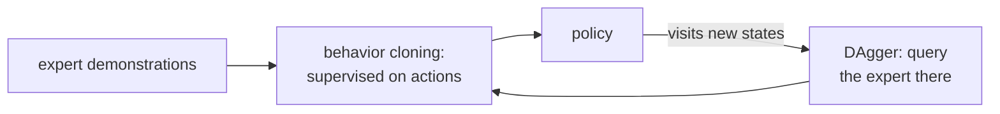

Designing a reward function is hard, and sometimes an expert can simply demonstrate
the task: a human driving, a teleoperated robot. **Imitation learning** turns those
demonstrations into a policy<FN n="1" />. The naive version is just supervised learning, and it
fails in a way that is specific to the sequential setting and worth understanding
precisely, because the fix is a small, clever change.

## Behavioral cloning

**Behavioral cloning** (BC) treats imitation as plain supervised classification:
collect a dataset of expert state-action pairs $\{(s_i, a^*_i)\}$ and fit a policy
$\pi_\theta(a \mid s)$ to predict the expert's action by maximum likelihood,

$$
\max_\theta \sum_i \log \pi_\theta(a^*_i \mid s_i).
$$

No environment interaction, no reward, no RL machinery: it is image classification
with actions as labels. On the training distribution it works well. The problem is
that the training distribution is not the distribution the policy will face when it
runs.

## Distribution shift and compounding error

BC is trained on states from the **expert's** trajectories. At deployment the
learner drives the state distribution itself, and the moment it makes a small error
it reaches a state slightly off the expert's path, a state it has *no training data
for*. There it errs more, drifting further off-distribution, and errors snowball.
This is **covariate shift**: the input distribution at test time differs from
training because the policy's own actions determine the inputs.

The cost of this is quantifiably worse than in ordinary supervised learning. If the
cloned policy has per-state error rate $\epsilon$ on its training distribution, a
classification model over $T$ independent inputs would make about $\epsilon T$
mistakes, linear in $T$. But in the sequential setting, a single mistake throws the
agent into off-distribution states for the rest of the episode, so the expected
number of mistakes grows like $\epsilon T^2$, **quadratic** in the horizon<FN n="2" />. Long
tasks amplify small cloning errors dramatically.

## DAgger: label the learner's own states

The fix addresses the shift directly: train on the states the learner actually
visits, not just the expert's. **DAgger** (Dataset Aggregation) does this in a loop<FN n="2" />:

1. Train a policy $\pi$ on the current dataset (start from the expert demos).
2. Run $\pi$ in the environment to collect the states *it* visits.
3. Ask the **expert** for the correct action $a^*$ at each of those states.
4. Add these new $(s, a^*)$ pairs to the dataset and return to step 1.

Each round, the training distribution moves closer to the learner's own
distribution, so the off-path states that broke BC now have expert labels. DAgger
restores the linear $\epsilon T$ error rate, at the cost of needing an
**interactive** expert that can be queried on arbitrary states, not just a fixed
log of demonstrations.



## Worked check: cloning error is quadratic, DAgger error is linear

Model the two regimes abstractly. The cloned policy errs with probability
$\epsilon$ per step. Under BC, a mistake leaves the expert's support permanently
(every later step is then wrong), the compounding case. Under DAgger, the expert
relabels visited states, so the policy recovers each step and errors are
independent. Measure the total mistakes as the horizon $T$ doubles: BC should grow
roughly fourfold (quadratic), DAgger roughly twofold (linear).

```python
import numpy as np
rng = np.random.default_rng(0)

eps, runs = 0.005, 8000      # per-step error probability of the cloned policy

def bc_cost(T):              # a mistake throws it off-distribution for the rest
    tot = 0
    for _ in range(runs):
        off = False
        for _ in range(T):
            if not off and rng.random() < eps: off = True   # left expert support
            tot += off                                      # every later step wrong
    return tot / runs

def dagger_cost(T):          # expert relabels learner states -> recovers each step
    return float(np.mean(np.sum(rng.random((runs, T)) < eps, axis=1)))

Ts = [50, 100, 200]
b = [bc_cost(T) for T in Ts]
d = [dagger_cost(T) for T in Ts]
for T, bt, dt in zip(Ts, b, d):
    print(f"T={T:3d}: BC mistakes {bt:6.2f}   DAgger mistakes {dt:5.2f}")
print("BC doubling ratios (-> ~4, quadratic):", round(b[1]/b[0], 2), round(b[2]/b[1], 2))
print("DAgger doubling ratios (-> ~2, linear):", round(d[1]/d[0], 2), round(d[2]/d[1], 2))
```

BC's mistake count roughly quadruples each time the horizon doubles while DAgger's
merely doubles, the quadratic-versus-linear split that distribution shift forces and
that relabeling the learner's own states removes.

## Exercises

**Exercise 1.** A behavioral-cloning policy has per-step error rate
$\epsilon = 0.01$ on its training distribution. Using the linear bound for ordinary
supervised prediction and the quadratic bound for the sequential setting, estimate
the expected number of mistakes over a horizon of $T = 200$ steps in each regime.
By what factor does the sequential setting cost more here?

<details>
<summary>Solution</summary>

**Step 1.** Supervised prediction over $T$ independent inputs makes about
$\epsilon T$ mistakes, since each input errs independently with probability
$\epsilon$:

$$
\epsilon T = 0.01 \cdot 200 = 2 \text{ mistakes}.
$$

**Step 2.** In the sequential setting a single error throws the agent
off-distribution for the rest of the episode, giving the quadratic bound
$\epsilon T^2$:

$$
\epsilon T^2 = 0.01 \cdot 200^2 = 0.01 \cdot 40000 = 400 \text{ mistakes}.
$$

**Step 3.** The ratio is $\epsilon T^2 / (\epsilon T) = T = 200$. The sequential
cost is a factor of $T$ worse, which is why long-horizon cloning fails even when the
per-step error rate looks small.

</details>

**Exercise 2.** DAgger restores the linear $\epsilon T$ error rate but requires an
**interactive** expert. State precisely what the expert must be able to do that a
fixed log of demonstrations cannot provide, and explain why behavioral cloning
cannot make the same demand.

<details>
<summary>Solution</summary>

**Step 1.** DAgger's loop runs the current policy $\pi$, collects the states $\pi$
actually visits (including off-path states the expert never entered), and asks the
expert for the correct action $a^*$ at *each of those states*. The expert must be
queryable on **arbitrary states**, not only the states in its own trajectories.

**Step 2.** A fixed log only contains $(s, a^*)$ pairs for states the expert chose to
visit. The off-distribution states that break behavioral cloning are precisely the
ones absent from that log, so a static dataset cannot supply their labels.

**Step 3.** Behavioral cloning consumes the log once and never generates new states
to label, so it never needs the interactive query. That is also its limitation: it
can only learn the expert's own state distribution, leaving the learner's drifted
states unlabeled, which is the gap DAgger's interactive expert closes.

</details>

**Exercise 3 (code).** Generate toy expert data where the expert action is
$\mathbb{1}[w^\star \cdot s > 0]$ for a fixed $w^\star$, then clone it by fitting a
logistic policy with gradient ascent on the log-likelihood
$\sum_i \log \pi_\theta(a^\star_i \mid s_i)$. Verify the cloned policy reaches above
$98\%$ accuracy on the training states.

<details>
<summary>Solution</summary>

```python
import numpy as np
rng = np.random.default_rng(0)

N, d = 400, 3
S = rng.normal(size=(N, d))                 # expert states
w_star = np.array([2.0, -1.0, 0.5])
a = (S @ w_star > 0).astype(float)          # expert action labels in {0, 1}

# Behavioral cloning: maximize sum_i log pi(a_i | s_i) for a logistic policy.
w = np.zeros(d)
for _ in range(2000):
    p = 1.0 / (1.0 + np.exp(-(S @ w)))      # pi(action = 1 | s)
    w += 0.1 * (S.T @ (a - p)) / N          # gradient of the mean log-likelihood
acc = ((S @ w > 0).astype(float) == a).mean()

assert acc > 0.98
print("clone train accuracy:", round(acc, 4))
```

The maximum-likelihood fit recovers the expert's decision boundary on the training
states, the regime where behavioral cloning works; the failure only appears once the
cloned policy drives the state distribution off this support.

</details>

Imitation learning copies the expert's actions. A deeper goal is to recover *why*
the expert acts as it does, the reward function behind the behavior. The next lesson
does that with inverse reinforcement learning.

<Footnotes>
  <FNItem n="1">**Ho, J., & Ermon, S.** (2016). "Generative adversarial imitation learning (GAIL)". *NeurIPS*. [arXiv:1606.03476](https://arxiv.org/abs/1606.03476). Surveys the imitation-learning setting and the limits of behavioral cloning.</FNItem>
  <FNItem n="2">**Ross, S., Gordon, G., & Bagnell, D.** (2011). "A reduction of imitation learning and structured prediction to no-regret online learning (DAgger)". *AISTATS*. [arXiv:1011.0686](https://arxiv.org/abs/1011.0686). Proves the quadratic cloning bound and the DAgger correction.</FNItem>
</Footnotes>
