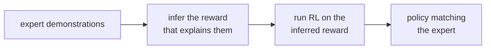

Behavioral cloning copies *what* the expert does. **Inverse reinforcement learning**
(IRL) recovers *why*: the reward function the expert is optimizing. A reward
generalizes far better than a copied policy, because it explains behavior in new
states the demonstrations never visited. The catch is that the problem is badly
underdetermined, and resolving that ambiguity is the whole technical content.

## The reward-ambiguity problem

Given expert trajectories, many reward functions make them optimal. The trivial
reward $r \equiv 0$ makes *every* policy optimal, the expert included. More subtly,
adding any potential-based shaping term leaves the optimal policy unchanged. So
"find a reward under which the expert is optimal" has a huge solution set, most of
them useless. IRL needs a principle to pick one.

## Maximum-entropy IRL

The **maximum-entropy** principle resolves the ambiguity by asking for the least
committed distribution over behavior consistent with the data. Among all
trajectory distributions whose expected features match the expert's, choose the one
with maximum [entropy](A2/entropy). The solution to that constrained maximization is
an exponential-family distribution in which a trajectory's probability is set by its
return under a **linear** reward $r_\theta(s) = \theta^\top \phi(s)$:

$$
p_\theta(\tau) \propto \exp\!\Big( \sum_{t} \theta^\top \phi(s_t) \Big).
$$

Higher-reward trajectories are exponentially more likely, but nothing beyond the
feature-matching constraint is assumed, which is exactly what "maximum entropy"
buys. Fitting $\theta$ by maximum likelihood gives a clean gradient:

$$
\nabla_\theta \mathcal{L} = \underbrace{\phi_{\text{expert}}}_{\text{empirical feature avg}} - \underbrace{\mathbb{E}_{p_\theta}[\phi]}_{\text{model feature avg}}.
$$

This is the generic exponential-family gradient: match the model's expected
features to the expert's. At the optimum the two are equal, so the recovered reward
reproduces the expert's feature expectations. Computing $\mathbb{E}_{p_\theta}[\phi]$
in a full MDP needs a soft (entropy-regularized) value-iteration pass, but the
feature-matching structure is the same in every case.

## GAIL: skip the reward, match occupancy

Recovering a reward and then running RL on it is a slow two-step loop. **Generative
adversarial imitation learning** (GAIL) collapses it. The state-action distribution
a policy induces is its **occupancy measure**; imitation succeeds exactly when the
learner's occupancy matches the expert's. GAIL drives that match with a GAN:

- A **discriminator** $D$ is trained to tell expert state-action pairs from the
  learner's, outputting the probability that a pair came from the expert.
- The **policy** is trained by RL (PPO) with reward $-\log(1 - D(s,a))$, which is
  high where the discriminator thinks a pair looks expert-like.

The discriminator plays the role of the recovered reward, and the adversarial game
pushes the learner's occupancy toward the expert's. GAIL imitates directly from
demonstrations without ever materializing an explicit reward, which is why it scales
to high-dimensional control where reward recovery is hard. The same adversarial
structure links it to the [GANs](D4/gan) of generative deep learning.



## Worked check: recover a reward that reproduces expert behavior

Use a one-step (contextual) version where the expert is soft-optimal for an unknown
linear reward $\theta^\top \phi(a)$. The only thing IRL observes is the expert's
feature expectation. Recover $\theta$ by the feature-matching gradient and confirm
the induced policy reproduces both the expert's feature expectations and its action
distribution.

```python
import numpy as np
rng = np.random.default_rng(0)

K, d = 6, 3
F = rng.normal(size=(K, d))                 # feature vector phi(a) of each action
theta_true = np.array([1.5, -1.0, 0.5])     # the expert's (unknown) reward weights
def softmax(u): e = np.exp(u - u.max()); return e / e.sum()

pi_expert = softmax(F @ theta_true)         # expert is soft-optimal for the reward
f_expert = pi_expert @ F                     # expert feature expectation (all IRL sees)

# Max-ent IRL: ascend the feature-matching gradient  grad = f_expert - E_pi[phi].
theta = np.zeros(d)
for _ in range(5000):
    pi = softmax(F @ theta)
    theta += 0.5 * (f_expert - pi @ F)

pi_rec = softmax(F @ theta)
print("feature expectations matched:", np.allclose(pi_rec @ F, f_expert, atol=1e-4))
print("recovered policy matches expert:", np.allclose(pi_rec, pi_expert, atol=1e-3))
print("expert policy:   ", np.round(pi_expert, 3))
print("recovered policy:", np.round(pi_rec, 3))
```

The recovered reward weights induce a policy whose feature expectations and action
probabilities match the expert's, recovering the behavior from feature statistics
alone, the maximum-entropy resolution of the reward ambiguity.

Imitation and IRL both assume an interactive environment or an online expert.
Often neither is available: there is only a fixed, logged dataset and no way to
collect more. The next lesson tackles that offline setting.
