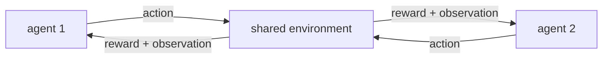

Every method so far assumes a single agent in a fixed environment. Many problems
have several agents learning at once: competing traders, cooperating robots, players
in a game. When other agents are also adapting, the ground shifts under each
learner, and the single-agent guarantees break. Multi-agent RL formalizes this and
the techniques that make it tractable.

## Stochastic games

The multi-agent generalization of an MDP is a **stochastic game** (Markov game):
$N$ agents, a shared state $s$, a **joint** action $(a^1, \dots, a^N)$, a transition
$P(s' \mid s, a^1, \dots, a^N)$ that depends on everyone's action, and a separate
reward $R^i$ for each agent. The single-agent MDP is the $N = 1$ case; a two-player
zero-sum game ($R^1 = -R^2$) is the competitive extreme, and identical rewards
($R^i = R^j$) the fully cooperative one.

The right notion of "solution" changes too. There is no single optimal policy;
instead the target is an **equilibrium**, typically a **Nash equilibrium**, a joint
policy where no agent can improve by unilaterally changing its own policy.

## The nonstationarity problem

The core difficulty: from one agent's point of view, the others are part of the
environment, and they are *changing*. The transition and reward that agent $i$
effectively experiences depend on the other agents' current policies, so as those
policies update, agent $i$'s environment becomes **nonstationary**. This breaks the
stationarity assumption every convergence result in this pillar relied on. Naive
**independent learning** (each agent runs its own Q-learning, treating others as
fixed) can oscillate or diverge, because each agent is chasing a moving target that
moves *because* it is chasing.

## Centralized training, decentralized execution

The dominant fix is **CTDE**. During training, allow a **centralized critic** that
sees the full joint state and all agents' actions, so it evaluates each agent
against a stationary, fully-observed picture. At execution time, each agent acts
through a **decentralized actor** that uses only its own local observation. Methods
like MADDPG put one centralized critic per agent over the joint action and a local
actor for each<FN n="1" />; the critic stabilizes learning (it is not fooled by the others'
changes because it observes them), while the actors remain independently deployable.

## Self-play

In symmetric competitive games, **self-play** is the engine: an agent trains against
copies of itself (current or past versions). This supplies an automatically
matched, ever-improving opponent, a natural curriculum that scales with the agent's
own skill. Self-play drove AlphaZero and superhuman play in Go, chess, and
StarCraft. Maintaining a pool of past opponents prevents the cycle where two agents
chase each other's latest weaknesses and forget how to beat older strategies.



## Worked check: fictitious play converges to the Nash equilibrium

A clean window on multi-agent learning is **fictitious play**: each player best-
responds to the empirical frequency of the opponent's past actions. In a zero-sum
game the empirical frequencies provably converge to the Nash equilibrium. For
Rock-Paper-Scissors that equilibrium is the uniform mix $(1/3, 1/3, 1/3)$, the only
unexploitable strategy. Run it and watch the frequencies converge there.

```python
import numpy as np

# Rock-Paper-Scissors payoff for the row player (+1 if row beats column).
M = np.array([[ 0, -1,  1],     # rock
              [ 1,  0, -1],     # paper
              [-1,  1,  0]])    # scissors

cntA = np.zeros(3); cntB = np.zeros(3)
cntA[0] = cntB[1] = 1.0          # arbitrary initial beliefs
for _ in range(20000):
    pB = cntB / cntB.sum(); pA = cntA / cntA.sum()
    aA = int(np.argmax(M @ pB))         # row best-responds to column's empirical mix
    aB = int(np.argmax(-(M.T @ pA)))    # column best-responds (minimizes row payoff)
    cntA[aA] += 1; cntB[aB] += 1

freqA = cntA / cntA.sum()
print("row empirical frequencies:", np.round(freqA, 3))
print("col empirical frequencies:", np.round(cntB / cntB.sum(), 3))
print("converged to uniform Nash (1/3 each):", np.allclose(freqA, 1/3, atol=0.02))
```

Both players' empirical action frequencies settle on the uniform mixture, the Nash
equilibrium of the game, reached purely by each side adapting to the other's history
despite the nonstationarity that adaptation creates.

## Exercises

**Exercise 1.** In Matching Pennies, the row player wins ($+1$) when the two coins
match and loses ($-1$) when they differ; the column player has the opposite payoff
(zero-sum). Find the mixed-strategy Nash equilibrium by the indifference principle,
and give the game's value to the row player.

<details>
<summary>Solution</summary>

**Step 1.** Let the column player play heads with probability $q$ and tails with
$1 - q$. The row player's expected payoff from playing heads is
$q(+1) + (1 - q)(-1) = 2q - 1$, and from tails is $q(-1) + (1 - q)(+1) = 1 - 2q$.

**Step 2.** At a mixed equilibrium the column player must make the row player
**indifferent** between its actions (otherwise row would play a pure best response,
which column could then exploit). Set the two payoffs equal:

$$
2q - 1 = 1 - 2q \quad\Longrightarrow\quad 4q = 2 \quad\Longrightarrow\quad q = \tfrac12.
$$

**Step 3.** By the symmetry of the game the same argument gives the row player's mix
as $(1/2, 1/2)$. The equilibrium is both players uniform, $(1/2, 1/2)$. The value to
the row player is the common indifference payoff $2 \cdot \tfrac12 - 1 = 0$: a fair
game, as a symmetric zero-sum game must be.

</details>

**Exercise 2.** Independent learners treat the other agents as part of a fixed
environment. Explain why this makes each agent's environment nonstationary, and why a
centralized critic that observes the joint action does not suffer from the same
problem.

<details>
<summary>Solution</summary>

**Step 1.** Agent $i$'s effective transition and reward are obtained by marginalizing
over the other agents' actions, which are drawn from *their current policies*. While
those policies are still updating, the marginalized transition $P(s' \mid s, a^i)$ and
reward change between updates, so agent $i$ faces a moving target: the environment it
sees is nonstationary, breaking the stationarity assumption every convergence proof in
the pillar relied on.

**Step 2.** A centralized critic conditions on the **full joint action**
$(a^1, \dots, a^N)$ and the full state. The true environment dynamics
$P(s' \mid s, a^1, \dots, a^N)$ depend on the joint action and are genuinely
stationary, so a critic that observes all of it evaluates against a fixed target. It
is not fooled by the others' policy changes because those changes are explicit inputs,
not hidden shifts in an opaque environment, which is why CTDE stabilizes learning.

</details>

**Exercise 3 (code).** Run fictitious play on Matching Pennies (each player
best-responds to the empirical frequency of the opponent's past actions) and confirm
the empirical frequencies converge to the $(1/2, 1/2)$ Nash equilibrium derived in
Exercise 1.

<details>
<summary>Solution</summary>

```python
import numpy as np

# Matching Pennies: row payoff +1 on a match, -1 on a mismatch (zero-sum).
M = np.array([[ 1, -1],     # row plays heads
              [-1,  1]])    # row plays tails

cntA = np.array([1.0, 0.0]); cntB = np.array([0.0, 1.0])   # arbitrary initial beliefs
for _ in range(50000):
    pB = cntB / cntB.sum(); pA = cntA / cntA.sum()
    aA = int(np.argmax(M @ pB))         # row best-responds to column's empirical mix
    aB = int(np.argmax(-(M.T @ pA)))    # column minimizes the row payoff
    cntA[aA] += 1; cntB[aB] += 1

fA, fB = cntA / cntA.sum(), cntB / cntB.sum()
assert np.allclose(fA, 0.5, atol=0.02) and np.allclose(fB, 0.5, atol=0.02)
print("row freq:", np.round(fA, 3), " col freq:", np.round(fB, 3))
```

Both players' empirical frequencies settle on the uniform mixture predicted by the
indifference principle, the unique Nash equilibrium, reached by each side adapting to
the other's history despite the nonstationarity that adaptation creates.

</details>

These extensions all keep one flat policy choosing primitive actions. The last
lesson of the subsection adds temporal structure: hierarchical RL, where high-level
policies select among lower-level skills that run for many steps.

<Footnotes>
  <FNItem n="1">**Lowe, R., et al.** (2017). "Multi-agent actor-critic for mixed cooperative-competitive environments (MADDPG)". *NeurIPS*. [arXiv:1706.02275](https://arxiv.org/abs/1706.02275). Introduces centralized-critic, decentralized-actor training.</FNItem>
</Footnotes>
