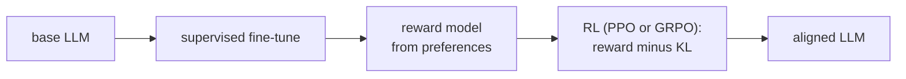

The [RLHF pipeline](E4/ppo-rlhf) was introduced from the language-modeling side:
fit a reward model to human preferences, then optimize the policy with PPO. This
lesson re-reads that pipeline through the RL formalism of this pillar, which makes
precise what the state, action, and reward actually are, and why a KL penalty to a
reference model is not a heuristic add-on but the defining feature of the objective<FN ns="1, 2" />.

## Generation as a token-level MDP

Autoregressive generation is already a sequential decision process. Cast it as an
MDP:

- **State** $s_t$: the prompt followed by the tokens generated so far,
  $s_t = (x, y_1, \dots, y_{t-1})$.
- **Action** $a_t$: the next token $y_t$ from the vocabulary.
- **Policy** $\pi_\theta(a_t \mid s_t)$: the language model itself, its next-token
  distribution.
- **Transition**: deterministic concatenation, $s_{t+1} = s_t \oplus y_t$. The
  environment just appends the chosen token; all the stochasticity is in the policy.
- **Reward**: zero at every intermediate token, and a single terminal reward
  $r(x, y)$ from the reward model when the sequence ends.

So a completion is an episode, the LM is the policy, and the reward is **sparse**:
one scalar at the end of generation. This is why PPO, built for exactly this
sparse-reward policy-optimization setting, is the natural optimizer<FN n="3" />.

## The KL-to-reference penalty

Optimizing the reward model alone is dangerous: the reward model is an imperfect
proxy, and a policy free to move anywhere will find inputs that score high under the
proxy while producing degenerate text (the [reward hacking](reward-hacking) of two
lessons ahead). RLHF prevents this by penalizing drift from the original supervised
model $\pi_{\text{ref}}$. The per-token reward becomes

$$
r_t = \underbrace{r(x, y)\,[\,t = T\,]}_{\text{terminal reward-model score}} - \beta\,\underbrace{\log \frac{\pi_\theta(a_t \mid s_t)}{\pi_{\text{ref}}(a_t \mid s_t)}}_{\text{per-token KL to reference}},
$$

so the agent maximizes reward while a coefficient $\beta$ holds it near the
reference. Summed over a completion, the objective is

$$
\max_\theta\; \mathbb{E}_{y \sim \pi_\theta}\big[ r(x, y) \big] - \beta\, \mathrm{KL}\big(\pi_\theta(\cdot \mid x)\,\|\,\pi_{\text{ref}}(\cdot \mid x)\big).
$$

This is the [PPO trust region](H2/ppo) idea in a second guise: keep the policy close
to a trusted anchor, here the reference model rather than the previous iterate.

## The optimal KL-regularized policy

The KL-regularized objective has a closed-form optimum, and deriving it explains
exactly what the penalty does. Maximizing
$\mathbb{E}_\pi[r] - \beta\,\mathrm{KL}(\pi \,\|\, \pi_{\text{ref}})$ over
distributions $\pi$ (a one-step / per-state problem) is solved by a Lagrangian whose
stationary point is

$$
\pi^*(a) = \frac{1}{Z}\,\pi_{\text{ref}}(a)\,\exp\!\Big(\frac{r(a)}{\beta}\Big),
$$

with $Z$ the normalizer. The optimal policy is the **reference reweighted by
exponentiated reward**: actions the reward likes get an exponential boost, but
starting from the reference's probabilities. The temperature $\beta$ tunes the pull:
as $\beta \to \infty$ the exponential flattens and $\pi^* \to \pi_{\text{ref}}$ (stay
put); as $\beta \to 0$ it sharpens onto the reward-maximizing token (pure reward
chasing). This same closed form is the identity that [DPO](E4/ppo-rlhf) inverts to
skip the RL loop entirely.



## Worked check: the closed form is the optimum, and $\beta$ interpolates

Treat one generation step as a bandit over a small vocabulary with a reference
distribution and a per-token reward. Verify that the closed-form policy
$\pi^* \propto \pi_{\text{ref}} \exp(r/\beta)$ matches the optimum found by gradient
ascent on the KL-regularized objective, and that $\beta$ slides the optimum from the
reference (large $\beta$) to the reward-greedy choice (small $\beta$).

```python
import numpy as np
rng = np.random.default_rng(0)

K = 8
logits_ref = rng.normal(size=K)
pi_ref = np.exp(logits_ref); pi_ref /= pi_ref.sum()   # reference next-token dist
r = rng.normal(size=K) * 2                             # reward-model score per token
def softmax(u): e = np.exp(u - u.max()); return e / e.sum()

def closed_form(beta):                                 # pi*(a) ∝ pi_ref(a) exp(r(a)/beta)
    return softmax(np.log(pi_ref) + r / beta)

def grad_ascent(beta, steps=20000, lr=0.05):           # maximize E[r] - beta*KL
    theta = np.log(pi_ref).copy()
    for _ in range(steps):
        pi = softmax(theta)
        adv = r - beta * (np.log(pi) - np.log(pi_ref) + 1)
        theta += lr * pi * (adv - pi @ adv)            # gradient w.r.t. logits
    return softmax(theta)

print("closed form == gradient-ascent optimum:", np.allclose(closed_form(1.0), grad_ascent(1.0), atol=1e-3))
print("beta=20 stays near the reference:", np.allclose(closed_form(20), pi_ref, atol=0.03))
print("beta=0.05 concentrates on argmax reward:",
      int(np.argmax(closed_form(0.05))) == int(np.argmax(r)), " max prob:", round(closed_form(0.05).max(), 3))
```

The closed-form policy matches the numerically optimized one, and the temperature
$\beta$ moves it continuously from "stay at the reference" to "take the highest-reward
token," which is exactly the knob the KL coefficient turns during RLHF.

This frames RLHF where the reward comes from a learned model of human preference. The
next lesson swaps that learned reward for a programmatic verifier, the setup behind
recent reasoning models.

<Footnotes>
  <FNItem n="1">**Ouyang, L., et al.** (2022). "Training language models to follow instructions with human feedback". *NeurIPS*. [arXiv:2203.02155](https://arxiv.org/abs/2203.02155). The InstructGPT recipe: SFT, reward model, then PPO with a KL-to-reference penalty.</FNItem>
  <FNItem n="2">**Christiano, P., et al.** (2017). "Deep reinforcement learning from human preferences". *NeurIPS*. [arXiv:1706.03741](https://arxiv.org/abs/1706.03741). The original learn-a-reward-from-comparisons framework underlying RLHF.</FNItem>
  <FNItem n="3">**Schulman, J., Wolski, F., Dhariwal, P., Radford, A., & Klimov, O.** (2017). "Proximal policy optimization algorithms". [arXiv:1707.06347](https://arxiv.org/abs/1707.06347). The clipped trust-region policy optimizer used to maximize the KL-regularized reward.</FNItem>
</Footnotes>
