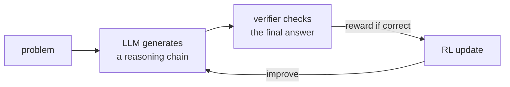

RLHF's reward comes from a learned model of human preference, which is a proxy that
can be gamed. For tasks with a checkable answer, math problems, code, formal proofs,
there is something better: a **verifier** that says, with certainty, whether the
answer is right. **Reinforcement learning from verifiable rewards** (RLVR) optimizes
against that ground truth, and it is what produced the recent jump in LLM reasoning<FN n="2" />.

## Verifiable rewards

In RLVR the reward is computed by a program, not a network:

$$
r(x, y) = \begin{cases} 1 & \text{the verifier accepts the answer in } y, \\ 0 & \text{otherwise}, \end{cases}
$$

where the verifier checks the final answer against a known solution, runs unit
tests on generated code, or type-checks a proof. The reward is **exact** (no
approximation error) and far **harder to hack**: a math answer is either correct or
not, so the model cannot win by finding adversarial inputs to a soft reward model.
The token-level MDP framing from the previous lesson is unchanged; only the source
of the terminal reward differs.

## GRPO: a baseline without a critic

PPO needs a value network (the critic) to compute advantages, which for a large LM
means training a second model of comparable size. **Group relative policy
optimization** (GRPO) removes the critic by building the baseline from a *group* of
sampled answers to the same prompt<FN n="1" />. For each prompt, sample $G$ completions
$y_1, \dots, y_G$, score each with the verifier to get $r_1, \dots, r_G$, and compute
a **group-relative advantage** by standardizing within the group:

$$
A_i = \frac{r_i - \operatorname{mean}(r_1, \dots, r_G)}{\operatorname{std}(r_1, \dots, r_G)}.
$$

The group mean is the baseline (the same variance-reduction role $V(s)$ played in
the [policy-gradient lesson](H2/policy-gradient)), estimated on the fly from siblings
instead of a learned critic. Completions better than the group average get a
positive advantage and are reinforced; worse-than-average ones are suppressed. The
policy is then updated with the PPO clipped objective using these advantages. This
is the algorithm covered from the LLM side in [E4](E4/grpo); here it is the natural
critic-free policy gradient for the verifier-reward MDP.

## R1-style emergence of reasoning

The striking empirical result is that optimizing only a terminal correctness reward,
with no supervision of the reasoning itself, makes long chains of thought **emerge**.
Given only "the final answer must be right," the model discovers on its own that
generating intermediate steps, checking its work, and backtracking raises its
probability of a correct answer, so RL reinforces those behaviors. Response lengths
grow over training and reflection-like patterns appear, none of it explicitly
rewarded<FN n="2" />. The reasoning is instrumental: it is selected because it pays off at the
verifier, the clearest demonstration that capability can come from reward signal
alone rather than demonstrations.



## Worked check: group-relative advantages train toward the verified answer

Model one prompt with $K$ candidate answers, exactly one of which the verifier
accepts. Run GRPO: sample a group, score it with the verifier, standardize the
rewards into advantages, and apply the policy gradient. Confirm the probability of
the correct answer climbs to near one and that the group advantages are mean-zero (a
pure baseline, introducing no bias).

```python
import numpy as np
rng = np.random.default_rng(0)

K, correct = 6, 3
def verify(a): return 1.0 if a == correct else 0.0     # programmatic verifier
def softmax(th): e = np.exp(th - th.max()); return e / e.sum()

theta = np.zeros(K)
G, lr = 16, 0.4                                         # group size, step size
p0 = softmax(theta)[correct]
adv_means = []
for _ in range(3000):
    pi = softmax(theta)
    group = rng.choice(K, size=G, p=pi)                # sample G completions
    r = np.array([verify(a) for a in group])
    adv = (r - r.mean()) / (r.std() + 1e-8)            # group-relative advantage, no critic
    adv_means.append(adv.mean())
    grad = sum(A * (np.eye(K)[a] - pi) for a, A in zip(group, adv))
    theta += lr * grad / G

print("P(correct) before:", round(p0, 3), " after:", round(softmax(theta)[correct], 3))
print("mean group advantage (a pure baseline, ~0):", round(float(np.mean(adv_means)), 4))
```

The probability of the verifier-correct answer rises from chance to essentially one,
driven entirely by the group-relative advantage with no value network, the
critic-free signal that GRPO uses to turn verifier rewards into a better policy.

## Exercises

**Exercise 1.** A GRPO group of $G = 4$ completions to one prompt receives binary
verifier rewards $r = (1, 0, 0, 0)$: one completion is correct. Compute the
group-relative advantage $A_i = \frac{r_i - \operatorname{mean}(r)}{\operatorname{std}(r)}$
for the correct completion and for a wrong one (use the population standard
deviation, dividing by $G$).

<details>
<summary>Solution</summary>

**Step 1.** The group mean is $\operatorname{mean}(r) = (1 + 0 + 0 + 0)/4 = 0.25$.

**Step 2.** The population variance is
$\frac{1}{4}\big[(1 - 0.25)^2 + 3(0 - 0.25)^2\big]
= \frac{1}{4}[0.5625 + 3 \cdot 0.0625] = \frac{0.75}{4} = 0.1875$, so the standard
deviation is $\sqrt{0.1875} = 0.4330$.

**Step 3.** The advantages are

$$
A_{\text{correct}} = \frac{1 - 0.25}{0.4330} = 1.732, \qquad
A_{\text{wrong}} = \frac{0 - 0.25}{0.4330} = -0.577.
$$

The single correct completion is reinforced with a large positive advantage; each of
the three wrong ones is suppressed. The advantages are mean-zero by construction
($1.732 + 3(-0.577) = 0$), so the group baseline adds no bias.

</details>

**Exercise 2.** In the worked block the verified-correct probability climbs toward
one. Explain why GRPO's standardized advantage keeps learning even after the policy
already places most of its mass on the correct answer, whereas a raw-reward signal
$A_i = r_i$ (no baseline) would not stall the same way but would inject bias. State
what the standardization buys and what its failure mode is.

<details>
<summary>Solution</summary>

**Step 1.** With the standardized advantage, the update direction depends on
*within-group ranking*, not absolute reward. As long as a sampled group contains at
least one correct and one wrong completion, the correct ones get $A > 0$ and the
wrong ones $A < 0$, so the gradient keeps pushing mass toward correct answers
regardless of how high $P(\text{correct})$ already is.

**Step 2.** A raw-reward signal $A_i = r_i \ge 0$ would only ever reinforce
(never suppress), and because it is not mean-centered it has a nonzero baseline that
inflates gradient variance and biases the policy-gradient estimate. The group mean is
the variance-reduction baseline that the policy-gradient lesson justifies; subtracting
it leaves the gradient unbiased while cutting its variance.

**Step 3.** The failure mode of standardization is a **degenerate group**: if every
sampled completion is correct (or every one wrong), the rewards are constant, the
standard deviation is zero, and the advantage is undefined (the $+\varepsilon$ in the
denominator forces it to zero). No within-group contrast means no learning signal
from that prompt, which is why difficulty has to be tuned so groups stay mixed.

</details>

**Exercise 3 (code).** Verify the advantage properties on a partial-credit verifier
that returns rewards in $\{0, 0.5, 1\}$. Standardize a mixed group and confirm the
advantages are mean-zero and unit-variance; then standardize an all-correct group and
confirm the advantage collapses to zero (the degenerate case from Exercise 2).

<details>
<summary>Solution</summary>

```python
import numpy as np

def grpo_adv(r):                                  # group-relative advantage
    r = np.asarray(r, float)
    return (r - r.mean()) / (r.std() + 1e-8)

r = np.array([0.0, 0.0, 0.5, 1.0, 1.0, 0.5, 0.0, 1.0])   # mixed group
A = grpo_adv(r)
print("advantages:", np.round(A, 3))
print("mean:", round(float(A.mean()), 6), " std:", round(float(A.std()), 4))
assert np.isclose(A.mean(), 0.0, atol=1e-6)       # baseline -> unbiased
assert np.isclose(A.std(), 1.0, atol=1e-3)        # standardized -> unit scale

flat = grpo_adv(np.ones(8))                       # all completions correct
print("all-correct group advantage ~0:", np.allclose(flat, 0.0, atol=1e-6))
assert np.allclose(flat, 0.0, atol=1e-6)          # no within-group contrast, no signal
```

The mixed group yields mean-zero, unit-variance advantages, so the update is unbiased
and scale-stable; the all-correct group yields zero advantage, the degenerate case
where every sample agrees and GRPO extracts no gradient from the prompt.

</details>

A verifier is a sharper reward than a learned model, but no reward is perfect, and
optimizing any proxy hard enough eventually corrupts the true objective. The last
lesson confronts that: reward hacking and overoptimization.

<Footnotes>
  <FNItem n="1">**Shao, Z., et al.** (2024). "DeepSeekMath: pushing the limits of mathematical reasoning in open language models". [arXiv:2402.03300](https://arxiv.org/abs/2402.03300). Introduces GRPO, the critic-free group-relative policy optimizer.</FNItem>
  <FNItem n="2">**DeepSeek-AI.** (2025). "DeepSeek-R1: incentivizing reasoning capability in LLMs via reinforcement learning". [arXiv:2501.12948](https://arxiv.org/abs/2501.12948). Long reasoning chains emerge from a terminal correctness reward alone.</FNItem>
</Footnotes>

