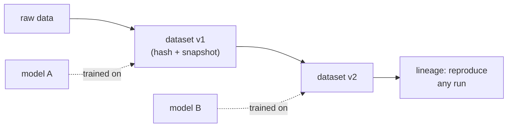

A model is a function of its data, so "which data?" must have an exact answer. If
a training set is a folder on a shared drive that people append to and overwrite,
then "the model trained on `customers.csv`" is meaningless a month later, because
`customers.csv` is a different file now. Code solved this with Git: every commit
is identified by the hash of its contents, so a commit hash names an exact
snapshot forever. Data versioning (DVC, lakeFS, Git LFS) applies the same idea to
datasets too large to put in Git directly.

## Content addressing

The core move is to name data by **what it contains**, not by where it sits or
what it is called. Run the bytes of a file through a cryptographic **hash
function** (SHA-256), which maps any input to a fixed-length digest with two
properties that matter here:

- **Determinism.** The same bytes always produce the same digest. So the digest
  is a stable identity: if two files hash equal, they are (for all practical
  purposes) the same file, anywhere, any time.
- **Collision resistance.** It is computationally infeasible to find two different
  inputs with the same digest. So distinct data reliably gets distinct names, and
  a digest can be trusted as a unique fingerprint.

Storing a file under its own digest is **content-addressed storage**<FN n="1" />. The digest
becomes the address. A version of a dataset is then just a small **manifest** that
lists the digests of its files; pinning a training run to that manifest pins it,
immutably, to those exact bytes. Change one row and the file's digest changes, the
manifest's digest changes, and you have a new version that coexists with the old
rather than destroying it.

## Deduplication falls out for free

Content addressing gives deduplication automatically. If a file is stored under
its content hash, then two identical files map to the *same* address and are
stored once. Better, split each file into fixed-size **chunks** and content-address
the chunks: now two datasets that share most of their rows, a snapshot and the
same snapshot with a few appended rows, share all the chunks they have in common
and only the changed or new chunks cost new storage.

This is why versioning every daily snapshot of a slowly-growing dataset does not
cost a full copy per day. The storage for $k$ snapshots is the size of the *union*
of their chunks, not the sum of their sizes. Identical chunks, however many
snapshots reference them, are paid for once<FN n="2" />.



## Worked example

We hash four data chunks, store two daily snapshots that overlap, and confirm that
content addressing stores each distinct chunk exactly once.

```python
import numpy as np, hashlib

def chunk_hash(arr):
    # Address a chunk by the SHA-256 of its raw bytes (first 8 hex chars shown).
    return hashlib.sha256(arr.tobytes()).hexdigest()[:8]

A = np.array([1, 2, 3], dtype=np.int64)   # four distinct data chunks
B = np.array([4, 5, 6], dtype=np.int64)
C = np.array([7, 8, 9], dtype=np.int64)
D = np.array([1, 2, 3], dtype=np.int64)   # byte-identical to A

# Determinism + collision behaviour: equal bytes -> equal address, and not others.
assert chunk_hash(A) == chunk_hash(D)
assert chunk_hash(A) != chunk_hash(B)

# Two snapshots. Day 2 keeps A, B and swaps C for a new chunk; reuses much of day 1.
day1 = [A, B, C]
day2 = [A, B, np.array([7, 8, 99], dtype=np.int64)]

store = {}                                 # content-addressed store: address -> chunk
for snap in (day1, day2):
    for ch in snap:
        store[chunk_hash(ch)] = ch          # identical addresses collapse to one slot

logical_chunks = len(day1) + len(day2)     # 6 chunk references across both snapshots
stored_chunks  = len(store)                # distinct chunks actually stored
print("logical chunk references:", logical_chunks)
print("distinct chunks stored:  ", stored_chunks)
print("chunks deduplicated:     ", logical_chunks - stored_chunks)
assert stored_chunks == 4                  # A, B, C, and the one new chunk
```

Six chunk references across the two snapshots collapse to four stored chunks: A
and B, shared by both days, are kept once, so versioning the second snapshot costs
only the one chunk that actually changed.

## Exercises

**Exercise 1.** A dataset is split into $1000$ fixed-size chunks. Day 1 stores all
$1000$. On day 2, $30$ chunks change (an edit touches $30$ chunks somewhere in the
file) and $20$ brand-new chunks are appended; the rest are byte-identical to day
1. How many *distinct* chunks does the content-addressed store hold after both
days, and how many chunk references does that represent across the two snapshots?

<details>
<summary>Solution</summary>

**Step 1.** Count what day 2 contributes that is new. The $970$ unchanged chunks
already hash to addresses present from day 1, so they add nothing to the store.
The $30$ changed chunks have new bytes, hence new addresses, and the $20$ appended
chunks are new as well: $30 + 20 = 50$ new distinct chunks.

**Step 2.** Distinct chunks stored is day 1's $1000$ plus those $50$:

$$
1000 + 50 = 1050 \text{ distinct chunks}.
$$

**Step 3.** Chunk references count every chunk each snapshot lists, with no
deduplication. Day 1 references $1000$; day 2 references $970$ unchanged $+ 30$
changed $+ 20$ appended $= 1020$. Total references:

$$
1000 + 1020 = 2020 \text{ references}, \quad 2020 - 1050 = 970 \text{ deduplicated}.
$$

Storing the second snapshot cost $50$ chunks of new storage rather than a full
$1020$-chunk copy.

</details>

**Exercise 2.** Collision resistance is what lets a digest stand in for the bytes.
Suppose someone proposes addressing chunks by a $16$-bit checksum instead of
SHA-256, on a store that will hold $50{,}000$ distinct chunks. Argue why this
breaks content addressing, and state what goes wrong operationally when two
different chunks share an address.

<details>
<summary>Solution</summary>

**Step 1.** A $16$-bit checksum has only $2^{16} = 65{,}536$ possible values. With
$50{,}000$ distinct chunks mapped into $65{,}536$ slots, the pigeonhole pressure is
severe: by the birthday bound, a collision becomes likely once the number of items
approaches $\sqrt{2^{16}} \approx 256$, far below $50{,}000$. Collisions are
essentially guaranteed, so the address no longer uniquely names its bytes.

**Step 2.** Content addressing stores a chunk under its address and assumes
"address already present" means "these exact bytes are already stored." When two
different chunks collide, the second write sees its address already occupied and is
silently skipped (or overwrites the first). One snapshot then reads back the wrong
chunk: a dataset version is corrupted, and the corruption is invisible because
every manifest still resolves to a stored address.

**Step 3.** The fix is a hash wide enough that accidental and adversarial
collisions are infeasible. SHA-256's $256$-bit space makes the birthday bound
astronomically large, which is exactly the collision-resistance property the
lesson relies on.

</details>

**Exercise 3 (code).** Implement chunk-level deduplication across three daily
snapshots of a growing log. Each day appends new rows and never edits old ones, so
every chunk from an earlier day reappears unchanged. Verify that the store holds
exactly the number of distinct chunks (not the sum of snapshot sizes) and that the
total bytes stored equals the union size.

<details>
<summary>Solution</summary>

```python
import numpy as np, hashlib

def chunk_hash(arr):
    return hashlib.sha256(arr.tobytes()).hexdigest()

rng = np.random.default_rng(0)
chunk_size = 4                       # 4 int64 values per chunk

# A growing log: day d holds the first (d * 5) chunks; earlier chunks are reused.
all_chunks = [rng.integers(0, 1000, size=chunk_size) for _ in range(15)]
day1 = all_chunks[:5]                # 5 chunks
day2 = all_chunks[:10]              # 10 chunks (5 reused + 5 new)
day3 = all_chunks[:15]             # 15 chunks (10 reused + 5 new)
snapshots = [day1, day2, day3]

store = {}                           # address -> chunk bytes
for snap in snapshots:
    for ch in snap:
        store[chunk_hash(ch)] = ch.tobytes()

references = sum(len(s) for s in snapshots)   # 5 + 10 + 15
distinct   = len(store)
bytes_stored = sum(len(b) for b in store.values())
union_bytes  = distinct * chunk_size * 8      # int64 = 8 bytes each

print("chunk references:", references)        # 30
print("distinct chunks: ", distinct)          # 15
print("bytes stored:    ", bytes_stored)

assert distinct == 15                          # the union, not the 30-chunk sum
assert references == 30
assert bytes_stored == union_bytes             # no chunk paid for twice
```

The store keeps $15$ distinct chunks though the three snapshots reference $30$;
the append-only log pays once per chunk, so total storage tracks the union size,
not the cumulative snapshot size.

</details>

With each dataset version now a reproducible, immutable name, the remaining
data-engineering job is noticing when *new* data stops looking like the data a
model was trained on, which the next lesson measures as [drift](drift-detection).

<Footnotes>
  <FNItem n="1">**Kleppmann, M.** (2017). *Designing Data-Intensive Applications.* O'Reilly. Content-addressed, immutable storage and hashing for stable identity.</FNItem>
  <FNItem n="2">**Reis, J., & Housley, M.** (2022). *Fundamentals of Data Engineering.* O'Reilly. Dataset versioning, lineage, and reproducibility in the data lifecycle.</FNItem>
</Footnotes>
