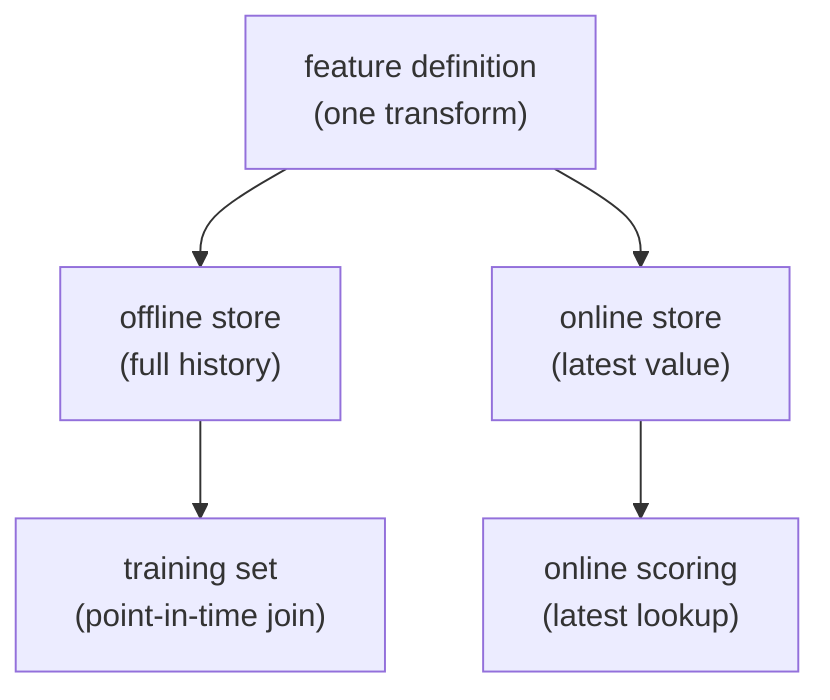

A model is trained on features computed in a batch pipeline and then, in
production, scored on features computed live. If those two computations disagree,
even slightly, the model sees inputs at serving time that it never saw in
training, and accuracy quietly collapses. A **feature store** exists to guarantee
they agree, and to solve a subtler problem in building the training set itself:
computing a feature's value *as it was at the moment of each training example*,
not as it is now. That second problem, **point-in-time correctness**, is where
most label leakage in tabular ML hides.

## Two stores, one definition

A feature store holds each feature behind a single definition but materializes it
into two places:

- The **offline store** (a warehouse table) keeps the full history of feature
  values over time. It answers "what was this feature for entity $e$ at time
  $t$?" for any past $t$, which is what building a training set needs.
- The **online store** (a low-latency key-value store) keeps only the *latest*
  value per entity. It answers "what is this feature for entity $e$ right now?" in
  single-digit milliseconds, which is what scoring a live request needs.



Because both stores are populated from the *same* definition, the value a model
trains on and the value it serves on are computed by identical logic. Eliminating
that gap, called **training-serving skew**, is the feature store's first job.

## The point-in-time problem

Now build a training set. You have **labels**: events that happened at specific
times, like "customer 7 churned on March 10." You want to attach **features** as
they stood *just before* each event: "how many orders had customer 7 placed as of
March 10?" The features live in the offline store as a time series of updates.

The wrong join is the easy one: take each label and attach the feature's *current*
value. That value reflects everything that happened *after* the label's timestamp,
including consequences of the very outcome you are predicting. Training on it
leaks the future, and the model posts spectacular offline numbers that vanish in
production, because at serving time the future is not available.

The correct join attaches, for each label at time $t$, the **most recent feature
value whose own timestamp is at or before $t$**:

$$
\text{feature}(e, t) = \text{value of the latest update for entity } e
\text{ with } t_{\text{update}} \le t.
$$

This is an **as-of join** (a backward, point-in-time join): for each label, look
back in the feature history and take the last value that existed by then, ignoring
every later update. It reconstructs exactly what a live system would have known at
time $t$, which is the only honest input for a model that will run live.

## Worked example

Customer 7 has a running "orders so far" feature that updates over time. We attach
it to two labelled events with both a naive latest-value join and a correct
point-in-time join.

```python
import numpy as np

# Feature history for one entity: (timestamp, orders_so_far), time-sorted.
feat_t = np.array([1, 5, 9, 14])          # days when the feature was updated
feat_v = np.array([1, 2, 3, 4])           # orders-so-far at each update

# Labelled events we want to build training rows for, at these times:
label_t = np.array([6, 12])               # e.g. churn checks on day 6 and day 12

# WRONG: attach the current (latest-ever) feature value to every label.
naive = np.full(label_t.shape, feat_v[-1])

# RIGHT: for each label time t, take the last update with feat_t <= t.
# searchsorted(side="right") counts updates at or before t; -1 indexes the last.
idx = np.searchsorted(feat_t, label_t, side="right") - 1
pit = feat_v[idx]

for t, n, p in zip(label_t, naive, pit):
    print(f"label@day {t:2d}:  naive={n}  point-in-time={p}")

# On day 6 only the day-1 and day-5 updates existed -> value 2, not 4.
assert pit.tolist() == [2, 3]
assert naive.tolist() == [4, 4]            # leaks the future on both rows
print("point-in-time join avoids leakage:", True)
```

The naive join hands both training rows the final value $4$, an input the live
model could never have at those dates; the point-in-time join recovers $2$ on day
6 and $3$ on day 12, exactly what was known then. Both the offline training set
and the online lookups now reflect feature values that genuinely existed at the
time, which only matters if you can also reproduce *which* historical data went
into them: that reproducibility is the job of [data versioning](data-versioning).
