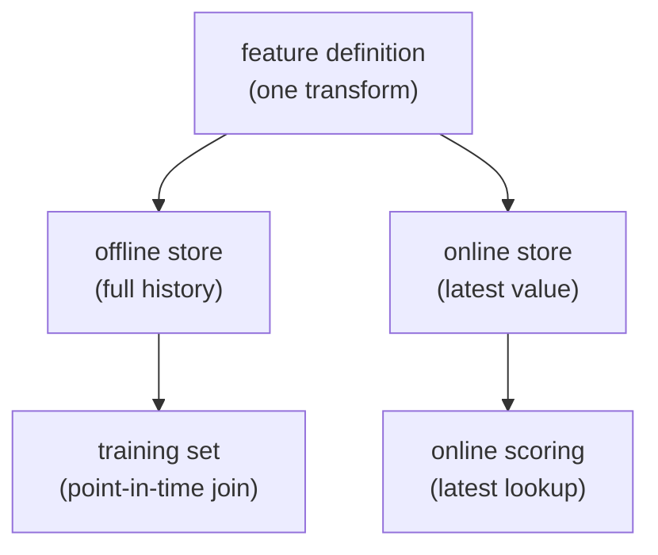

A model is trained on features computed in a batch pipeline and then, in
production, scored on features computed live. If those two computations disagree,
even slightly, the model sees inputs at serving time that it never saw in
training, and accuracy quietly collapses. A **feature store** exists to guarantee
they agree, and to solve a subtler problem in building the training set itself:
computing a feature's value *as it was at the moment of each training example*,
not as it is now. That second problem, **point-in-time correctness**, is where
most label leakage in tabular ML hides<FN n="1" />.

## Two stores, one definition

A feature store holds each feature behind a single definition but materializes it
into two places:

- The **offline store** (a warehouse table) keeps the full history of feature
  values over time. It answers "what was this feature for entity $e$ at time
  $t$?" for any past $t$, which is what building a training set needs.
- The **online store** (a low-latency key-value store) keeps only the *latest*
  value per entity. It answers "what is this feature for entity $e$ right now?" in
  single-digit milliseconds, which is what scoring a live request needs.



Because both stores are populated from the *same* definition, the value a model
trains on and the value it serves on are computed by identical logic. Eliminating
that gap, called **training-serving skew**, is the feature store's first job<FN n="2" />.

## The point-in-time problem

Now build a training set. You have **labels**: events that happened at specific
times, like "customer 7 churned on March 10." You want to attach **features** as
they stood *just before* each event: "how many orders had customer 7 placed as of
March 10?" The features live in the offline store as a time series of updates.

The wrong join is the easy one: take each label and attach the feature's *current*
value. That value reflects everything that happened *after* the label's timestamp,
including consequences of the very outcome you are predicting. Training on it
leaks the future, and the model posts spectacular offline numbers that vanish in
production, because at serving time the future is not available.

The correct join attaches, for each label at time $t$, the **most recent feature
value whose own timestamp is at or before $t$**:

$$
\text{feature}(e, t) = \text{value of the latest update for entity } e
\text{ with } t_{\text{update}} \le t.
$$

This is an **as-of join** (a backward, point-in-time join): for each label, look
back in the feature history and take the last value that existed by then, ignoring
every later update. It reconstructs exactly what a live system would have known at
time $t$, which is the only honest input for a model that will run live.

## Worked example

Customer 7 has a running "orders so far" feature that updates over time. We attach
it to two labelled events with both a naive latest-value join and a correct
point-in-time join.

```python
import numpy as np

# Feature history for one entity: (timestamp, orders_so_far), time-sorted.
feat_t = np.array([1, 5, 9, 14])          # days when the feature was updated
feat_v = np.array([1, 2, 3, 4])           # orders-so-far at each update

# Labelled events we want to build training rows for, at these times:
label_t = np.array([6, 12])               # e.g. churn checks on day 6 and day 12

# WRONG: attach the current (latest-ever) feature value to every label.
naive = np.full(label_t.shape, feat_v[-1])

# RIGHT: for each label time t, take the last update with feat_t <= t.
# searchsorted(side="right") counts updates at or before t; -1 indexes the last.
idx = np.searchsorted(feat_t, label_t, side="right") - 1
pit = feat_v[idx]

for t, n, p in zip(label_t, naive, pit):
    print(f"label@day {t:2d}:  naive={n}  point-in-time={p}")

# On day 6 only the day-1 and day-5 updates existed -> value 2, not 4.
assert pit.tolist() == [2, 3]
assert naive.tolist() == [4, 4]            # leaks the future on both rows
print("point-in-time join avoids leakage:", True)
```

The naive join hands both training rows the final value $4$, an input the live
model could never have at those dates; the point-in-time join recovers $2$ on day
6 and $3$ on day 12, exactly what was known then.

## Exercises

**Exercise 1.** A feature "account_balance" for entity $e$ updates at days
$t_{\text{update}} = \{2, 6, 9, 13\}$ with values $\{100, 250, 80, 400\}$. A
labelled event for $e$ occurs at $t = 9$. What feature value does the correct
point-in-time (as-of) join attach, and what would the naive latest-value join
attach? Explain the off-by-one care needed at the boundary.

<details>
<summary>Solution</summary>

**Step 1.** The as-of join takes the most recent update whose timestamp is at or
*before* $t = 9$. The updates with $t_{\text{update}} \le 9$ are at days $2, 6, 9$;
the latest is day $9$ itself, value $80$.

**Step 2.** The boundary matters: the rule is $t_{\text{update}} \le t$, not
strictly less than. The day-9 update is allowed because it carries the
$\le$ relation, so the join attaches $80$. (Were the rule strict, $<$, the day-6
value $250$ would be used instead; the convention must match what a live system
would have known at the instant $t$.)

**Step 3.** The naive latest-value join attaches the final value $400$ (from day
$13$), which reflects updates that happened *after* the event. That is the future
leaking into a training row.

</details>

**Exercise 2.** Training-serving skew and point-in-time leakage are distinct
failures, both prevented by a feature store. Describe a concrete scenario for each:
one where the offline and online feature computations disagree (skew) with no time
leakage at all, and one where the same definition is used in both stores but a
training set still leaks the future. State which store property fixes each.

<details>
<summary>Solution</summary>

**Step 1 (skew, no time leak).** A "7-day average spend" feature is computed in the
batch pipeline with a SQL query that rounds spend to cents, while the online
serving code reimplements it in application code and rounds to dollars. Every
training row uses the cents version; every live request uses the dollars version.
There is no time leakage (both look only at the past), but the model trains on one
function and serves on another, so accuracy degrades. The fix is the feature
store's *single definition* materialized into both stores, so identical logic
produces both values.

**Step 2 (time leak, same definition).** Both stores use the same correct "orders
so far" definition, but the training set is built with a plain join on entity id
that grabs the feature's current offline value. That value already counts orders
placed after each label's timestamp. The definition is shared, so there is no
skew, yet the training set leaks the future. The fix is the *point-in-time
(as-of) join*, attaching only updates with $t_{\text{update}} \le t$.

**Step 3.** The two properties are orthogonal: one definition for both stores kills
skew; the as-of join kills time leakage. A feature store needs both.

</details>

**Exercise 3 (code).** Generalize the as-of join to many entities at once. Each
entity has its own feature-update history; each label names an entity and a time.
Implement a vectorized point-in-time join that, for every label, finds the latest
update for *that entity* with timestamp at or before the label time. Verify it
against a brute-force reference.

<details>
<summary>Solution</summary>

```python
import numpy as np

# Feature updates: (entity, timestamp, value), not globally sorted.
fe = np.array([0, 0, 0, 1, 1, 2])          # entity id
ft = np.array([1, 5, 9, 2, 8, 3])          # update timestamp
fv = np.array([10, 20, 30, 40, 50, 60])    # value at that update

# Labels: (entity, time) to build training rows for.
le = np.array([0, 0, 1, 1, 2])
lt = np.array([6, 9, 1, 8, 5])

def asof_join(fe, ft, fv, le, lt):
    out = np.empty(le.shape, dtype=fv.dtype)
    for k in range(le.size):
        m = (fe == le[k]) & (ft <= lt[k])  # this entity, updates at or before t
        if not m.any():
            out[k] = -1                     # no prior update
        else:
            cand_t, cand_v = ft[m], fv[m]
            out[k] = cand_v[np.argmax(cand_t)]  # latest such update
    return out

pit = asof_join(fe, ft, fv, le, lt)
print("point-in-time values:", pit.tolist())

# Brute-force reference, computed independently.
expected = []
for e, t in zip(le, lt):
    best_t, best_v = -1, -1
    for fe_i, ft_i, fv_i in zip(fe, ft, fv):
        if fe_i == e and ft_i <= t and ft_i > best_t:
            best_t, best_v = ft_i, fv_i
    expected.append(best_v)

# label (entity 1, t=1) has no update at or before t=1 -> -1 (entity 1 starts at t=2).
assert pit.tolist() == expected
assert pit.tolist() == [20, 30, -1, 50, 60]
```

Each label resolves against only its own entity's history and takes the latest
update at or before the label time, matching the brute-force reference. The
entity-$1$ label at $t = 1$ has no prior update (its first is at $t = 2$), so it
correctly returns the no-value sentinel rather than borrowing another entity's
row.

</details>

Both the offline training set and the online lookups now reflect feature values
that genuinely existed at the time, which only matters if you can also reproduce
*which* historical data went into them: that reproducibility is the job of
[data versioning](data-versioning).

<Footnotes>
  <FNItem n="1">**Huyen, C.** (2022). *Designing Machine Learning Systems.* O'Reilly. Feature stores, point-in-time joins, and the leakage they prevent.</FNItem>
  <FNItem n="2">**Sculley, D., et al.** (2015). "Hidden technical debt in machine learning systems". *NeurIPS*. Training-serving skew and the data dependencies that accrue technical debt.</FNItem>
</Footnotes>
