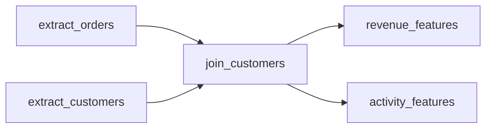

A real pipeline is not one script; it is many tasks with dependencies. "Load
yesterday's orders" must finish before "join orders with customers," which must
finish before "compute daily revenue features." An **orchestrator** (Airflow,
Dagster, Prefect) is the system that knows this dependency structure, runs each
task only after its inputs are ready, retries failures, and lets you rerun a past
date<FN n="1" />. Three ideas make that possible: the dependency graph, a schedule derived
from it, and idempotency.

## A pipeline is a directed acyclic graph

Model each task as a node and each dependency as a directed edge: an edge
$u \to v$ means "$v$ depends on $u$, so $u$ must run first." The result is a
**directed acyclic graph** (DAG). *Directed* because dependencies have a
direction; *acyclic* because a cycle would mean a task depends, transitively, on
itself, which can never be scheduled.



A valid execution order is one where every task comes after all its dependencies.
Such an order is a **topological order** of the DAG, and finding one is the
orchestrator's core scheduling problem.

## Scheduling by topological sort

**Kahn's algorithm** produces a topological order directly from the dependency
counts. Define the **in-degree** of a task as the number of dependencies it still
has unfinished. The algorithm is:

- **Step 1.** Compute every task's in-degree (how many edges point into it).
- **Step 2.** Any task with in-degree $0$ has no unmet dependencies, so it is
  ready; put all such tasks in a ready set.
- **Step 3.** Remove a ready task, append it to the order, and for each task that
  depended on it, decrement that task's in-degree by one. If a decrement brings a
  task to in-degree $0$, it is now ready.
- **Step 4.** Repeat until no tasks remain ready.

If the algorithm emits all $n$ tasks, the order it produced is a valid schedule.
If it stops early with tasks still unscheduled, those tasks form a **cycle**: each
is still waiting on another, so none ever reaches in-degree $0$. That is exactly
the check that the dependency graph really is acyclic.

## Idempotency: why reruns must be safe

Tasks fail. A network blip, an out-of-memory worker, a source that was briefly
unavailable: the orchestrator's answer is to **retry**. And when you discover a
bug in last Tuesday's logic, you fix it and **backfill**, rerunning the pipeline
for every affected past date. Both retries and backfills mean a task runs *more
than once on the same input*. For that to be safe, a task must be **idempotent**:
running it twice produces the same destination state as running it once.

The failure mode is concrete. A task that *appends* "yesterday's rows" to a table
doubles those rows if it runs twice. A task that *replaces the partition* for
yesterday's date (delete-then-write, or an upsert keyed by date) leaves the same
state no matter how many times it runs. Idempotency is what makes "just rerun it"
a safe instruction rather than a data-corruption risk, and it is the single most
important property of a well-built pipeline task<FN n="2" />.

## Worked example

The block below runs Kahn's algorithm on the DAG above, then contrasts an
idempotent partition-replace against a non-idempotent append under a retry.

```python
import numpy as np

# DAG as adjacency: task -> tasks that depend on it
deps = {
    "extract_orders":    ["join_customers"],
    "extract_customers": ["join_customers"],
    "join_customers":    ["revenue_features", "activity_features"],
    "revenue_features":  [],
    "activity_features": [],
}
tasks = list(deps)

# Step 1: in-degree = number of dependencies pointing INTO each task
indeg = {t: 0 for t in tasks}
for u in tasks:
    for v in deps[u]:
        indeg[v] += 1

# Steps 2-4: Kahn's algorithm. Sort the ready set for a deterministic order.
ready = sorted(t for t in tasks if indeg[t] == 0)
order = []
while ready:
    u = ready.pop(0)
    order.append(u)
    newly_ready = []
    for v in deps[u]:
        indeg[v] -= 1
        if indeg[v] == 0:
            newly_ready.append(v)
    ready = sorted(ready + newly_ready)

print("schedule:", order)
assert len(order) == len(tasks), "cycle detected: not all tasks scheduled"
# every task appears after all of its dependencies
pos = {t: i for i, t in enumerate(order)}
assert all(pos[u] < pos[v] for u in tasks for v in deps[u])
print("valid topological order:", True)

# Idempotency under a retry: write yesterday's 3 rows, then the task runs AGAIN.
yesterday = np.array([10.0, 20.0, 30.0])
table_append, table_replace = np.array([]), np.array([])
for _run in range(2):                     # first run + one retry
    table_append = np.concatenate([table_append, yesterday])  # NOT idempotent
    table_replace = yesterday.copy()                          # idempotent
print("append rows after retry: ", table_append.size, "(doubled)")
print("replace rows after retry:", table_replace.size, "(correct)")
```

The topological order schedules both extracts before the join and the join before
either feature task, and the two strategies show why idempotency matters: the
append leaves six rows after a single retry, the partition-replace leaves the
correct three. With a safe-to-rerun task graph in hand, the next lesson serves
those features consistently to training and inference through a
[feature store](feature-stores).

<Footnotes>
  <FNItem n="1">**Reis, J., & Housley, M.** (2022). *Fundamentals of Data Engineering.* O'Reilly. Orchestration, scheduling, and the role of DAG-based workflow systems.</FNItem>
  <FNItem n="2">**Kleppmann, M.** (2017). *Designing Data-Intensive Applications.* O'Reilly. Idempotence and the reliability of retried, replayed operations.</FNItem>
</Footnotes>
