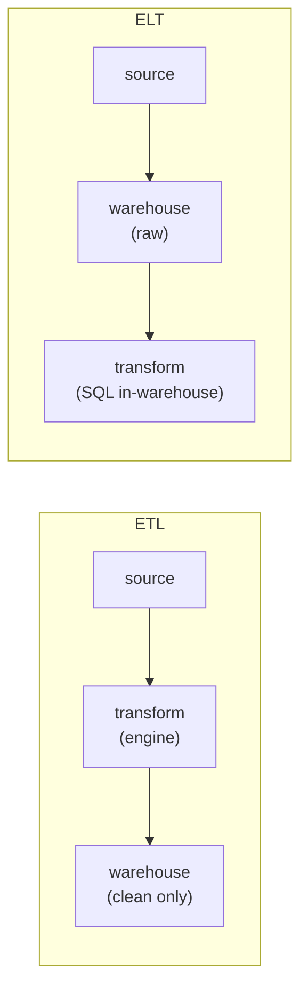

Before a model can learn anything, raw data has to move from where it is produced
(application databases, event logs, third-party APIs) to where it is consumed
(a training job, a feature store, a dashboard). That movement is a **data
pipeline**, and almost every pipeline is described by two independent choices:
*where the transformation happens* and *when the data moves*. Getting these two
axes right is most of data engineering for machine learning.

## Axis 1: where transformation happens

A pipeline always does three things: **extract** data from a source, **transform**
it into the shape the consumer needs (clean types, joined tables, derived
columns), and **load** it into a destination. The only question is the order of
the last two.

**ETL (extract, transform, load)** transforms data *before* loading it. A
processing engine reads from the source, applies the cleaning and joining logic
in flight, and writes only the finished result to the destination. The
destination stores exactly what consumers need and nothing else.

**ELT (extract, load, transform)** loads the *raw* data first, into a warehouse
or lake, and transforms it *afterwards* with queries that run inside that system.
The raw data is kept; transformations are views or tables derived from it.

The trade is **storage and recomputation against rigidity**. ETL stores less and
hands consumers a tidy result, but the raw data is gone: if the transformation
had a bug, or a new consumer needs a column the old transform dropped, there is
nothing to reprocess from. ELT keeps the raw data, so any transform can be
rerun or added later against the original, at the cost of storing everything and
pushing heavy compute into the warehouse. Cheap cloud storage and fast warehouses
made ELT the default for analytics and ML, precisely because **keeping the raw
data is what lets you recompute features when the model's needs change**<FN n="1" />.

## Axis 2: when the data moves

The second axis is the cadence of the move.

**Batch** processing collects records into a bounded chunk (an hour, a day) and
processes the whole chunk at once on a schedule. It is simple to reason about: a
run has a clear start and end, reads a fixed input, and can be rerun to reproduce
its output exactly. The cost is latency: a feature computed by a nightly batch is
up to a day stale.

**Streaming** processing handles each record (or a small micro-batch) as it
arrives, maintaining continuously-updated state. It delivers fresh results with
sub-second latency, which a fraud or recommendation model may genuinely need, but
the engineering is harder: the input is an unbounded stream, records can arrive
late or out of order, and "rerun it" no longer has an obvious meaning<FN n="2" />.

The two axes are independent. A nightly ELT job that loads raw events and rebuilds
feature tables is *batch ELT*. A streaming job that cleans events and writes
clean rows to an online store is *streaming ETL*. Most ML platforms run both: a
batch ELT backbone for training data and historical features, plus a streaming
path for the few features that must be fresh at inference time.

## Choosing the shape

Two questions settle most designs:

- **What latency does the consumer need?** A model retrained weekly is happy with
  batch features. A model scoring live requests on signals that change by the
  second needs a streaming path for those signals. Latency requirements pull you
  toward streaming; everything else prefers batch, because batch is cheaper to
  build, test, and reprocess.
- **Will the transformation logic change?** If feature definitions are still
  evolving, ELT's retained raw data lets you redefine and backfill features
  without re-extracting from the source. If the transform is fixed and storage is
  expensive, ETL's load-only-the-result discipline pays off.

## Exercises

**Exercise 1.** A team runs a nightly ETL job that extracts raw clickstream
events, transforms them into a "sessions" table (dropping the raw events to save
storage), and loads only the sessions. Six months later, a new model needs a
"time-on-page" feature that requires the raw events, which were never kept. Name
the paradigm choice that caused this, and the one-word change that would have
prevented it. Then state the cost that change imposes.

Solution

**Step 1.** The job is ETL: it transforms before loading and writes only the
finished sessions table, so the raw events are discarded. A feature that needs the
raw events has nothing to reprocess from, which is the exact failure ETL trades
for its smaller storage footprint.

**Step 2.** The change is ELT: load the raw events first, then derive the sessions
table (and later the time-on-page feature) with in-warehouse transforms. Keeping
the raw data is what makes a new feature definition a backfill rather than an
impossibility.

**Step 3.** The cost is storage and warehouse compute: every raw event is retained,
and the heavy transforms run inside the warehouse on demand. ELT pays in bytes and
query cost to buy the freedom to recompute features when the model's needs change.

**Exercise 2.** A fraud model scores card transactions in real time and must react
to a "transactions in the last 60 seconds" signal that changes by the second. The
same platform also retrains the model weekly on a year of history. Assign a
paradigm (batch vs streaming, and ETL vs ELT where relevant) to each of the two
data paths, and justify why a single paradigm cannot serve both.

Solution

**Step 1.** The live "last 60 seconds" signal has a sub-minute freshness
requirement. Batch features computed on a schedule would be up to a full cycle
stale, far too old for a per-second signal, so this path must be *streaming*: each
transaction updates the rolling count as it arrives, typically a streaming ETL that
cleans and writes the count to an online store.

**Step 2.** Weekly retraining reads a year of fixed history with no freshness
pressure. A *batch* path is the right fit: it has a clear start and end, reads a
bounded input, and reruns reproducibly, which retraining and backfills need. ELT
on retained raw history lets feature definitions evolve between retrains.

**Step 3.** No single paradigm serves both because the requirements conflict:
streaming buys freshness at the cost of harder reprocessing and unbounded input,
while batch buys reproducibility and cheap reprocessing at the cost of staleness.
The platform runs both, a batch ELT backbone for training plus a streaming path for
the few signals that must be fresh, which is the standard split.

**Exercise 3.** "Rerun it" is unambiguous for a batch job but loses its meaning for
a streaming job. Explain, using the properties of the two cadences from this
lesson, why a batch run can be reproduced exactly while a streaming computation
generally cannot, and describe one mechanism a streaming system uses to recover
some notion of reproducibility.

Solution

**Step 1.** A batch run reads a *bounded, fixed* input chunk (an hour, a day) with
a clear start and end. The same input is still sitting in storage, so rerunning the
job reads identical bytes and produces identical output. Reproducibility is a
direct consequence of the input being fixed and re-readable.

**Step 2.** A streaming job consumes an *unbounded* sequence in which records can
arrive late or out of order, and it maintains continuously-updated state. There is
no fixed input snapshot to point at: the "input" at any instant depends on exactly
which records had arrived by then and in what order. Replaying later sees a
different arrival pattern, so the output need not match.

**Step 3.** A common recovery mechanism is an append-only, replayable log (a
durable event stream) with checkpointed offsets and watermarks: the system records
how far it has consumed and a bound on lateness, so it can replay from a saved
offset and recompute deterministically up to the watermark. This restores a bounded
"rerun" semantics on top of an inherently unbounded source.

These choices set up the rest of the discipline: a pipeline is a graph of tasks
that has to be scheduled, retried, and backfilled, which is the
[orchestration](orchestration-dags) problem the next lesson takes up.

<Footnotes>
  <FNItem n="1">**Kleppmann, M.** (2017). *Designing Data-Intensive Applications.* O'Reilly. Batch and stream processing systems, and the storage-versus-recomputation trade behind ETL and ELT.</FNItem>
  <FNItem n="2">**Reis, J., & Housley, M.** (2022). *Fundamentals of Data Engineering.* O'Reilly. The data-engineering lifecycle: batch vs streaming ingestion and where transformation belongs.</FNItem>
</Footnotes>
