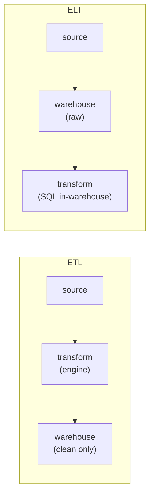

Before a model can learn anything, raw data has to move from where it is produced
(application databases, event logs, third-party APIs) to where it is consumed
(a training job, a feature store, a dashboard). That movement is a **data
pipeline**, and almost every pipeline is described by two independent choices:
*where the transformation happens* and *when the data moves*. Getting these two
axes right is most of data engineering for machine learning.

## Axis 1: where transformation happens

A pipeline always does three things: **extract** data from a source, **transform**
it into the shape the consumer needs (clean types, joined tables, derived
columns), and **load** it into a destination. The only question is the order of
the last two.

**ETL (extract, transform, load)** transforms data *before* loading it. A
processing engine reads from the source, applies the cleaning and joining logic
in flight, and writes only the finished result to the destination. The
destination stores exactly what consumers need and nothing else.

**ELT (extract, load, transform)** loads the *raw* data first, into a warehouse
or lake, and transforms it *afterwards* with queries that run inside that system.
The raw data is kept; transformations are views or tables derived from it.

The trade is **storage and recomputation against rigidity**. ETL stores less and
hands consumers a tidy result, but the raw data is gone: if the transformation
had a bug, or a new consumer needs a column the old transform dropped, there is
nothing to reprocess from. ELT keeps the raw data, so any transform can be
rerun or added later against the original, at the cost of storing everything and
pushing heavy compute into the warehouse. Cheap cloud storage and fast warehouses
made ELT the default for analytics and ML, precisely because **keeping the raw
data is what lets you recompute features when the model's needs change**.

## Axis 2: when the data moves

The second axis is the cadence of the move.

**Batch** processing collects records into a bounded chunk (an hour, a day) and
processes the whole chunk at once on a schedule. It is simple to reason about: a
run has a clear start and end, reads a fixed input, and can be rerun to reproduce
its output exactly. The cost is latency: a feature computed by a nightly batch is
up to a day stale.

**Streaming** processing handles each record (or a small micro-batch) as it
arrives, maintaining continuously-updated state. It delivers fresh results with
sub-second latency, which a fraud or recommendation model may genuinely need, but
the engineering is harder: the input is an unbounded stream, records can arrive
late or out of order, and "rerun it" no longer has an obvious meaning.

The two axes are independent. A nightly ELT job that loads raw events and rebuilds
feature tables is *batch ELT*. A streaming job that cleans events and writes
clean rows to an online store is *streaming ETL*. Most ML platforms run both: a
batch ELT backbone for training data and historical features, plus a streaming
path for the few features that must be fresh at inference time.

## Choosing the shape

Two questions settle most designs:

- **What latency does the consumer need?** A model retrained weekly is happy with
  batch features. A model scoring live requests on signals that change by the
  second needs a streaming path for those signals. Latency requirements pull you
  toward streaming; everything else prefers batch, because batch is cheaper to
  build, test, and reprocess.
- **Will the transformation logic change?** If feature definitions are still
  evolving, ELT's retained raw data lets you redefine and backfill features
  without re-extracting from the source. If the transform is fixed and storage is
  expensive, ETL's load-only-the-result discipline pays off.

These choices set up the rest of the discipline: a pipeline is a graph of tasks
that has to be scheduled, retried, and backfilled, which is the
[orchestration](orchestration-dags) problem the next lesson takes up.
