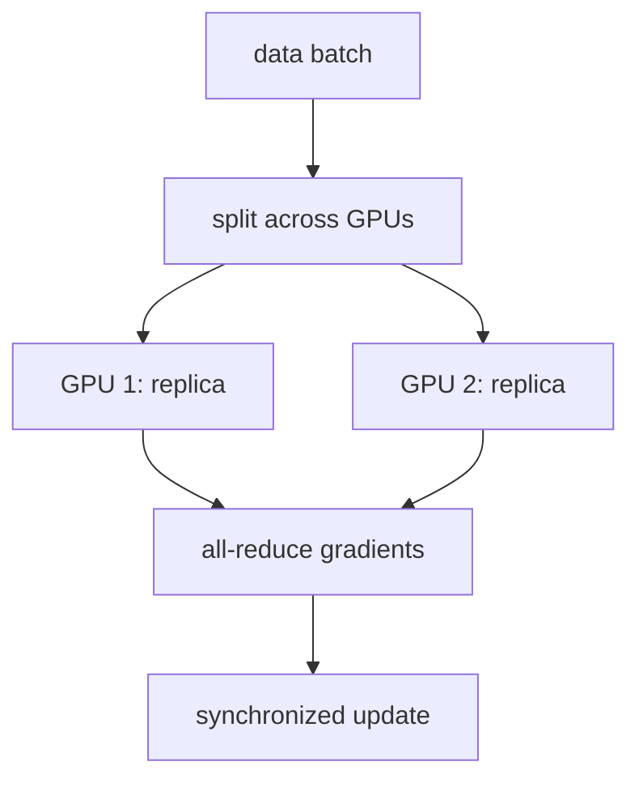

A single GPU can only hold so large a batch, and processing a big dataset one
small batch at a time is slow. The first lever for scaling training is **data
parallelism**: put a full copy of the model on each of $K$ workers, give each
worker a different slice of the batch, and combine their work so the result is
*as if* one machine had processed the whole batch. The combine step is a
collective operation called **all-reduce**, and the reason the scheme is correct
is a one-line fact about gradients of sums.

## The setup

Every worker $k$ holds identical model parameters $w$ and receives its own
**local batch** $B_k$ of $m$ examples. The total, or **global**, batch is the
union $B = B_1 \cup \dots \cup B_K$ of size $Km$. Worker $k$ runs a forward and
backward pass on its local batch and computes the **local gradient**, the average
loss gradient over its own $m$ examples:

$$
g_k = \frac{1}{m}\sum_{i \in B_k} \nabla_w \ell_i(w),
$$

where $\ell_i(w)$ is the loss on example $i$. Each worker now holds a different
gradient, computed from different data. They must be combined into the gradient
the whole batch would have produced.

## Why averaging the local gradients is exact

The gradient a single machine would compute on the full batch $B$ is the average
loss gradient over all $Km$ examples:

$$
g_{\text{global}} = \frac{1}{Km}\sum_{i \in B} \nabla_w \ell_i(w).
$$

Split that sum over the $K$ disjoint slices and factor each slice into its local
average:

$$
g_{\text{global}}
= \frac{1}{Km}\sum_{k=1}^{K}\sum_{i \in B_k} \nabla_w \ell_i(w)
= \frac{1}{K}\sum_{k=1}^{K}\underbrace{\frac{1}{m}\sum_{i \in B_k}\nabla_w \ell_i(w)}_{g_k}
= \frac{1}{K}\sum_{k=1}^{K} g_k.
$$

The middle step pulls a factor of $1/K$ out front and leaves exactly the local
gradient $g_k$ inside. So **the mean of the local gradients equals the
single-machine gradient on the union batch**, exactly, because the gradient of a
sum is the sum of the gradients. Data parallelism is not an approximation; it
reproduces large-batch training.

## All-reduce and learning-rate scaling

Computing that mean across workers is the **all-reduce** collective: it sums a
vector (here each worker's $g_k$) across all workers and leaves the result on
*every* worker, so each can apply an identical parameter update and stay in sync.
A naive implementation sends everything to one node and back, whose cost grows
with $K$; the standard **ring all-reduce** instead passes partial sums around a
ring, moving an amount of data per worker that is independent of $K$, which is
what makes the scheme scale.

One consequence needs care. After all-reduce, each step uses the global batch of
$Km$ examples instead of $m$, so the gradient is averaged over $K$ times as many
samples and its estimate of the true gradient has lower variance. To keep the size
of each parameter step comparable, the **linear scaling rule** multiplies the
learning rate by $K$ when the batch grows by $K$ (with a short warmup to stay
stable early). The intuition: a $K\times$ larger, less noisy gradient can safely be
trusted with a $K\times$ larger step.



## Worked example

We compute local gradients on $K$ disjoint slices of a batch and confirm their
all-reduced mean matches the single-machine gradient on the whole batch to
floating-point precision.

```python
import numpy as np
rng = np.random.default_rng(0)

K, m, d = 4, 16, 5          # 4 workers, 16 examples each, 5 model parameters
X = rng.normal(size=(K * m, d))
y = rng.normal(size=K * m)
w = rng.normal(size=d)

# Per-example gradient of a least-squares loss l_i = 0.5 (x_i.w - y_i)^2  is  r_i x_i.
def local_grad(Xb, yb):
    r = Xb @ w - yb
    return (Xb * r[:, None]).mean(axis=0)        # mean over this worker's m examples

# Single machine: one gradient over the full Km-example batch.
g_global = local_grad(X, y)

# Data parallel: each worker takes a disjoint slice, then all-reduce = mean of g_k.
slices = X.reshape(K, m, d), y.reshape(K, m)
g_locals = [local_grad(slices[0][k], slices[1][k]) for k in range(K)]
g_allreduce = np.mean(g_locals, axis=0)

print("max |g_allreduce - g_global| =", np.max(np.abs(g_allreduce - g_global)))
assert np.allclose(g_allreduce, g_global)
print("K workers reproduce the single-machine gradient:", True)

# Linear scaling rule: K-times bigger batch -> K-times bigger step.
base_lr = 0.01
print(f"single-worker lr {base_lr}  ->  {K}-worker lr {K * base_lr}")
```

The all-reduced mean of the four workers' gradients equals the one-machine
gradient to machine precision, which is the whole correctness argument, and the
learning rate scales by the worker count to match the larger batch. Data
parallelism replicates the model on every worker, so it breaks down once the model
itself no longer fits in one device's memory, the constraint the next lesson
attacks with [sharding](memory-and-sharding).
