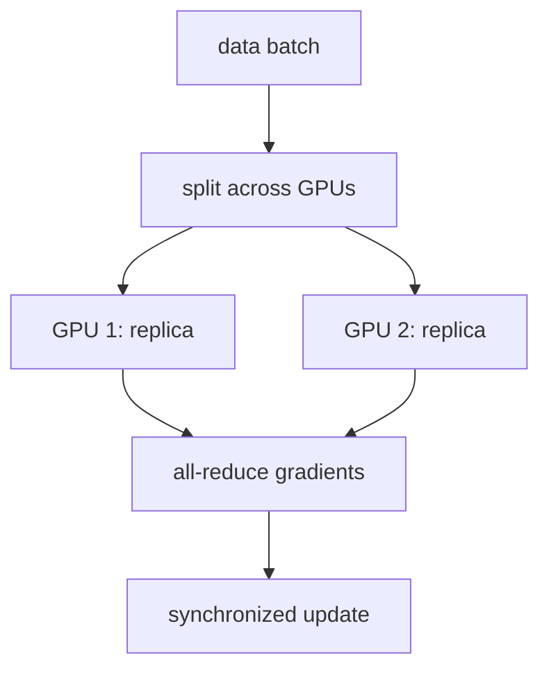

A single GPU can only hold so large a batch, and processing a big dataset one
small batch at a time is slow. The first lever for scaling training is **data
parallelism**: put a full copy of the model on each of $K$ workers, give each
worker a different slice of the batch, and combine their work so the result is
*as if* one machine had processed the whole batch. The combine step is a
collective operation called **all-reduce**, and the reason the scheme is correct
is a one-line fact about gradients of sums.

## The setup

Every worker $k$ holds identical model parameters $w$ and receives its own
**local batch** $B_k$ of $m$ examples. The total, or **global**, batch is the
union $B = B_1 \cup \dots \cup B_K$ of size $Km$. Worker $k$ runs a forward and
backward pass on its local batch and computes the **local gradient**, the average
loss gradient over its own $m$ examples:

$$
g_k = \frac{1}{m}\sum_{i \in B_k} \nabla_w \ell_i(w),
$$

where $\ell_i(w)$ is the loss on example $i$. Each worker now holds a different
gradient, computed from different data. They must be combined into the gradient
the whole batch would have produced.

## Why averaging the local gradients is exact

The gradient a single machine would compute on the full batch $B$ is the average
loss gradient over all $Km$ examples:

$$
g_{\text{global}} = \frac{1}{Km}\sum_{i \in B} \nabla_w \ell_i(w).
$$

Split that sum over the $K$ disjoint slices and factor each slice into its local
average:

$$
g_{\text{global}}
= \frac{1}{Km}\sum_{k=1}^{K}\sum_{i \in B_k} \nabla_w \ell_i(w)
= \frac{1}{K}\sum_{k=1}^{K}\underbrace{\frac{1}{m}\sum_{i \in B_k}\nabla_w \ell_i(w)}_{g_k}
= \frac{1}{K}\sum_{k=1}^{K} g_k.
$$

The middle step pulls a factor of $1/K$ out front and leaves exactly the local
gradient $g_k$ inside. So **the mean of the local gradients equals the
single-machine gradient on the union batch**, exactly, because the gradient of a
sum is the sum of the gradients. Data parallelism is not an approximation; it
reproduces large-batch training.

## All-reduce and learning-rate scaling

Computing that mean across workers is the **all-reduce** collective: it sums a
vector (here each worker's $g_k$) across all workers and leaves the result on
*every* worker, so each can apply an identical parameter update and stay in sync.
A naive implementation sends everything to one node and back, whose cost grows
with $K$; the standard **ring all-reduce** instead passes partial sums around a
ring, moving an amount of data per worker that is independent of $K$, which is
what makes the scheme scale.

One consequence needs care. After all-reduce, each step uses the global batch of
$Km$ examples instead of $m$, so the gradient is averaged over $K$ times as many
samples and its estimate of the true gradient has lower variance. To keep the size
of each parameter step comparable, the **linear scaling rule** multiplies the
learning rate by $K$ when the batch grows by $K$ (with a short warmup to stay
stable early)<FN n="1" />. The intuition: a $K\times$ larger, less noisy gradient can safely be
trusted with a $K\times$ larger step.



## Worked example

We compute local gradients on $K$ disjoint slices of a batch and confirm their
all-reduced mean matches the single-machine gradient on the whole batch to
floating-point precision.

```python
import numpy as np
rng = np.random.default_rng(0)

K, m, d = 4, 16, 5          # 4 workers, 16 examples each, 5 model parameters
X = rng.normal(size=(K * m, d))
y = rng.normal(size=K * m)
w = rng.normal(size=d)

# Per-example gradient of a least-squares loss l_i = 0.5 (x_i.w - y_i)^2  is  r_i x_i.
def local_grad(Xb, yb):
    r = Xb @ w - yb
    return (Xb * r[:, None]).mean(axis=0)        # mean over this worker's m examples

# Single machine: one gradient over the full Km-example batch.
g_global = local_grad(X, y)

# Data parallel: each worker takes a disjoint slice, then all-reduce = mean of g_k.
slices = X.reshape(K, m, d), y.reshape(K, m)
g_locals = [local_grad(slices[0][k], slices[1][k]) for k in range(K)]
g_allreduce = np.mean(g_locals, axis=0)

print("max |g_allreduce - g_global| =", np.max(np.abs(g_allreduce - g_global)))
assert np.allclose(g_allreduce, g_global)
print("K workers reproduce the single-machine gradient:", True)

# Linear scaling rule: K-times bigger batch -> K-times bigger step.
base_lr = 0.01
print(f"single-worker lr {base_lr}  ->  {K}-worker lr {K * base_lr}")
```

The all-reduced mean of the four workers' gradients equals the one-machine
gradient to machine precision, which is the whole correctness argument, and the
learning rate scales by the worker count to match the larger batch.

## Exercises

**Exercise 1.** The local averages are exact only when every worker holds the
same number of examples. Suppose worker $1$ has $m_1$ examples and worker $2$ has
$m_2 \ne m_1$. Show that the plain mean $\tfrac12(g_1 + g_2)$ of the two local
averages is **not** equal to the global gradient $g_{\text{global}}$ over the
$m_1 + m_2$ examples, and give the weighting that fixes it.

<details>
<summary>Solution</summary>

**Step 1.** Write each local average in terms of its example sum. With
$S_k = \sum_{i \in B_k} \nabla_w \ell_i(w)$, the local average is
$g_k = S_k / m_k$, so $S_k = m_k g_k$.

**Step 2.** The global gradient sums all examples and divides by the total count:

$$
g_{\text{global}} = \frac{S_1 + S_2}{m_1 + m_2}
= \frac{m_1 g_1 + m_2 g_2}{m_1 + m_2}.
$$

**Step 3.** This is a count-weighted mean. The plain mean
$\tfrac12(g_1 + g_2)$ equals it only when $m_1 = m_2$ (then the weights
$m_k/(m_1+m_2)$ both become $\tfrac12$). For unequal shards the correct combine
weights each $g_k$ by $m_k/(m_1+m_2)$, recovering the exact global gradient.

</details>

**Exercise 2.** Ring all-reduce moves a fixed amount of data per worker
independent of $K$. For a gradient vector of $N$ floats and $K$ workers, the
reduce-scatter phase sends $(K-1)$ chunks of size $N/K$ and the all-gather phase
sends another $(K-1)$ chunks of the same size. Derive the total bytes each worker
sends, and take its limit as $K \to \infty$ to show it does not grow with $K$.

<details>
<summary>Solution</summary>

**Step 1.** Each phase has $K-1$ steps, and each step sends one chunk of $N/K$
floats. Per worker, per phase, that is $(K-1) \cdot N/K$ floats.

**Step 2.** Both phases together send

$$
2(K-1)\frac{N}{K} = 2N\frac{K-1}{K} = 2N\left(1 - \frac1K\right) \text{ floats}.
$$

**Step 3.** As $K \to \infty$ the factor $(1 - 1/K) \to 1$, so the per-worker
traffic approaches $2N$ floats, a constant set by the gradient size, not the
worker count. A naive parameter-server scheme instead routes all $K$ gradients
through one node, whose traffic grows linearly in $K$; the ring's flat $2N$ is
why it scales.

</details>

**Exercise 3 (code).** Verify both facts numerically on a least-squares gradient:
that the **count-weighted** combine reproduces the single-machine gradient when
the two workers hold unequal numbers of examples (the plain mean does not), and
that ring all-reduce per-worker bytes match $2N(1 - 1/K)$ floats.

<details>
<summary>Solution</summary>

```python
import numpy as np
rng = np.random.default_rng(0)

d = 5
m1, m2 = 10, 22                       # unequal shard sizes
X1, y1 = rng.normal(size=(m1, d)), rng.normal(size=m1)
X2, y2 = rng.normal(size=(m2, d)), rng.normal(size=m2)
w = rng.normal(size=d)

def local_grad(Xb, yb):               # mean over this worker's examples
    r = Xb @ w - yb
    return (Xb * r[:, None]).mean(axis=0)

g1, g2 = local_grad(X1, y1), local_grad(X2, y2)

# Single machine over the union of m1 + m2 examples.
Xu, yu = np.vstack([X1, X2]), np.concatenate([y1, y2])
g_global = local_grad(Xu, yu)

plain = 0.5 * (g1 + g2)                              # wrong for unequal shards
weighted = (m1 * g1 + m2 * g2) / (m1 + m2)           # count-weighted: exact

assert not np.allclose(plain, g_global)
assert np.allclose(weighted, g_global)

# Ring all-reduce per-worker traffic: 2N(1 - 1/K) floats, independent-ish of K.
N = 1_000_000
for K in [2, 8, 64, 1024]:
    floats = 2 * N * (1 - 1 / K)
    assert floats < 2 * N                            # always below the 2N ceiling
print("count-weighted combine exact; ring traffic stays under 2N floats")
```

The plain mean misses the global gradient while the count-weighted combine hits
it exactly, and the ring's per-worker traffic stays just under the $2N$ ceiling
for every worker count.

</details>

Data parallelism replicates the model on every worker, so it breaks down once the
model itself no longer fits in one device's memory, the constraint the next lesson
attacks with [sharding](memory-and-sharding)<FN n="2" />.

<Footnotes>
  <FNItem n="1">**Goyal, P., et al.** (2017). "Accurate, large minibatch SGD: training ImageNet in 1 hour". [arXiv:1706.02677](https://arxiv.org/abs/1706.02677) The linear learning-rate scaling rule and gradual warmup for large synchronized batches.</FNItem>
  <FNItem n="2">**Rajbhandari, S., Rasley, J., Ruwase, O., & He, Y.** (2020). "ZeRO: memory optimizations toward training trillion parameter models". *SC*. [arXiv:1910.02054](https://arxiv.org/abs/1910.02054) Data parallelism as the replicated-state baseline that sharding later removes.</FNItem>
</Footnotes>
