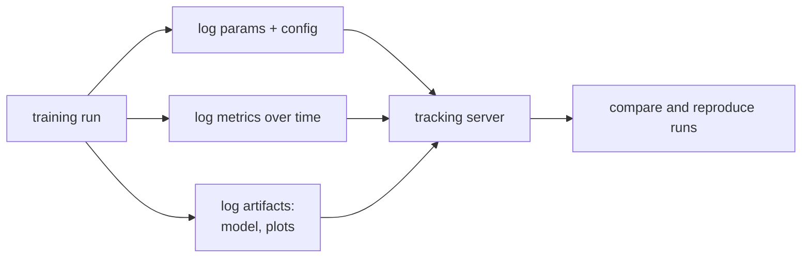

Training a model is an experiment, and an experiment that cannot be reproduced is
not a result. A month after a promising run you will want to ask: what data was
this trained on, what hyperparameters, what code, and can I get the same number
again? **Experiment tracking** (Weights & Biases, MLflow) answers those questions
by recording, for every run, the full set of *inputs* and *outputs*<FN n="1" />. The discipline
behind it is **lineage**: a run's metric is reproducible only if everything that
fed into it was captured.

## What a run is a function of

Treat a training run as a function. Its output (a metric, a checkpoint) is
determined by a set of inputs:

- **Code.** The exact version of the training program, pinned by a Git commit
  hash.
- **Data.** The exact dataset version, pinned by the [content hash](I1/data-versioning)
  of its snapshot, not just a file path that may have changed underneath you.
- **Config.** Every hyperparameter: learning rate, batch size, architecture,
  number of steps.
- **Seed.** The seed for the random number generator that drives weight
  initialization, data shuffling, and any stochastic layer.
- **Environment.** Library versions and hardware, which can change numerics.

A tracker logs all of these alongside the outputs (metrics over time, the final
checkpoint, sample predictions). Two runs are **comparable** only when they differ
in exactly the input you are studying and agree on everything else, which is why
logging all the inputs, not just the one you are sweeping, is the whole point.

## Why the seed is not enough

A common mistake is to believe that fixing the random seed makes a run
reproducible. It makes the run reproducible *given that every other input is held
fixed*. The seed determines the *sequence of random numbers*, but the metric is a
function of that sequence **and** the data it is applied to and the config that
shapes the update. Change the data version while keeping the seed, and the same
random draws act on different data, producing a different result. The seed is one
input among several; reproducibility requires pinning the whole tuple. This is
precisely the lineage record, and it is what lets a tracker say "rerun this exact
experiment" and mean it<FN n="2" />.



## Worked example

A toy "training" run consumes seeded random draws to perturb a dataset and returns
a final metric. We show that the same `(seed, data)` reproduces exactly, the same
seed on a *new data version* does not, and only the full lineage tuple identifies a
reproducible result.

```python
import numpy as np, hashlib

def train(seed, data):
    # Deterministic given (seed, data): seeded noise added to the data's signal.
    rng = np.random.default_rng(seed)
    updates = rng.normal(0, 0.1, size=data.size)   # seed drives the "stochastic" part
    return float(np.mean(data + updates))          # metric depends on BOTH inputs

def data_hash(d):
    return hashlib.sha256(d.tobytes()).hexdigest()[:8]

data_v1 = np.arange(100, dtype=np.float64)
data_v2 = data_v1.copy(); data_v2[0] = 999.0       # a new data version: one row changed

# Same seed AND same data -> bit-identical metric (true reproduction).
assert train(42, data_v1) == train(42, data_v1)

# Same seed, DIFFERENT data version -> different metric. Seed alone did not pin it.
m_v1 = train(42, data_v1)
m_v2 = train(42, data_v2)
print(f"seed=42 on data {data_hash(data_v1)}: metric={m_v1:.4f}")
print(f"seed=42 on data {data_hash(data_v2)}: metric={m_v2:.4f}")
assert m_v1 != m_v2

# The reproducible identity of a run is the full lineage tuple, not the seed.
lineage = {"code": "a1b2c3d", "data": data_hash(data_v1), "seed": 42, "lr": 0.01}
print("run lineage:", lineage)
print("metric reproducible from full lineage:", train(42, data_v1) == m_v1)
```

The two runs share a seed yet land on different metrics because they ran on
different data versions, which is exactly why a tracker logs the data hash beside
the seed.

## Exercises

**Exercise 1.** A teammate reports that two of their runs disagree by a few
percent on validation accuracy and insists "the seed was the same in both, so
this is a real effect". List the inputs from the lineage tuple that could each,
on their own, explain the gap while the seed is held fixed, and name the minimal
change to their logging that would let them rule each one out.

<details>
<summary>Solution</summary>

**Step 1.** The metric is a function of the whole input tuple
(code, data, config, seed, environment), not the seed alone. Holding the seed
fixed pins only the *random number sequence*; everything that sequence acts on
can still differ.

**Step 2.** Each non-seed input is a candidate explanation:

- **Code:** a different Git commit changes the model or the loss, so the same
  draws drive a different computation.
- **Data:** a different dataset version means the same draws shuffle and learn
  from different rows.
- **Config:** a different learning rate or batch size reshapes the update even
  with identical draws.
- **Environment:** different library or hardware versions change numerics, which
  can shift the metric.

**Step 3.** The minimal fix is to log the full lineage tuple per run (Git commit,
data content hash, config dict, seed, library/hardware versions). Then comparing
the two runs' records isolates the one field that differs, turning "a real
effect" into "they ran on different data" or whichever input actually changed.

</details>

**Exercise 2.** Define two runs as **comparable** when they differ in exactly the
one input under study and agree on every other input. You want to measure the
effect of learning rate, sweeping it over $3$ values. Your tracker logs $5$
independent inputs. How many of those input fields must be held fixed for the
sweep to be a controlled comparison, and why does logging all $5$, rather than
just the learning rate, make the claim checkable rather than assumed?

<details>
<summary>Solution</summary>

**Step 1.** One input (learning rate) is the variable under study. The other
$5 - 1 = 4$ inputs must be held fixed for the three runs to be comparable, so a
difference in the metric is attributable to the learning rate and nothing else.

**Step 2.** Logging only the learning rate records the variable you changed but
leaves the other four fields unrecorded. If one of them silently drifted (a new
data snapshot, a library bump), the comparison is confounded and you cannot
detect it.

**Step 3.** Logging all $5$ fields per run lets you read the records back and
verify that the four control inputs are byte-identical across the three runs.
The controlled-comparison claim becomes a check against the logs, not an
assumption, which is the entire reason a tracker logs every input rather than
only the swept one.

</details>

**Exercise 3 (code).** Demonstrate the confounding directly. Build a `train(seed,
data, lr)` whose output depends on all three inputs. Show that a learning-rate
sweep run on a *fixed* data version cleanly attributes the metric change to `lr`,
but the same sweep where the data version silently changes between runs produces
a metric difference that is **not** attributable to `lr` alone.

<details>
<summary>Solution</summary>

```python
import numpy as np

def train(seed, data, lr):
    rng = np.random.default_rng(seed)
    noise = rng.normal(0, 0.1, size=data.size)
    return float(np.mean(data + noise) + lr)   # depends on seed, data, AND lr

data_v1 = np.arange(100, dtype=np.float64)
data_v2 = data_v1.copy(); data_v2[0] = 999.0   # silently different data version

# Controlled sweep: vary lr only, hold seed and data fixed.
m_lo = train(0, data_v1, lr=0.01)
m_hi = train(0, data_v1, lr=0.05)
controlled_gap = m_hi - m_lo
assert np.isclose(controlled_gap, 0.04)        # exactly the lr difference, nothing else

# Confounded sweep: lr changes AND data version changes between the two runs.
c_lo = train(0, data_v1, lr=0.01)
c_hi = train(0, data_v2, lr=0.05)              # data quietly swapped to v2
confounded_gap = c_hi - c_lo
assert not np.isclose(confounded_gap, 0.04)    # gap is NOT the lr effect alone
print(f"controlled gap = {controlled_gap:.4f} (= lr change)")
print(f"confounded gap = {confounded_gap:.4f} (lr change + data change)")
```

The controlled sweep recovers the learning-rate change exactly because every
other input was pinned, while the confounded sweep reports a gap that mixes the
learning rate with the unlogged data change, which is the failure logging the
full lineage tuple is designed to catch.

</details>

With runs now individually reproducible, the next question is how to *choose* the
config in the first place, the [hyperparameter search](hyperparameter-search)
problem.

<Footnotes>
  <FNItem n="1">**Huyen, C.** (2022). *Designing Machine Learning Systems.* O'Reilly. Experiment tracking, lineage, and the inputs a run must log to be reproducible.</FNItem>
  <FNItem n="2">**Sculley, D., et al.** (2015). "Hidden technical debt in machine learning systems". *NeurIPS*. Reproducibility debt and the tangle of undocumented configuration and data dependencies.</FNItem>
</Footnotes>
