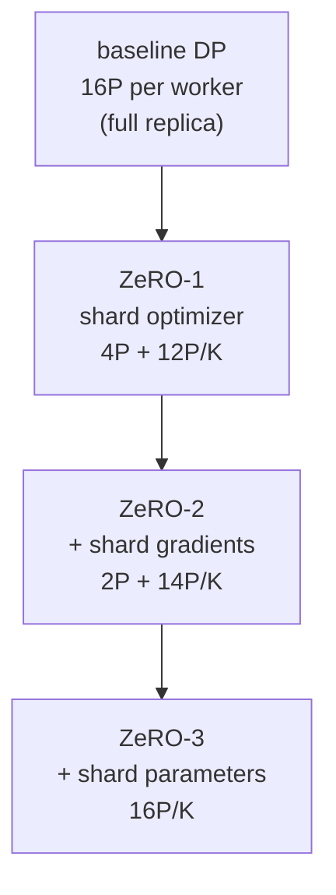

Plain data parallelism puts a *full copy* of the model on every worker, so it
helps only while the model fits on one device. Modern models do not. The obstacle
is not the parameters alone; it is everything training keeps *alongside* them, the
gradients and the optimizer's state, which together are several times the size of
the weights. **ZeRO** (Zero Redundancy Optimizer) attacks exactly this by noticing
that data parallelism stores all of that redundantly on every worker, and sharding
it instead<FN n="1" />. To see what it buys, first count the bytes.

## The memory of a training step

Train a model of $P$ parameters with Adam in the standard **mixed-precision**
setup. Per parameter, the resident state is:

- **fp16 parameters**, used for the forward and backward pass: $2$ bytes.
- **fp16 gradients**, one per parameter: $2$ bytes.
- **Optimizer state in fp32**: a master copy of the weights ($4$ bytes), Adam's
  first moment $m$ ($4$ bytes), and second moment $v$ ($4$ bytes): $12$ bytes.

That is $2 + 2 + 12 = 16$ bytes per parameter, the well-known rule that mixed-
precision Adam costs about **$16P$ bytes**. The optimizer state is the heavy part:
$12$ of those $16$ bytes, three-quarters of the footprint, is state the optimizer
keeps and the forward pass never touches. (Activations are extra and depend on
batch and sequence length; here we count only the model-and-optimizer state ZeRO
shards.)

In plain data parallelism every one of the $K$ workers holds all $16P$ bytes. The
parameters and optimizer state are *identical* across workers, so $K-1$ copies of
them are pure redundancy<FN n="2" />. ZeRO removes that redundancy in three stages.

## The three ZeRO stages

Each stage shards one more of the three components across the $K$ workers, so each
worker stores only its $1/K$ slice of what is sharded and gathers the rest over the
network only when a step needs it.

- **ZeRO-1** shards the **optimizer state** ($12P$). Per worker:
  $2P + 2P + 12P/K$.
- **ZeRO-2** shards the optimizer state **and gradients** ($12P + 2P$). Per worker:
  $2P + (2P + 12P)/K$.
- **ZeRO-3** shards **everything**, parameters too. Per worker:
  $(2P + 2P + 12P)/K = 16P/K$.



The progression trades memory for communication. ZeRO-1 and ZeRO-2 keep the full
parameters on every worker, so they cost no extra communication beyond the
gradient all-reduce already in data parallelism. ZeRO-3 shards the parameters too,
so a worker must gather the layers it does not own before using them and release
them after, adding communication in exchange for driving per-worker memory all the
way down to $16P/K$. This is complementary to the [model parallelism](D/model-parallel)
that splits a single layer across devices; ZeRO splits the *replicated state* of
data parallelism instead.

## Worked example

We tabulate per-worker memory for a $7.5$-billion-parameter model across $8$
workers under the baseline and the three ZeRO stages.

```python
import numpy as np

P = 7.5e9            # parameters
K = 8                # data-parallel workers
param_b, grad_b, opt_b = 2 * P, 2 * P, 12 * P   # bytes: fp16 w, fp16 grad, fp32 Adam

def per_worker_bytes(stage):
    if stage == 0: return param_b + grad_b + opt_b          # full replica
    if stage == 1: return param_b + grad_b + opt_b / K      # shard optimizer
    if stage == 2: return param_b + (grad_b + opt_b) / K    # + shard gradients
    if stage == 3: return (param_b + grad_b + opt_b) / K    # + shard parameters

GB = 1e9
for stage, name in [(0, "baseline DP"), (1, "ZeRO-1"), (2, "ZeRO-2"), (3, "ZeRO-3")]:
    print(f"{name:12s}: {per_worker_bytes(stage) / GB:6.1f} GB/worker")

# ZeRO-3 drives per-worker state to exactly 16P/K, and the total stays 16P.
assert np.isclose(per_worker_bytes(3), 16 * P / K)
assert np.isclose(per_worker_bytes(3) * K, 16 * P)
print("baseline needs", per_worker_bytes(0) / GB, "GB; ZeRO-3 fits in",
      round(per_worker_bytes(3) / GB), "GB per 80GB GPU")
```

The baseline asks $120$ GB on every worker, which does not fit an $80$ GB GPU,
while ZeRO-3 spreads the same total across the eight workers to $15$ GB each, which
does. Sharding is what makes training a model larger than one device possible at
all. That closes the training-infrastructure subsection; the next subsection turns
from training the model to [serving](I3/latency-throughput) it under a latency
budget.

<Footnotes>
  <FNItem n="1">**Rajbhandari, S., Rasley, J., Ruwase, O., & He, Y.** (2020). "ZeRO: memory optimizations toward training trillion parameter models". *SC*. [arXiv:1910.02054](https://arxiv.org/abs/1910.02054) The $16P$ mixed-precision memory accounting and the three sharding stages.</FNItem>
  <FNItem n="2">**Goyal, P., et al.** (2017). "Accurate, large minibatch SGD: training ImageNet in 1 hour". [arXiv:1706.02677](https://arxiv.org/abs/1706.02677) The data-parallel replica model whose per-worker redundancy ZeRO removes.</FNItem>
</Footnotes>
