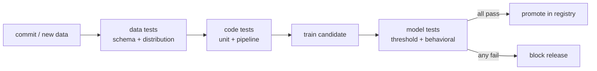

In ordinary software, continuous integration runs a test suite on every change
and refuses to merge if anything is red. ML breaks the assumption that code is the
only input: a model's behavior is determined by **code, data, and the learned
weights together**, so two of the three things that can regress are invisible to a
normal test runner<FN n="1" />. **CI/CD for ML** closes that gap by adding tests on the data
and on the trained model to the usual tests on the code, then wiring them as gates
a [registered model version](I2/model-registry) must clear before it is promoted.

## Three layers of tests

A useful pipeline checks three things in order, cheapest first:



**Data tests** run before training and assert that the inputs are sane<FN n="2" />: every
expected column is present with the right type (a **schema** test), and the new
batch has not drifted from the reference distribution using the
[KS / PSI statistics](I1/drift-detection) from the data-engineering lessons. Bad
data caught here never wastes a training run.

**Code tests** are ordinary unit tests on the transforms plus a **pipeline test**
that runs the whole train→evaluate flow on a tiny fixture, catching the plumbing
bugs (a misaligned join, a dropped column) that a unit test misses.

**Model tests** run after training the candidate. A **threshold test** fails the
build if a headline metric falls below a floor (or drops more than $\varepsilon$
below the current production model). **Behavioral tests** assert properties the
metric can average away: an **invariance** test says a prediction must not change
when an irrelevant feature is perturbed, and a **directional** test says it must
move the right way when a meaningful one does. A model can hit its target accuracy
and still fail these, which is exactly the kind of silent regression CI exists to
stop<FN n="3" />.

## Worked example: an invariance test as a gate

We hold a model's other features fixed, perturb a feature that should be
irrelevant, and fail the gate if too many predictions move. This is a unit test
you would run in CI on every candidate before promotion.

```python
import numpy as np
rng = np.random.default_rng(0)

# A toy scoring model. It is SUPPOSED to ignore feature 2 (say, a random id),
# but a leak during training gave it a small, illegitimate weight on it.
w = np.array([1.2, -0.8, 0.15])   # w[2] should have been 0.0

def model(X):
    return 1 / (1 + np.exp(-X @ w))   # logistic score in [0, 1]

X = rng.normal(size=(2000, 3))
base = model(X)

# Invariance test: perturb ONLY feature 2, everything else fixed.
Xp = X.copy()
Xp[:, 2] = rng.normal(size=X.shape[0])
perturbed = model(Xp)

# A prediction "flips" if it crosses the 0.5 decision boundary.
flip_rate = np.mean((base >= 0.5) != (perturbed >= 0.5))
TOL = 0.01   # allow at most 1% flips from an irrelevant feature

print(f"prediction flip rate under irrelevant perturbation = {flip_rate:.3f}")
print(f"gate tolerance                                      = {TOL:.3f}")
gate_passes = flip_rate <= TOL
print("CI gate passes:", gate_passes)

assert not gate_passes   # this buggy model is correctly REJECTED by the gate
print("the invariance test catches a leak the accuracy metric would hide:", True)
```

The model could report a perfectly healthy accuracy and still fail this gate,
because the bug is a *dependence on the wrong feature*, not an aggregate error. A
red test here blocks promotion in the [registry](I2/model-registry) instead of
shipping the regression.

## Exercises

**Exercise 1.** Of the three test layers (data, code, model), the pipeline runs
them cheapest-first. Explain why ordering data tests before the training step,
rather than after, changes the *cost* of catching a bad-data regression, and give
a concrete example of a defect each layer catches that the others would miss.

<details>
<summary>Solution</summary>

**Step 1.** Training is the expensive step. A data test that runs before training
fails on a schema break or a drifted batch without ever paying for a training
run; the same defect caught by a model test after training has already burned the
compute. Ordering cheapest-first means a regression is rejected at the earliest,
lowest-cost gate that can see it.

**Step 2.** Each layer sees a different surface:

- **Data test:** a column that changed type or a feature whose distribution
  drifted past the KS/PSI threshold. Neither the code nor the trained weights are
  wrong, so no other layer flags it.
- **Code test:** a misaligned join or a dropped column in a transform, caught by
  a pipeline test on a tiny fixture. The data may be fine and the metric on real
  data may even look plausible, hiding the plumbing bug.
- **Model test:** a candidate that hits target accuracy but depends on a feature
  it should ignore (an invariance failure). The data and code are clean; only a
  behavioral test on the trained model exposes it.

**Step 3.** The three surfaces (inputs, plumbing, learned behavior) are
independent, so all three layers are needed, and running them cheapest-first
minimizes the compute spent before a regression is caught.

</details>

**Exercise 2.** A threshold test fails the build if the candidate's accuracy drops
more than $\varepsilon$ below the current production model. Production sits at
$0.910$. You set $\varepsilon = 0.005$. A candidate reports $0.908$ on a test set
of $n = 2000$ examples. Decide whether the gate should pass, then argue why a raw
threshold on a finite test set is noisy, and what one change makes the decision
trustworthy.

<details>
<summary>Solution</summary>

**Step 1.** The floor is $0.910 - 0.005 = 0.905$. The candidate's $0.908$ is above
$0.905$, so the raw threshold test passes.

**Step 2.** The accuracy estimate has sampling noise. For a proportion near
$p = 0.91$ on $n = 2000$ examples, the standard error is
$\sqrt{p(1-p)/n} = \sqrt{0.91 \cdot 0.09 / 2000} \approx 0.0064$. The gap being
tested ($0.002$) is smaller than one standard error, so the measured difference
could easily be noise rather than a true regression.

**Step 3.** Evaluate on a larger held-out set (or a fixed, versioned test set
reused across candidates so the comparison is paired), shrinking the standard
error until it is small relative to $\varepsilon$. Then a pass or fail reflects a
real change in the model, not the luck of the draw on a small sample.

</details>

**Exercise 3 (code).** Turn the threshold gate into a noise-aware check. Given a
production accuracy, an $\varepsilon$ margin, and a candidate's correct-prediction
count on a test set, compute the candidate's accuracy and its standard error, and
fail the gate only when the candidate is below the floor by more than one standard
error. Show the noisy near-tie from Exercise 2 is treated as inconclusive.

<details>
<summary>Solution</summary>

```python
import numpy as np

def gate(prod_acc, eps, correct, n):
    cand_acc = correct / n
    floor = prod_acc - eps
    se = np.sqrt(cand_acc * (1 - cand_acc) / n)   # binomial standard error
    # Fail only if clearly below the floor: more than 1 SE under it.
    clearly_below = cand_acc < floor - se
    return cand_acc, floor, se, clearly_below

cand_acc, floor, se, fail = gate(prod_acc=0.910, eps=0.005, correct=1816, n=2000)
print(f"candidate {cand_acc:.4f}, floor {floor:.4f}, se {se:.4f}, fail={fail}")

# 0.908 sits above the 0.905 floor (and well within one SE) -> not a failure.
assert not fail
assert abs(se - 0.0064) < 5e-4                    # SE matches the hand estimate
# A genuinely worse candidate (0.88) is far below the floor -> gate fails.
_, _, _, fail_bad = gate(0.910, 0.005, correct=1760, n=2000)
assert fail_bad
```

The $0.908$ candidate sits above the floor and well within its own sampling noise,
so the gate correctly declines to fail it, while a candidate at $0.88$ is many
standard errors under the floor and is rejected, matching the Exercise 2 analysis.

</details>

These automated gates are what make the
[deployment strategies](I3/deployment-strategies) of the next subsection safe to
run on real traffic: by the time a model reaches a canary, it has already proven
it does not break the invariants you wrote down.

<Footnotes>
  <FNItem n="1">**Sculley, D., et al.** (2015). "Hidden technical debt in machine learning systems". *NeurIPS*. Why data and model behavior, not just code, are the surfaces that silently regress.</FNItem>
  <FNItem n="2">**Breck, E., Cai, S., Nielsen, E., Salib, M., & Sculley, D.** (2017). "The ML test score: a rubric for ML production readiness and technical debt reduction". *IEEE Big Data*. [doi:10.1109/BigData.2017.8258038](https://doi.org/10.1109/BigData.2017.8258038)</FNItem>
  <FNItem n="3">**Huyen, C.** (2022). *Designing Machine Learning Systems.* O'Reilly. Behavioral and threshold tests as release gates in an ML CI/CD pipeline.</FNItem>
</Footnotes>
