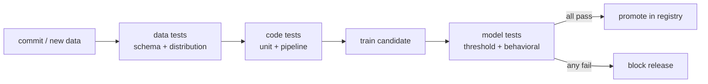

In ordinary software, continuous integration runs a test suite on every change
and refuses to merge if anything is red. ML breaks the assumption that code is the
only input: a model's behavior is determined by **code, data, and the learned
weights together**, so two of the three things that can regress are invisible to a
normal test runner. **CI/CD for ML** closes that gap by adding tests on the data
and on the trained model to the usual tests on the code, then wiring them as gates
a [registered model version](I2/model-registry) must clear before it is promoted.

## Three layers of tests

A useful pipeline checks three things in order, cheapest first:



**Data tests** run before training and assert that the inputs are sane: every
expected column is present with the right type (a **schema** test), and the new
batch has not drifted from the reference distribution using the
[KS / PSI statistics](I1/drift-detection) from the data-engineering lessons. Bad
data caught here never wastes a training run.

**Code tests** are ordinary unit tests on the transforms plus a **pipeline test**
that runs the whole train→evaluate flow on a tiny fixture, catching the plumbing
bugs (a misaligned join, a dropped column) that a unit test misses.

**Model tests** run after training the candidate. A **threshold test** fails the
build if a headline metric falls below a floor (or drops more than $\varepsilon$
below the current production model). **Behavioral tests** assert properties the
metric can average away: an **invariance** test says a prediction must not change
when an irrelevant feature is perturbed, and a **directional** test says it must
move the right way when a meaningful one does. A model can hit its target accuracy
and still fail these, which is exactly the kind of silent regression CI exists to
stop.

## Worked example: an invariance test as a gate

We hold a model's other features fixed, perturb a feature that should be
irrelevant, and fail the gate if too many predictions move. This is a unit test
you would run in CI on every candidate before promotion.

```python
import numpy as np
rng = np.random.default_rng(0)

# A toy scoring model. It is SUPPOSED to ignore feature 2 (say, a random id),
# but a leak during training gave it a small, illegitimate weight on it.
w = np.array([1.2, -0.8, 0.15])   # w[2] should have been 0.0

def model(X):
    return 1 / (1 + np.exp(-X @ w))   # logistic score in [0, 1]

X = rng.normal(size=(2000, 3))
base = model(X)

# Invariance test: perturb ONLY feature 2, everything else fixed.
Xp = X.copy()
Xp[:, 2] = rng.normal(size=X.shape[0])
perturbed = model(Xp)

# A prediction "flips" if it crosses the 0.5 decision boundary.
flip_rate = np.mean((base >= 0.5) != (perturbed >= 0.5))
TOL = 0.01   # allow at most 1% flips from an irrelevant feature

print(f"prediction flip rate under irrelevant perturbation = {flip_rate:.3f}")
print(f"gate tolerance                                      = {TOL:.3f}")
gate_passes = flip_rate <= TOL
print("CI gate passes:", gate_passes)

assert not gate_passes   # this buggy model is correctly REJECTED by the gate
print("the invariance test catches a leak the accuracy metric would hide:", True)
```

The model could report a perfectly healthy accuracy and still fail this gate,
because the bug is a *dependence on the wrong feature*, not an aggregate error. A
red test here blocks promotion in the [registry](I2/model-registry) instead of
shipping the regression. These automated gates are what make the
[deployment strategies](I3/deployment-strategies) of the next subsection safe to
run on real traffic: by the time a model reaches a canary, it has already proven
it does not break the invariants you wrote down.
