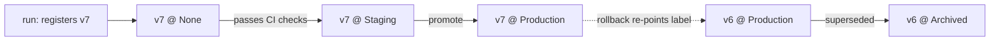

[Experiment tracking](I2/experiment-tracking) answers *which run produced this
result*. The **model registry** answers the next question a team faces: *which
model is in production right now, and how do I change it safely?* A registry is a
catalog of trained-model **artifacts**, each one immutable and versioned, with a
small set of named **stages** (typically `None` → `Staging` → `Production` →
`Archived`) that a model moves through. Deployment becomes a metadata operation,
move version 7 to `Production`, rather than a rebuild, and that one indirection
buys auditability and instant rollback<FN n="1" />.

## A version is an immutable artifact, not a file

When a training run finishes, you do not "save the model" over the last one. You
**register a new version**: a frozen bundle of the serialized weights, the input
and output **signature** (the schema the server validates requests against), the
exact environment (library versions, so it deserializes the same way in two
years), and a back-pointer to the [experiment run](I2/experiment-tracking) and
[data version](I1/data-versioning) that produced it. Versions are append-only and
numbered; you never mutate version 6, you register version 7. That immutability is
what makes rollback trivial, the previous good artifact still exists, untouched.

## Stages turn a deploy into a pointer swap

A **stage** is a named label pointing at one version. The serving layer is
configured to load *whatever version currently holds the `Production` stage*, so
it never hard-codes a version number. Promotion and rollback are then the same
operation, repointing a label:

Because the server follows the label, promoting v7 and rolling back to v6 are
both a single, audited write to the registry, no redeploy, no rebuild. The
**transition log** (who promoted what, when, and why) is the governance record an
auditor or an [incident review](I4/slos-and-error-budgets) reads to reconstruct
exactly which model served a given request.

## Why the gate matters

The stages are not decoration; each transition is a **gate** where automated
checks must pass before a version advances. A model entering `Staging` runs the
test suite of the [next lesson](I2/ml-cicd), schema validation, a behavioral
threshold on a held-out set, before any traffic depends on it. The registry is
the spine that those checks hang off: it gives every candidate a stable identity
to test, promote, serve, and, when something regresses, fall back from<FN n="2" />.

## Exercises

**Exercise 1.** A team currently deploys by overwriting `model.pkl` on the serving
host with each new training run, and the serving code loads that fixed filename.
Production starts returning bad predictions an hour after the latest deploy.
Walk through why rollback is hard under this scheme, then describe how a registry
with immutable versions and a `Production` stage label turns the same rollback
into a single safe operation.

Solution

**Step 1.** Overwriting `model.pkl` destroys the previous artifact. The known-good
model no longer exists on disk, so rolling back means re-running training (slow,
and not guaranteed to reproduce the old weights without the full lineage) or
hunting for a backup that may not have been kept.

**Step 2.** A registry registers each run as a new immutable version
(v6, v7, ...) and never mutates an existing one. The previous good artifact, v6,
is still present and untouched when v7 is registered.

**Step 3.** The serving layer loads whatever version holds the `Production` stage
label rather than a hard-coded filename. Rollback is then repointing that label
from v7 back to v6, a single audited metadata write, with no rebuild and no
retrain, and the transition log records who did it and when.

**Exercise 2.** Two properties are bundled into a registered version: it is
**immutable** (never edited after registration) and it is **versioned**
(append-only, numbered). Argue why immutability alone, without versioning, would
not give you rollback, and why versioning alone, without immutability, would not
give you a trustworthy audit trail. What does each property contribute?

Solution

**Step 1.** Immutability without versioning: if there is only ever one slot that
you refuse to edit, then to ship a new model you must replace the artifact in that
slot, which destroys the old one. Nothing to roll back to. Immutability protects a
*given* artifact but does not by itself keep the *history* of artifacts.

**Step 2.** Versioning without immutability: numbered versions exist, but if v6
can be edited in place after registration, then the artifact a stage label points
at can silently change. An auditor reading "v6 served this request" cannot trust
that the current v6 is the v6 that actually served it. The trail is unreliable.

**Step 3.** Immutability guarantees each version's bytes never change;
versioning keeps every version around under a stable number. Together they give a
frozen, complete history: any past `Production` version still exists exactly as it
served, which is what makes both rollback and audit sound.

**Exercise 3.** Design the stage set and gates for a team that needs a human
sign-off before any model reaches users, on top of the automated CI checks.
Propose the stages and the gate on each transition, say which transitions are
automated and which require a person, and explain how the transition log supports
a later incident review that asks "which model served request X at time T, and who
approved it".

Solution

**Step 1.** Use the stages `None` -> `Staging` -> `Production` -> `Archived`. A
run registers a version at `None`. Promotion to `Staging` is gated on the
automated CI suite (schema, behavioral, threshold tests) and can be fully
automatic, since no user traffic is at risk yet.

**Step 2.** The `Staging` -> `Production` transition carries two gates: the
automated checks must still be green on the staging artifact, and a named reviewer
must approve. This transition is the human sign-off the team requires, so it is
not automated. Superseded versions move `Production` -> `Archived` automatically
when a new version is promoted, and rollback re-points the `Production` label to a
prior version (itself an audited, optionally human-approved, transition).

**Step 3.** Every transition writes a log entry (version, source and target stage,
timestamp, actor, reason). Because serving follows the `Production` label, the
log's timeline of which version held `Production` over time answers "which model
served request X at time T": find the version labeled `Production` at T. The actor
field on that promotion entry names who approved it, giving the incident review
both the model identity and the accountable person.

The next lesson builds the [CI/CD pipeline](I2/ml-cicd) that decides whether a
registered version is allowed through the gate.

<Footnotes>
  <FNItem n="1">**Huyen, C.** (2022). *Designing Machine Learning Systems.* O'Reilly. Model versioning, staged promotion, and deployment as a metadata operation.</FNItem>
  <FNItem n="2">**Sculley, D., et al.** (2015). "Hidden technical debt in machine learning systems". *NeurIPS*. Undeclared model dependencies and the value of a stable, auditable artifact identity.</FNItem>
</Footnotes>
