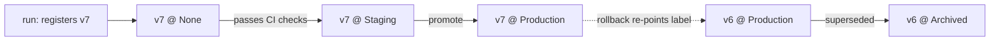

[Experiment tracking](I2/experiment-tracking) answers *which run produced this
result*. The **model registry** answers the next question a team faces: *which
model is in production right now, and how do I change it safely?* A registry is a
catalog of trained-model **artifacts**, each one immutable and versioned, with a
small set of named **stages** (typically `None` → `Staging` → `Production` →
`Archived`) that a model moves through. Deployment becomes a metadata operation,
move version 7 to `Production`, rather than a rebuild, and that one indirection
buys auditability and instant rollback.

## A version is an immutable artifact, not a file

When a training run finishes, you do not "save the model" over the last one. You
**register a new version**: a frozen bundle of the serialized weights, the input
and output **signature** (the schema the server validates requests against), the
exact environment (library versions, so it deserializes the same way in two
years), and a back-pointer to the [experiment run](I2/experiment-tracking) and
[data version](I1/data-versioning) that produced it. Versions are append-only and
numbered; you never mutate version 6, you register version 7. That immutability is
what makes rollback trivial, the previous good artifact still exists, untouched.

## Stages turn a deploy into a pointer swap

A **stage** is a named label pointing at one version. The serving layer is
configured to load *whatever version currently holds the `Production` stage*, so
it never hard-codes a version number. Promotion and rollback are then the same
operation, repointing a label:

Because the server follows the label, promoting v7 and rolling back to v6 are
both a single, audited write to the registry, no redeploy, no rebuild. The
**transition log** (who promoted what, when, and why) is the governance record an
auditor or an [incident review](I4/slos-and-error-budgets) reads to reconstruct
exactly which model served a given request.

## Why the gate matters

The stages are not decoration; each transition is a **gate** where automated
checks must pass before a version advances. A model entering `Staging` runs the
test suite of the [next lesson](I2/ml-cicd), schema validation, a behavioral
threshold on a held-out set, before any traffic depends on it. The registry is
the spine that those checks hang off: it gives every candidate a stable identity
to test, promote, serve, and, when something regresses, fall back from. The next
lesson builds the [CI/CD pipeline](I2/ml-cicd) that decides whether a registered
version is allowed through the gate.
