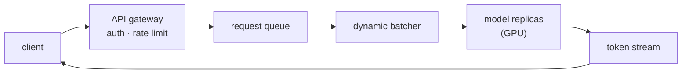

Serving is the discipline of answering requests with a model under a latency
and cost budget. The trained artifact is fixed; the problem is everything
around it: how a request arrives, how it is batched with other requests, how
the response streams back, and how much hardware the whole thing costs per
thousand tokens.

## Classical serving vs. LLM serving

A classical model (a tree ensemble, a CNN) takes a fixed-size input and returns
a fixed-size output in one forward pass. Serving it well is mostly about
throughput: batch requests, pin the model in memory, scale replicas behind a
load balancer. TorchServe and TF Serving exist for exactly this shape.

Autoregressive LLMs break the assumption. Generation is a loop: one forward
pass per output token, each depending on all previous tokens. Two consequences
drive every modern LLM server:

- **KV cache.** The keys and values for earlier positions are identical on
  every step, so they are computed once and stored. Memory, not compute, becomes
  the binding constraint, and it grows with sequence length × batch size.
- **Continuous batching.** Requests finish at different lengths. Static batching
  wastes the GPU waiting for the slowest sequence; continuous batching (vLLM,
  TGI, SGLang) swaps finished sequences out and new ones in at each step, keeping
  the device saturated.

## Buying headroom: quantization, distillation, pruning

When a model is too large or too slow for the budget, three levers reduce its
footprint without retraining from scratch:

- **Quantization** stores weights (and sometimes activations) in fewer bits —
  8-bit or 4-bit instead of 16. It cuts memory and bandwidth, which for
  memory-bound LLM decoding often means a direct latency win.
- **Distillation** trains a smaller student model to imitate a larger teacher,
  trading some quality for a much cheaper forward pass.
- **Pruning** removes weights or whole structures that contribute little, then
  fine-tunes to recover.

## The deployment surface

Where the model runs shapes the rest of the stack. Cloud GPU endpoints give
elasticity and managed scaling. Edge and on-device targets (ONNX Runtime,
CoreML) trade peak capability for privacy, offline operation, and zero
per-request cost. The decision is rarely about the model and almost always
about the latency budget, the privacy requirements, and the unit economics.
