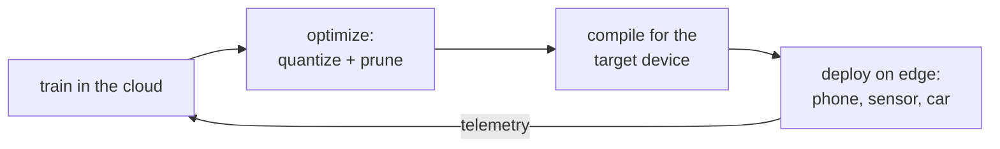

Everything so far assumed the model runs in a data center on a GPU you control.
Sometimes it has to run on a phone, a browser, a camera, or a microcontroller.
This is **edge** or **on-device** deployment, and it is not just "the same model on
a smaller GPU." The whole objective function changes: in the cloud you optimize
throughput per dollar; at the edge you optimize fitting inside a fixed, often tiny,
device while respecting power, privacy, and connectivity constraints. The model
choices that follow are downstream of those constraints.

## Why move to the edge at all

Three pressures push inference onto the device, and each one, not raw performance,
is the reason:

- **Latency and connectivity.** A round trip to a server adds network latency and
  fails entirely when the device is offline. A keyboard's next-word model or a
  car's perception stack cannot wait on, or depend on, a network.
- **Privacy.** Data that never leaves the device cannot be intercepted or logged
  server-side. Keeping a health or keyboard model on-device is often a hard
  requirement, not an optimization.
- **Cost.** On-device inference runs on hardware the user already paid for, so it
  has zero marginal server cost per request. At consumer scale that can dominate
  the economics.

A cloud endpoint, by contrast, keeps elasticity (scale replicas with load),
access to the largest models, and centralized updates. The decision is almost never
about the model's accuracy and almost always about the latency budget, the privacy
requirement, and the unit economics.

## The binding constraints

On-device targets are bounded by resources the cloud treats as free:

- **Memory.** A phone gives an app a few hundred megabytes, a microcontroller a few
  hundred *kilo*bytes. The model plus its working memory must fit, which makes
  [quantization](quantization) and pruning prerequisites rather than refinements.
- **Power and heat.** Inference drains the battery and heats the chip; a model that
  pins the CPU is unusable on a phone regardless of its accuracy.
- **Heterogeneous hardware.** The same app runs on thousands of chip variants
  (CPUs, mobile GPUs, and neural accelerators like Apple's Neural Engine or
  Qualcomm's Hexagon), each with its own instruction set.

## Exchange formats and graph optimization

Two pieces of machinery make a trained model portable and fast on this hardware.

An **exchange format** decouples the framework a model was *trained* in from the
runtime it is *served* by. **ONNX** (Open Neural Network Exchange) is a standard
serialization of a model's computation graph: export once from PyTorch or
TensorFlow, then run anywhere an ONNX runtime exists. **CoreML** (Apple) and
**TFLite** (Android, embedded) play the same role for their platforms, compiling the
graph to the on-device accelerators.

On top of the format, **graph optimization** rewrites the computation to run faster
without changing what it computes:

- **Operator fusion** merges a chain of operations (for example a convolution, a
  bias add, and a ReLU) into a single kernel, removing the memory round-trips
  between them, the same memory-bound saving that [quantization](quantization)
  chases from the other direction.
- **Constant folding** precomputes any subgraph whose inputs are all fixed at
  export time, so it costs nothing at runtime.
- **Layout and kernel selection** picks the data layout and the implementation
  best suited to the target chip.

Together, quantization to shrink the weights, an exchange format to reach the
hardware, and graph optimization to use it well are what turn a data-center model
into one that runs in a few hundred milliseconds on a phone. That closes the
deployment subsection. The model is now trained, served, and shipped; the final
subsection asks how to know it is still *working* once real traffic hits it, which
is [monitoring](I4/slos-and-error-budgets).
