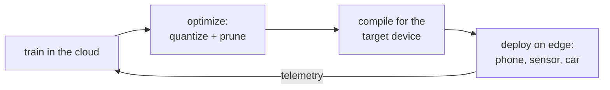

Everything so far assumed the model runs in a data center on a GPU you control.
Sometimes it has to run on a phone, a browser, a camera, or a microcontroller.
This is **edge** or **on-device** deployment, and it is not just "the same model on
a smaller GPU." The whole objective function changes: in the cloud you optimize
throughput per dollar; at the edge you optimize fitting inside a fixed, often tiny,
device while respecting power, privacy, and connectivity constraints. The model
choices that follow are downstream of those constraints<FN n="1" />.

## Why move to the edge at all

Three pressures push inference onto the device, and each one, not raw performance,
is the reason:

- **Latency and connectivity.** A round trip to a server adds network latency and
  fails entirely when the device is offline. A keyboard's next-word model or a
  car's perception stack cannot wait on, or depend on, a network.
- **Privacy.** Data that never leaves the device cannot be intercepted or logged
  server-side. Keeping a health or keyboard model on-device is often a hard
  requirement, not an optimization.
- **Cost.** On-device inference runs on hardware the user already paid for, so it
  has zero marginal server cost per request. At consumer scale that can dominate
  the economics.

A cloud endpoint, by contrast, keeps elasticity (scale replicas with load),
access to the largest models, and centralized updates. The decision is almost never
about the model's accuracy and almost always about the latency budget, the privacy
requirement, and the unit economics.

## The binding constraints

On-device targets are bounded by resources the cloud treats as free:

- **Memory.** A phone gives an app a few hundred megabytes, a microcontroller a few
  hundred *kilo*bytes. The model plus its working memory must fit, which makes
  [quantization](quantization) and pruning prerequisites rather than refinements<FN n="2" />.
- **Power and heat.** Inference drains the battery and heats the chip; a model that
  pins the CPU is unusable on a phone regardless of its accuracy.
- **Heterogeneous hardware.** The same app runs on thousands of chip variants
  (CPUs, mobile GPUs, and neural accelerators like Apple's Neural Engine or
  Qualcomm's Hexagon), each with its own instruction set.

## Exchange formats and graph optimization

Two pieces of machinery make a trained model portable and fast on this hardware.

An **exchange format** decouples the framework a model was *trained* in from the
runtime it is *served* by. **ONNX** (Open Neural Network Exchange) is a standard
serialization of a model's computation graph: export once from PyTorch or
TensorFlow, then run anywhere an ONNX runtime exists. **CoreML** (Apple) and
**TFLite** (Android, embedded) play the same role for their platforms, compiling the
graph to the on-device accelerators.

On top of the format, **graph optimization** rewrites the computation to run faster
without changing what it computes:

- **Operator fusion** merges a chain of operations (for example a convolution, a
  bias add, and a ReLU) into a single kernel, removing the memory round-trips
  between them, the same memory-bound saving that [quantization](quantization)
  chases from the other direction.
- **Constant folding** precomputes any subgraph whose inputs are all fixed at
  export time, so it costs nothing at runtime.
- **Layout and kernel selection** picks the data layout and the implementation
  best suited to the target chip.

Together, quantization to shrink the weights, an exchange format to reach the
hardware, and graph optimization to use it well are what turn a data-center model
into one that runs in a few hundred milliseconds on a phone.

## Exercises

**Exercise 1.** A speech model could run either as a cloud endpoint or on-device.
For each of the three edge pressures in the lesson (latency/connectivity, privacy,
cost), give a concrete deployment scenario where that pressure alone forces the
model onto the device, even if the cloud model were more accurate.

Solution

**Step 1 (latency/connectivity).** A car's voice command system or an offline
dictation feature on a plane must respond with no network. A round trip adds latency
and fails entirely when offline, so the model must be on-device regardless of cloud
accuracy.

**Step 2 (privacy).** A medical transcription app handling patient audio may be
legally required to keep data on the device. If the audio cannot leave the device,
the model cannot live in the cloud, accuracy notwithstanding.

**Step 3 (cost).** A keyboard's always-on dictation runs millions of times per user
per day. On-device inference runs on hardware the user already paid for, so its
marginal server cost is zero; at that scale a more accurate cloud model could be
economically impossible to serve.

**Exercise 2.** Graph optimization rewrites a model "without changing what it
computes." Explain why operator fusion (merging a convolution, bias add, and ReLU
into one kernel) speeds up inference even though it performs the same arithmetic,
and connect this to the memory-bound argument from the quantization lesson.

Solution

**Step 1.** Run separately, each operation reads its input from memory and writes
its output back: the convolution writes a tensor, the bias add reads and rewrites
it, the ReLU reads and rewrites it again. The arithmetic is cheap; the repeated
memory round-trips are not.

**Step 2.** Fusion keeps the intermediate values in fast registers or on-chip cache
and applies all three operations in one pass, so the tensor is read once and written
once. The same floating-point operations happen, but the memory traffic collapses.

**Step 3.** This is the memory-bound regime: throughput is limited by moving data,
not by the compute units. Quantization attacks the same bottleneck from the other
side, shrinking the *bytes per weight* moved; fusion shrinks the *number of trips*.
Both win by reducing memory traffic, not arithmetic.

**Exercise 3.** An exchange format like ONNX sits between the training framework and
the serving runtime. Describe the coupling a team would suffer without it (training
in PyTorch, deploying to three platforms: iOS, Android, and a browser), and how the
format removes that coupling. Identify the one thing the format alone does not give
you that still requires per-platform work.

Solution

**Step 1 (the coupling).** Without an exchange format, the model's served form is
tied to its training framework. Reaching iOS, Android, and a browser would mean
maintaining three separate hand-ported reimplementations of the model, each kept in
sync with the PyTorch original as it changes: a combinatorial maintenance burden.

**Step 2 (what the format removes).** Exporting once to a standard serialization of
the computation graph (ONNX) decouples "trained in" from "served by." Any runtime
that reads the format can load the one exported graph, so the team maintains a
single artifact instead of three ports.

**Step 3 (what remains).** The format standardizes the graph, not its execution on
each chip. Compiling the graph to a platform's accelerators (CoreML for Apple,
TFLite for Android, a browser runtime) and the per-target graph optimization and
kernel selection are still platform-specific work the format does not do for you.

That closes the
deployment subsection. The model is now trained, served, and shipped; the final
subsection asks how to know it is still *working* once real traffic hits it, which
is [monitoring](I4/slos-and-error-budgets).

<Footnotes>
  <FNItem n="1">**Howard, A. G., et al.** (2017). "MobileNets: efficient convolutional neural networks for mobile vision applications". [arXiv:1704.04861](https://arxiv.org/abs/1704.04861) Architecture designed for the on-device memory and power budget.</FNItem>
  <FNItem n="2">**Gholami, A., Kim, S., Dong, Z., Yao, Z., Mahoney, M. W., & Keutzer, K.** (2021). "A survey of quantization methods for efficient neural network inference". [arXiv:2103.13630](https://arxiv.org/abs/2103.13630) Quantization as a prerequisite for fitting models on constrained hardware.</FNItem>
</Footnotes>
