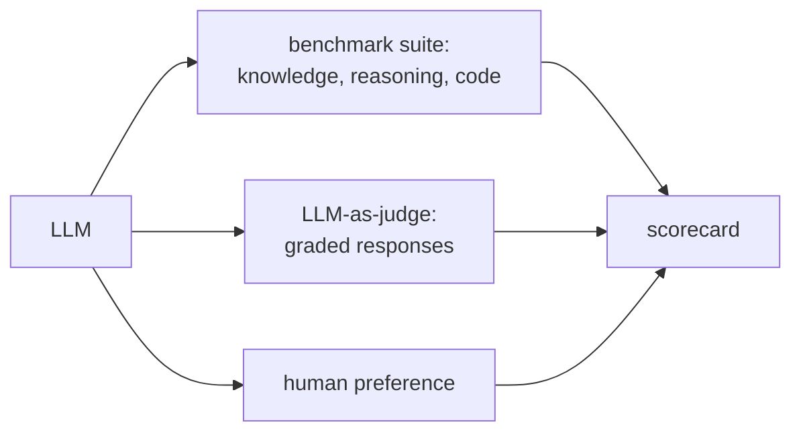

A classifier's accuracy is unambiguous: the prediction is right or wrong. A
generative model is harder to score. Its output is a sampled string, the same
prompt gives different answers on different draws, and "correct" may mean "the code
passes the tests" rather than "matches one gold label." Evaluating LLMs therefore
needs its own statistics: an unbiased way to summarize sampled successes
(**pass@k**), an honest confidence interval on a benchmark number, and a guard
against the failure mode that silently inflates every score, **contamination**.

## pass@k and why the naive estimate is biased

For tasks with an automatic checker (does the generated code pass the unit tests?),
the standard metric is **pass@k**: the probability that *at least one* of $k$
sampled generations is correct. If a single sample is correct with probability
$\theta$, then by independence

$$
\text{pass@}k = 1 - (1-\theta)^k,
$$

since $(1-\theta)^k$ is the chance all $k$ fail. You do not know $\theta$; you
estimate it from samples. The tempting plug-in is to take $n$ samples, count $c$
correct, and substitute $\hat\theta = c/n$ into the formula. That estimate is
**biased**, because a nonlinear function of an estimate is not the estimate of the
function ($\mathbb{E}[f(\hat\theta)] \neq f(\mathbb{E}[\hat\theta])$ when $f$ is
nonlinear).

The HumanEval paper's fix is a directly **unbiased** estimator<FN n="1" />. Draw $n \ge k$
samples, count $c$ correct, and compute the probability that a random size-$k$
subset of the $n$ samples contains no correct one, then subtract from $1$:

$$
\widehat{\text{pass@}k} = 1 - \frac{\binom{n-c}{k}}{\binom{n}{k}}.
$$

The fraction is "ways to choose $k$ samples from the $n-c$ wrong ones" over "ways to
choose $k$ from all $n$": exactly the chance a $k$-subset is all-wrong. Its
expectation equals the true pass@k, so averaging it over many problems gives an
unbiased benchmark number. Sampling more than $k$ (using $n > k$) is what makes the
estimate low-variance.

## A score is an estimate, so report an interval

A benchmark result like "$82\%$ on $100$ problems" is a sample proportion, not the
truth; run a different $100$ problems and you would get a different number. Report a
**confidence interval**. For a proportion the **Wilson interval** is the right
default (it stays inside $[0,1]$ and behaves well for small $m$ or extreme rates,
unlike the textbook normal approximation). For $x$ successes in $m$ trials with
$z = 1.96$ for $95\%$ confidence, it is centered and half-widthed by

$$
\text{center} = \frac{\hat p + \frac{z^2}{2m}}{1 + \frac{z^2}{m}}, \qquad
\text{half} = \frac{z}{1 + \frac{z^2}{m}}\sqrt{\frac{\hat p(1-\hat p)}{m} + \frac{z^2}{4m^2}},
$$

with $\hat p = x/m$. The interval is what lets you say whether a $2$-point gap
between two models is real or noise, the same logic as the
[A/B test](B/ab-testing): a difference inside the error bars is not yet a result.

## Contamination

All of this assumes the test problems are *unseen*. The most dangerous failure in
LLM evaluation is **contamination**: the benchmark's questions (and answers) leaked
into the pretraining corpus, so the model scores by recall, not capability, and the
number is meaningless as a measure of generalization. Because pretraining data is
web-scale, public benchmarks routinely end up inside it. Defenses are
process-level: check for verbatim n-gram overlap between test items and the
training corpus, prefer benchmarks released *after* the model's data cutoff, and
hold out private test sets. A headline score without a contamination check should be
read with suspicion<FN n="2" />.



## Worked example

We confirm the unbiased pass@k estimator recovers the true value where the naive
plug-in does not, then put a Wilson interval on an $82/100$ benchmark score.

```python
import numpy as np
from math import comb
rng = np.random.default_rng(0)

def passk_unbiased(n, c, k):
    if n - c < k: return 1.0                     # impossible to draw k all-wrong
    return 1 - comb(n - c, k) / comb(n, k)       # 1 - P(a random k-subset is all wrong)
def passk_naive(n, c, k):
    return 1 - (1 - c / n) ** k                  # plug-in: biased for nonlinear f

theta, n, k = 0.3, 20, 5                          # true per-sample success rate
true = 1 - (1 - theta) ** k                       # ground-truth pass@k
cs = rng.binomial(n, theta, 200_000)              # simulate counts of c correct in n
unb = np.mean([passk_unbiased(n, int(c), k) for c in cs])
nai = np.mean([passk_naive(n, int(c), k) for c in cs])
print(f"true pass@{k} = {true:.4f}")
print(f"unbiased est = {unb:.4f}  (bias {unb - true:+.4f})")
print(f"naive est    = {nai:.4f}  (bias {nai - true:+.4f})")
assert abs(unb - true) < 0.002 and abs(nai - true) > abs(unb - true)

def wilson(x, m, z=1.96):                          # 95% CI for a proportion
    p, denom = x / m, 1 + z*z/m
    center = (p + z*z/(2*m)) / denom
    half = z/denom * np.sqrt(p*(1-p)/m + z*z/(4*m*m))
    return center - half, center + half

lo, hi = wilson(82, 100)
print(f"\nbenchmark 82/100 -> 95% Wilson CI [{lo:.3f}, {hi:.3f}]")
assert lo < 0.82 < hi
```

## Exercises

**Exercise 1.** A single generation is correct with probability $\theta = 0.25$.
Compute the true pass@$1$, pass@$2$, and pass@$4$ from $1 - (1-\theta)^k$, and
explain in one sentence why pass@$k$ rises with $k$ but with diminishing returns.

<details>
<summary>Solution</summary>

**Step 1.** With $1 - \theta = 0.75$:

$$
\text{pass@}1 = 1 - 0.75 = 0.25, \qquad
\text{pass@}2 = 1 - 0.75^2 = 1 - 0.5625 = 0.4375,
$$

$$
\text{pass@}4 = 1 - 0.75^4 = 1 - 0.3164 = 0.6836.
$$

**Step 2.** Each extra sample multiplies the all-fail probability by another factor
of $0.75$, so the failure probability decays geometrically toward zero and pass@$k$
rises toward $1$. The increments shrink ($+0.1875$ from $k{=}1$ to $k{=}2$, but only
$+0.246$ spread across $k{=}2$ to $k{=}4$) because each added sample removes a
smaller absolute slice of an already-shrinking failure mass.

</details>

**Exercise 2.** Explain why the naive plug-in $1 - (1 - c/n)^k$ is a biased
estimator of pass@$k$, naming the inequality responsible. State the direction of
the bias for this convex-in-$\theta$ failure term and why.

<details>
<summary>Solution</summary>

**Step 1.** The estimator applies a nonlinear function $f(\theta) = 1 - (1-\theta)^k$
to the random estimate $\hat\theta = c/n$. By Jensen's inequality,
$\mathbb{E}[f(\hat\theta)] \neq f(\mathbb{E}[\hat\theta])$ whenever $f$ is nonlinear,
even though $\hat\theta$ is itself unbiased for $\theta$. So plugging an unbiased
$\hat\theta$ into a nonlinear $f$ does not yield an unbiased estimate of $f(\theta)$.

**Step 2.** The pass@$k$ function is concave in $\theta$ for $k \ge 2$ (its second
derivative $-k(k-1)(1-\theta)^{k-2}$ is negative). For a concave $f$, Jensen gives
$\mathbb{E}[f(\hat\theta)] \le f(\mathbb{E}[\hat\theta]) = f(\theta)$, so the naive
plug-in is biased **downward**: it underestimates the true pass@$k$, which is why
the worked example saw it sit several points low.

</details>

**Exercise 3 (code).** A model scores $73/100$ on a benchmark. Compute the $95\%$
Wilson interval by hand-implemented formula, and confirm the interval lies inside
$[0, 1]$ and contains the point estimate $0.73$.

<details>
<summary>Solution</summary>

```python
import numpy as np

def wilson(x, m, z=1.96):                     # 95% CI for a proportion
    p, denom = x / m, 1 + z*z/m
    center = (p + z*z/(2*m)) / denom
    half = z/denom * np.sqrt(p*(1-p)/m + z*z/(4*m*m))
    return center - half, center + half

lo, hi = wilson(73, 100)
print(f"73/100 -> 95% Wilson CI [{lo:.3f}, {hi:.3f}]")

assert 0.0 <= lo < 0.73 < hi <= 1.0
```

The interval comes out to roughly $[0.636, 0.807]$, about $\pm 9$ points around the
$0.73$ estimate. It stays inside $[0, 1]$ and brackets the point estimate, which is
the Wilson interval's whole advantage over the normal approximation for proportions
near the extremes or with modest $m$.

</details>

The unbiased estimator lands on the true pass@k while the naive plug-in sits almost
four points low, and the Wilson interval shows that "$82\%$" really means roughly
$73$ to $88\%$, wide enough that small benchmark gaps should not be over-read.
Evaluating *capability* is one axis; evaluating *safety*, how often a model can be
pushed into harmful behavior, is the next, in [safety evals and
red-teaming](safety-evals-red-teaming).

<Footnotes>
  <FNItem n="1">**Chen, M., et al.** (2021). "Evaluating large language models trained on code". [arXiv:2107.03374](https://arxiv.org/abs/2107.03374) Introduces HumanEval and the unbiased pass@k estimator.</FNItem>
  <FNItem n="2">**Liang, P., et al.** (2023). "Holistic evaluation of language models (HELM)". *TMLR*. [arXiv:2211.09110](https://arxiv.org/abs/2211.09110) Multi-metric benchmarking and contamination hygiene.</FNItem>
</Footnotes>
