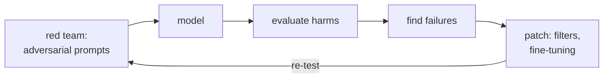

[Capability evals](llm-evaluation) ask what a model *can* do; **safety evals** ask
what it can be *made* to do that it should not. The measurement is adversarial: a
**red team** (humans, or an automated attacker model) deliberately probes for
prompts that elicit harmful behavior, jailbreaks past the safety training, leaks
private data, or produces disallowed content<FN n="1" />. The output is a rate, and because
that rate is estimated from a finite, noisy set of attacks, the statistics from the
last lesson, confidence intervals and two-sample comparisons, are exactly what turn
red-team transcripts into a defensible safety claim.

## The attack success rate

Fix a suite of attack attempts and a judge (a human rater, or a classifier) that
decides whether each attempt produced harmful output. The **attack success rate**
(ASR) is the fraction that succeeded:

$$
\text{ASR} = \frac{\text{successful attacks}}{\text{total attempts}}.
$$

Lower is safer. Unlike a capability metric, where you want the rate high, here the
rate is a *vulnerability*: an ASR of $0.09$ means nearly one in ten adversarial
prompts got through. The number is only as good as the attack suite, an ASR
measured against weak attacks understates real risk, which is why red-teaming
emphasizes *diverse, evolving* attacks rather than a fixed checklist<FN n="2" />.

## An ASR is an estimate

The ASR is a sample proportion over however many attacks you ran, so it carries
sampling noise and must come with a [confidence interval](llm-evaluation). The
**Wilson interval** is again the right tool. With few attempts, the interval is
wide: an ASR of $0.04$ from $200$ attempts could reflect a true rate anywhere from
roughly $2\%$ to $8\%$. Reporting ASR as a bare point estimate invites two
mistakes, declaring a model safe on a handful of attacks that happened to fail, or
panicking over a rate whose interval comfortably includes a tolerable value.

## Comparing two models honestly

The decision you usually care about is comparative: is the safety-tuned candidate B
*actually* safer than the deployed model A, or did it just draw a luckier set of
attacks? A tempting shortcut is to eyeball whether the two Wilson intervals overlap,
but that is the wrong test: intervals can overlap while the difference is still
significant. The correct tool is the **two-proportion z-test**. Pool the two
samples under the null hypothesis "same true ASR" to estimate a common rate $\hat
p$, form the standard error of the difference, and standardize:

$$
\hat p = \frac{x_A + x_B}{n_A + n_B}, \qquad
z = \frac{\hat p_A - \hat p_B}{\sqrt{\hat p(1-\hat p)\left(\frac{1}{n_A}+\frac{1}{n_B}\right)}}.
$$

A two-sided $p$-value from $z$ answers whether the gap is larger than sampling noise
would plausibly produce. Only then can you say B is safer rather than luckier. This
is the same hypothesis-testing logic used everywhere else; the point is that safety
claims are statistical claims and deserve the same rigor.



## Worked example

Two models are each hit with $200$ attacks. We compute each ASR with a Wilson
interval, then run a two-proportion z-test to decide whether B is genuinely safer.

```python
import numpy as np
from math import erf, sqrt

def wilson(x, m, z=1.96):                          # 95% CI for a proportion
    p, denom = x / m, 1 + z*z/m
    center = (p + z*z/(2*m)) / denom
    half = z/denom * np.sqrt(p*(1-p)/m + z*z/(4*m*m))
    return round(float(center - half), 3), round(float(center + half), 3)

def normal_cdf(z):
    return 0.5 * (1 + erf(z / sqrt(2)))            # standard normal CDF, no scipy

nA, xA = 200, 18                                   # model A: 18 successful attacks
nB, xB = 200, 8                                    # model B: safety-tuned candidate
asrA, asrB = xA / nA, xB / nB
print(f"model A: ASR {asrA:.3f}  95% CI {wilson(xA, nA)}")
print(f"model B: ASR {asrB:.3f}  95% CI {wilson(xB, nB)}")

# Two-proportion z-test under H0: same true ASR.
p_pool = (xA + xB) / (nA + nB)
se = sqrt(p_pool * (1 - p_pool) * (1/nA + 1/nB))
z = (asrA - asrB) / se
p_value = 2 * (1 - normal_cdf(abs(z)))
print(f"\ntwo-proportion z = {z:.2f},  p-value = {p_value:.3f}")
print(f"B significantly safer at alpha=0.05: {p_value < 0.05}")
assert asrB < asrA and p_value < 0.05
```

The Wilson intervals overlap slightly, which the naive eyeball test would call
inconclusive, yet the two-proportion test returns $p \approx 0.04$: model B's lower
ASR is real, not noise. Capability and safety both cost money to run and to serve;
the final lesson closes the loop by monitoring that cost itself, in
[cost monitoring and token economics](cost-monitoring).

<Footnotes>
  <FNItem n="1">**Perez, E., et al.** (2022). "Red teaming language models with language models". *EMNLP*. [arXiv:2202.03286](https://arxiv.org/abs/2202.03286) Automated attacker model that elicits harmful outputs.</FNItem>
  <FNItem n="2">**Ganguli, D., et al.** (2022). "Red teaming language models to reduce harms: methods, scaling behaviors, and lessons learned". [arXiv:2209.07858](https://arxiv.org/abs/2209.07858) Attack-success-rate methodology and the value of diverse attacks.</FNItem>
</Footnotes>
