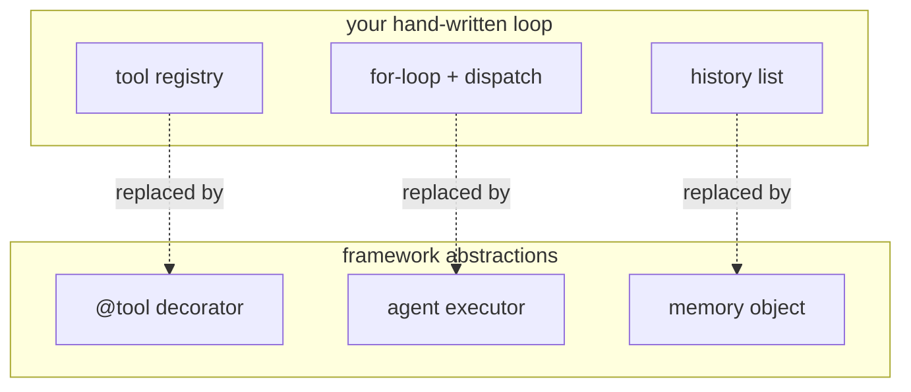

The [hand-written ReAct loop](react-loop) is maybe twenty lines, so why use a
framework? Because the twenty lines hide a long tail of details that frameworks like
LangChain have already solved: prompt formatting for each model, parsing tool calls
when the API does not return clean JSON, retries on malformed output, conversation
memory, streaming, and tracing. A framework is a packaging of that tail<FN n="1" />. Knowing
exactly which part of *your* loop each abstraction replaces is what lets you use one
without it becoming a black box.

## The abstractions, mapped to the loop

Every agent framework offers the same three core abstractions, each standing in for a
piece you wrote by hand:

- **Tool.** A decorator or wrapper that turns a plain function into a tool: it reads
  the function's signature and docstring to generate the schema you previously wrote
  out by hand. This replaces your manual tool registry.
- **Agent executor.** The object that *is* the loop: it owns the Thought-Action-
  Observation cycle, the model calls, the dispatch, and the step budget<FN n="2" />. This replaces
  your `for` loop and dispatcher.
- **Memory.** A store of conversation history that is automatically threaded back into
  the prompt each turn. This replaces the `history` list you passed around manually.



The same agent in framework form collapses to a few declarations (this is
illustrative, not runnable here):

```python-static
from langchain.agents import create_react_agent, AgentExecutor
from langchain.tools import tool

@tool
def get_stock(ticker: str) -> float:
    """Get the latest price for a stock ticker."""
    return prices[ticker]

agent = create_react_agent(llm, tools=[get_stock], prompt=react_prompt)
executor = AgentExecutor(agent=agent, tools=[get_stock], max_iterations=5)
executor.invoke({"input": "What is Apple trading at?"})
```

The `@tool` decorator generates the schema from the type hints and docstring,
`create_react_agent` wires the model to the tools, and `AgentExecutor` runs the loop
you wrote by hand, with `max_iterations` as the same step budget.

## What you gain and what you give up

The trade is real in both directions. You **gain** the solved tail: robust parsing,
retries, memory, streaming, swappable model backends, and an ecosystem of pre-built
tools. You **give up** transparency and control. When the agent misbehaves, the bug is
now inside the framework's prompt templating or output parser, layers you did not
write, and matching the framework's assumptions to your model can be its own work.

The judgment call: reach for a framework when you want the solved tail and your use
case fits its shape, and stay with the hand-written loop when you need to see and
control every token, which is common for latency-critical or high-stakes systems.
Either way, the loop underneath is the one from the last lesson. When control flow
gets more complex than a single loop, branching, looping back, pausing for human
input, even a framework's linear executor strains, which is the case for
[graph-structured agents](langgraph-state-machines).

<Footnotes>
  <FNItem n="1">**Huyen, C.** (2024). *AI Engineering: Building Applications with Foundation Models.* O'Reilly. What agent frameworks abstract over a hand-written loop, and the trade-offs.</FNItem>
  <FNItem n="2">**Yao, S., et al.** (2023). "ReAct: synergizing reasoning and acting in language models". *ICLR*. [arXiv:2210.03629](https://arxiv.org/abs/2210.03629). The reason-act-observe cycle the executor automates.</FNItem>
</Footnotes>
