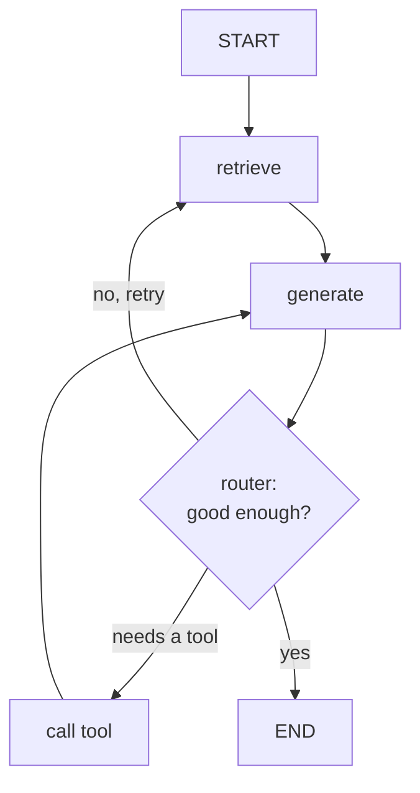

A simple [agent executor](agent-frameworks) runs one loop: think, act, repeat. Real
workflows are not one loop. They branch (if the query is about billing, route to the
billing tools; otherwise to support), they loop back (retrieve, check if the context
is sufficient, retrieve again if not), and they sometimes pause to wait for a human to
approve an action. Expressing that as a linear chain becomes a tangle of conditionals.
**LangGraph** models the agent as an explicit **state machine** instead, which makes
the control flow a first-class, inspectable object.

## Nodes, edges, state, and routers

The model has four parts:

- **State.** A single shared object (typically a dict) that every step reads and
  writes: the messages so far, retrieved documents, intermediate results. The state
  *is* the agent's working memory, passed along the graph.
- **Nodes.** Units of work, a function or a model call, that take the state and return
  an updated state. "Retrieve," "call the model," "run a tool," "ask a human" are each
  a node.
- **Edges.** Directed connections that say which node runs next. A plain edge is
  unconditional ("after retrieve, always generate").
- **Routers (conditional edges).** An edge whose target is chosen at runtime by a
  function of the state. This is where branching and looping live: a router inspects
  the state and returns the name of the next node.



In framework form the graph is declared by adding nodes and edges (illustrative, not
runnable here):

```python-static
from langgraph.graph import StateGraph, START, END

graph = StateGraph(AgentState)
graph.add_node("retrieve", retrieve)
graph.add_node("generate", generate)
graph.add_node("call_tool", call_tool)
graph.add_edge(START, "retrieve")
graph.add_edge("retrieve", "generate")
graph.add_conditional_edges("generate", route, {   # router picks the next node
    "retry": "retrieve", "tool": "call_tool", "done": END,
})
app = graph.compile(checkpointer=saver)             # checkpointing enables pause/resume
```

The `route` function reads the state and returns `"retry"`, `"tool"`, or `"done"`,
and the graph follows the matching edge.

## Why a graph beats a chain

Three properties fall out of making the control flow explicit. **Cycles are
first-class**: a loop is just an edge pointing back, so retrieve-check-retrieve needs
no special casing. **The structure is inspectable**: because the graph is a data
object, you can visualize it, test each node in isolation, and reason about every path
the agent can take, instead of tracing nested `if`s. And **checkpointing is natural**:
since all the work lives in the shared state, the framework can snapshot that state
between nodes, which is what lets a graph *pause* for human approval and *resume*
later, or recover from a crash mid-run.

The cost is upfront structure: you must name the nodes and draw the edges before
running anything, which is heavier than a one-line agent. The payoff is that complex,
auditable, human-in-the-loop workflows stay manageable. With the agent-building toolkit
in hand (RAG, tools, the loop, frameworks, graphs), the next subsection steps up to
*systems thinking*: how these agents talk to the outside world through a standard
protocol, [MCP](J2/mcp-protocol).
