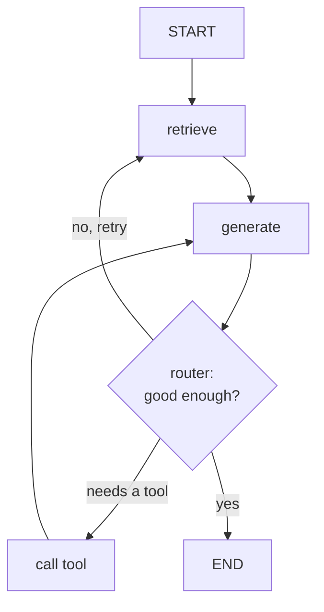

A simple [agent executor](agent-frameworks) runs one loop: think, act, repeat. Real
workflows are not one loop. They branch (if the query is about billing, route to the
billing tools; otherwise to support), they loop back (retrieve, check if the context
is sufficient, retrieve again if not), and they sometimes pause to wait for a human to
approve an action. Expressing that as a linear chain becomes a tangle of conditionals.
**LangGraph** models the agent as an explicit **state machine** instead, which makes
the control flow a first-class, inspectable object<FN n="1" />.

## Nodes, edges, state, and routers

The model has four parts:

- **State.** A single shared object (typically a dict) that every step reads and
  writes: the messages so far, retrieved documents, intermediate results. The state
  *is* the agent's working memory, passed along the graph.
- **Nodes.** Units of work, a function or a model call, that take the state and return
  an updated state. "Retrieve," "call the model," "run a tool," "ask a human" are each
  a node.
- **Edges.** Directed connections that say which node runs next. A plain edge is
  unconditional ("after retrieve, always generate").
- **Routers (conditional edges).** An edge whose target is chosen at runtime by a
  function of the state. This is where branching and looping live: a router inspects
  the state and returns the name of the next node.



In framework form the graph is declared by adding nodes and edges (illustrative, not
runnable here):

```python-static
from langgraph.graph import StateGraph, START, END

graph = StateGraph(AgentState)
graph.add_node("retrieve", retrieve)
graph.add_node("generate", generate)
graph.add_node("call_tool", call_tool)
graph.add_edge(START, "retrieve")
graph.add_edge("retrieve", "generate")
graph.add_conditional_edges("generate", route, {   # router picks the next node
    "retry": "retrieve", "tool": "call_tool", "done": END,
})
app = graph.compile(checkpointer=saver)             # checkpointing enables pause/resume
```

The `route` function reads the state and returns `"retry"`, `"tool"`, or `"done"`,
and the graph follows the matching edge.

## Why a graph beats a chain

Three properties fall out of making the control flow explicit. **Cycles are
first-class**: a loop is just an edge pointing back, so retrieve-check-retrieve needs
no special casing. **The structure is inspectable**: because the graph is a data
object, you can visualize it, test each node in isolation, and reason about every path
the agent can take, instead of tracing nested `if`s<FN n="2" />. And **checkpointing is natural**:
since all the work lives in the shared state, the framework can snapshot that state
between nodes, which is what lets a graph *pause* for human approval and *resume*
later, or recover from a crash mid-run.

The cost is upfront structure: you must name the nodes and draw the edges before
running anything, which is heavier than a one-line agent. The payoff is that complex,
auditable, human-in-the-loop workflows stay manageable.

## Exercises

**Exercise 1.** Trace the corrective-RAG graph from this lesson (`START` ->
`retrieve` -> `generate` -> router) on a run where the first generation is judged
not good enough, the retry retrieves better context, the second generation needs a
tool, and after the tool the third generation is accepted. Write the ordered
sequence of nodes visited, and state how many times each of `retrieve`,
`generate`, and `call_tool` ran.

<details>
<summary>Solution</summary>

**Step 1.** Read the router from the diagram. After `generate`, the router returns
one of: `no, retry` (back to `retrieve`), `needs a tool` (to `call_tool`, which
returns to `generate`), or `yes` (to `END`).

**Step 2.** Walk the described run step by step.

1. `START` enters and the unconditional edge goes to `retrieve`. (retrieve #1)
2. Edge `retrieve -> generate` runs `generate`. (generate #1)
3. Router returns `no, retry` -> back to `retrieve`. (retrieve #2)
4. Edge `retrieve -> generate`. (generate #2)
5. Router returns `needs a tool` -> `call_tool`. (call_tool #1)
6. Edge `call_tool -> generate`. (generate #3)
7. Router returns `yes` -> `END`.

**Step 3.** The ordered node sequence is

$$
\text{retrieve} \to \text{generate} \to \text{retrieve} \to \text{generate} \to \text{call\_tool} \to \text{generate} \to \text{END}.
$$

Counts: `retrieve` ran 2 times, `generate` ran 3 times, `call_tool` ran 1 time.

</details>

**Exercise 2.** The lesson lists three properties that fall out of making control
flow explicit: cycles are first-class, the structure is inspectable, and
checkpointing is natural. For each, name a concrete capability it gives a
human-in-the-loop refund workflow that a linear agent executor cannot offer.

<details>
<summary>Solution</summary>

**Step 1.** Cycles are first-class. The refund workflow can retrieve account
history, check whether it is sufficient to decide, and loop back to retrieve more,
with the loop expressed as a single edge pointing back rather than a special-cased
counter inside one flat loop.

**Step 2.** The structure is inspectable. Because the graph is a data object, a
reviewer can visualize every path the refund agent can take and test the
"escalate" node in isolation, instead of tracing nested conditionals to prove the
agent never issues a refund without the lookup.

**Step 3.** Checkpointing is natural. Since all work lives in the shared state, the
framework can snapshot the state at the "ask a human" node, pause the run while the
human reviews, and resume from that exact state on approval (or recover it after a
crash). A linear executor has no first-class place to suspend and resume a run.

</details>

**Exercise 3.** Consider replacing the graph's runtime **router** (a conditional
edge whose target is a function of the state) with a plain unconditional edge that
always sends `generate` straight to `END`. Describe precisely which behaviors of
the corrective-RAG graph are lost, and explain why this collapses the state machine
back to a linear chain.

<details>
<summary>Solution</summary>

**Step 1.** Identify what the router controlled. The router after `generate` chose
among `retry` (loop back to `retrieve`), `tool` (go to `call_tool`), and `done`
(go to `END`), inspecting the state each time.

**Step 2.** Remove it. If `generate -> END` is now unconditional, the graph can
only run `retrieve -> generate -> END` once. The retry loop is gone (no path back
to `retrieve`), the tool branch is gone (no path to `call_tool`), and the
"good enough?" check no longer influences control flow.

**Step 3.** Explain the collapse. The branching and the cycle were the only parts
that made this a state machine rather than a sequence; both lived in the router. A
graph with only unconditional edges and no cycles is just a fixed linear pipeline,
which is exactly the linear chain the lesson contrasts the graph against. The
upfront structure remains, but it now buys nothing over a one-line chain.

</details>

With the agent-building toolkit in hand (RAG, tools, the loop, frameworks, graphs),
the next subsection steps up to *systems thinking*: how these agents talk to the
outside world through a standard protocol, [MCP](J2/mcp-protocol).

<Footnotes>
  <FNItem n="1">**Huyen, C.** (2024). *AI Engineering: Building Applications with Foundation Models.* O'Reilly. Branching, looping, and human-in-the-loop control flow in agent systems.</FNItem>
  <FNItem n="2">**Yao, S., et al.** (2023). "ReAct: synergizing reasoning and acting in language models". *ICLR*. [arXiv:2210.03629](https://arxiv.org/abs/2210.03629). The reason-act loop that each graph node and router generalizes.</FNItem>
</Footnotes>
