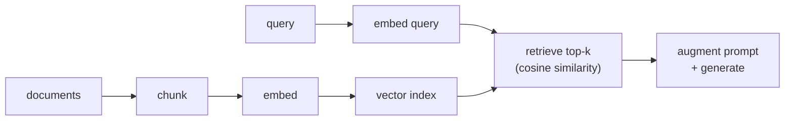

A language model only knows what was in its training data, frozen at its cutoff,
and it cannot cite a source. **Retrieval-augmented generation** (RAG) fixes both by
putting the relevant text *into the prompt* at query time: find the passages in your
own documents that bear on the question, paste them in, and ask the model to answer
from them. The [concept](E/rag-fundamentals) was covered from the NLP side; here we
build the engineering loop from scratch, because every production RAG system is this
loop with more careful parts.

## The four steps

RAG is a pipeline of four stages, run once to index and then per query:



- **Chunk.** Documents are too long to embed or to paste whole, so split each into
  passages of a few hundred tokens. Chunk too coarsely and a passage mixes
  unrelated topics; too finely and it loses the context that makes it meaningful.
- **Embed.** Run each chunk through an [embedding model](E/dense-retrieval) that maps
  text to a vector, positioned so that *semantically similar* text lands nearby.
- **Index.** Store the chunk vectors so they can be searched. At small scale this is
  a plain array; at large scale it is a vector database.
- **Retrieve and generate.** Embed the query the same way, find the $k$ nearest
  chunk vectors, and put those chunks in the prompt for the model to answer from.

The retrieval step is the heart of it, and "nearest" needs a definition.

## Cosine similarity

Two pieces of text are similar when their embedding vectors point in the same
direction, regardless of length. The measure is **cosine similarity**, the cosine of
the angle between vectors, which is the [inner product](A/inner-products) normalized
by both magnitudes:

$$
\cos(a, b) = \frac{a \cdot b}{\lVert a \rVert \, \lVert b \rVert}.
$$

It runs from $1$ (identical direction, maximally similar) through $0$ (orthogonal,
unrelated) to $-1$ (opposite). Dividing by the norms is what makes it a measure of
*direction only*, so a short chunk and a long chunk about the same topic still score
high. Retrieval ranks every chunk by its cosine similarity to the query and keeps the
top $k$. That is the whole retrieval rule; everything fancier in production is an
optimization of this ranking.

## Worked example

We embed four chunks (hand-built toy vectors so the geometry is legible), embed an
energy-metabolism query, and retrieve the top two by cosine similarity.

```python
import numpy as np

chunks = [
    "Mitochondria are the powerhouse of the cell.",
    "Photosynthesis converts sunlight into chemical energy.",
    "ATP, the cell's energy currency, is produced in mitochondria.",
    "Mount Everest is the tallest mountain on Earth.",
]
# Toy 4-d embeddings; axes loosely mean [biology, energy, geography, sport].
emb = np.array([
    [0.9, 0.7, 0.0, 0.1],     # mitochondria
    [0.8, 0.9, 0.0, 0.0],     # photosynthesis
    [0.9, 0.8, 0.0, 0.0],     # ATP
    [0.0, 0.0, 0.9, 0.8],     # everest
])
query = np.array([0.85, 0.75, 0.0, 0.0])      # "how do cells produce energy?"

def cosine(q, M):                              # cosine of q against every row of M
    return np.dot(M, q) / (np.linalg.norm(M, axis=1) * np.linalg.norm(q))

scores = cosine(query, emb)
k = 2
topk = np.argsort(scores)[::-1][:k]            # indices of the k highest scores
print("retrieved (score, chunk):")
for i in topk:
    print(f"  {scores[i]:.3f}  {chunks[i]}")

assert 3 not in topk                           # the Everest chunk is off-topic
assert scores[3] < 0.1                         # and scores near orthogonal
print("\noff-topic chunk excluded; top-k grounds the answer:", True)
```

The two energy-metabolism chunks score above $0.99$ and are retrieved, while the
off-topic Everest chunk scores near zero and is left out, so the model is handed only
relevant context. That hands one capability to the model; the next lesson hands it
another, the ability to *act* by calling [tools](tool-use).
