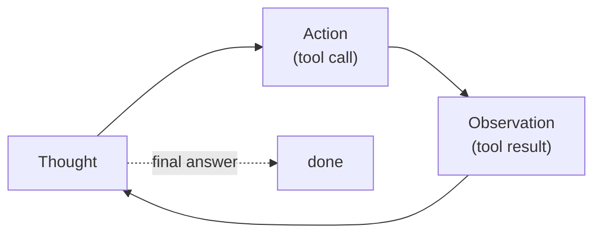

One [tool call](tool-use) answers one self-contained question. Real tasks need
several, and crucially the *next* call depends on what the *last* one returned: look
up a user's account, then, based on what you find, issue a refund or escalate. An
**agent** is what you get when you put the model in a loop, letting it call a tool,
see the result, and decide what to do next, until it has an answer. The
[ReAct pattern](E/react-agents) (reason + act) is the simplest such loop, and writing
it by hand demystifies every agent framework.

## Thought, Action, Observation

ReAct structures the loop as a repeating cycle of three moves:

- **Thought.** The model reasons in natural language about what it knows so far and
  what to do next. Making the reasoning explicit improves the action choice and gives
  you a readable trace.
- **Action.** The model emits a structured [tool call](tool-use), exactly as in the
  single-call case.
- **Observation.** Your application runs the tool and feeds the result back. This
  observation becomes part of the history the model reasons over on the next
  Thought.



The loop continues until the model decides it can answer directly (it emits a final
answer instead of another action) or a step budget is hit. That budget matters: a
buggy or stuck agent will otherwise loop forever, so a hard cap on steps is a
non-negotiable safety rail, not an afterthought. The whole agent is this `while` loop
around the model plus a tool dispatcher.

## Worked example

We drive the loop on "compute $12 \times 7 + 5$" with two tools. The model is stood in
for by a scripted `policy` (a real LLM would generate the thoughts and actions; we
hard-code them so the loop is deterministic and the mechanism is the point).

```python
def multiply(a, b): return a * b
def add(a, b): return a + b
TOOLS = {"multiply": multiply, "add": add}

# A SCRIPTED stand-in for the model: given the observation history, it returns the
# next (thought, action). A real LLM would generate these from the prompt.
def policy(history):
    obs = [h[1] for h in history if h[0] == "observation"]
    if not obs:
        return ("I need 12*7 first.", ("multiply", (12, 7)))
    if len(obs) == 1:
        return (f"Got {obs[0]}; now add 5.", ("add", (obs[0], 5)))
    return (f"The result is {obs[1]}.", ("final", obs[1]))

# The ReAct loop: Thought -> Action -> Observation, until 'final' or the step cap.
history, answer = [], None
for step in range(5):                            # hard step budget: no infinite loops
    thought, (name, payload) = policy(history)
    print(f"Thought: {thought}")
    if name == "final":
        answer = payload
        print(f"Final answer: {answer}")
        break
    result = TOOLS[name](*payload)               # run the tool -> observation
    print(f"Action: {name}{payload}  ->  Observation: {result}")
    history.append(("action", (name, payload)))
    history.append(("observation", result))

assert answer == 89
print("loop reached the answer in-budget:", answer)
```

The agent chains two tool calls, each using the previous observation, and stops on
its own once it can answer, all inside a `for` loop with a step cap. This hand-written
loop is exactly what production frameworks wrap in nicer abstractions; the next lesson
asks what [those frameworks](agent-frameworks) actually add.
