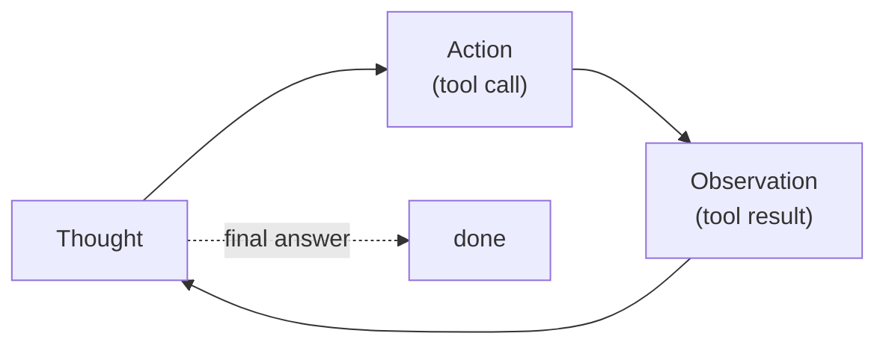

One [tool call](tool-use) answers one self-contained question. Real tasks need
several, and crucially the *next* call depends on what the *last* one returned: look
up a user's account, then, based on what you find, issue a refund or escalate. An
**agent** is what you get when you put the model in a loop, letting it call a tool,
see the result, and decide what to do next, until it has an answer<FN n="1" />. The
[ReAct pattern](E/react-agents) (reason + act) is the simplest such loop, and writing
it by hand demystifies every agent framework<FN n="2" />.

## Thought, Action, Observation

ReAct structures the loop as a repeating cycle of three moves:

- **Thought.** The model reasons in natural language about what it knows so far and
  what to do next. Making the reasoning explicit improves the action choice and gives
  you a readable trace.
- **Action.** The model emits a structured [tool call](tool-use), exactly as in the
  single-call case.
- **Observation.** Your application runs the tool and feeds the result back. This
  observation becomes part of the history the model reasons over on the next
  Thought.



The loop continues until the model decides it can answer directly (it emits a final
answer instead of another action) or a step budget is hit. That budget matters: a
buggy or stuck agent will otherwise loop forever, so a hard cap on steps is a
non-negotiable safety rail, not an afterthought. The whole agent is this `while` loop
around the model plus a tool dispatcher.

## Worked example

We drive the loop on "compute $12 \times 7 + 5$" with two tools. The model is stood in
for by a scripted `policy` (a real LLM would generate the thoughts and actions; we
hard-code them so the loop is deterministic and the mechanism is the point).

```python
def multiply(a, b): return a * b
def add(a, b): return a + b
TOOLS = {"multiply": multiply, "add": add}

# A SCRIPTED stand-in for the model: given the observation history, it returns the
# next (thought, action). A real LLM would generate these from the prompt.
def policy(history):
    obs = [h[1] for h in history if h[0] == "observation"]
    if not obs:
        return ("I need 12*7 first.", ("multiply", (12, 7)))
    if len(obs) == 1:
        return (f"Got {obs[0]}; now add 5.", ("add", (obs[0], 5)))
    return (f"The result is {obs[1]}.", ("final", obs[1]))

# The ReAct loop: Thought -> Action -> Observation, until 'final' or the step cap.
history, answer = [], None
for step in range(5):                            # hard step budget: no infinite loops
    thought, (name, payload) = policy(history)
    print(f"Thought: {thought}")
    if name == "final":
        answer = payload
        print(f"Final answer: {answer}")
        break
    result = TOOLS[name](*payload)               # run the tool -> observation
    print(f"Action: {name}{payload}  ->  Observation: {result}")
    history.append(("action", (name, payload)))
    history.append(("observation", result))

assert answer == 89
print("loop reached the answer in-budget:", answer)
```

The agent chains two tool calls, each using the previous observation, and stops on
its own once it can answer, all inside a `for` loop with a step cap.

## Exercises

**Exercise 1.** The worked loop computes $12 \times 7 + 5$ in two tool calls. By
hand, write out the full ReAct trace as the sequence of (Thought, Action,
Observation) triples the scripted policy produces, and state how many model turns
(policy calls) the run takes including the final-answer turn.

<details>
<summary>Solution</summary>

**Step 1.** The policy branches on how many observations are in the history. The
loop appends one action and one observation per non-final step, so the policy sees
0, then 1, then 2 observations on its three calls.

**Step 2.** Unroll the trace.

- Turn 1 (0 observations): Thought "I need 12*7 first." Action `multiply(12, 7)`.
  Observation `84`.
- Turn 2 (1 observation): Thought "Got 84; now add 5." Action `add(84, 5)`.
  Observation `89`.
- Turn 3 (2 observations): Thought "The result is 89." Action `final` with payload
  `89`. No observation; the loop breaks.

**Step 3.** Count the turns. The policy is called 3 times: two action turns plus
the final-answer turn. Two tool calls (`multiply`, `add`) run, and the final turn
emits the answer $89$ rather than an action.

</details>

**Exercise 2.** The lesson calls the step budget a "non-negotiable safety rail."
Suppose the policy had a bug and never emitted `final` (it kept requesting more
tool calls). With the budget set to `range(5)`, state exactly how many tool calls
run and what value `answer` holds when the loop ends, and explain why the program
still terminates.

<details>
<summary>Solution</summary>

**Step 1.** Trace the buggy run. Each iteration that is not `final` runs one tool
and appends an action and observation, then continues. With no `final` ever
returned, the `if name == "final"` branch is never taken, so `break` never fires.

**Step 2.** Apply the budget. `for step in range(5)` runs exactly 5 iterations
(steps 0 through 4), then the loop ends because the iterator is exhausted, not
because of a `break`. Five iterations each run one tool, so 5 tool calls run.

**Step 3.** State the final state. `answer` was initialized to `None` and is only
assigned inside the `final` branch, which never executes, so `answer` is still
`None` when the loop ends. The program terminates because the budget caps the
iteration count regardless of the agent's behavior, which is the safety rail's
purpose: a stuck agent stops instead of looping forever.

</details>

**Exercise 3 (code).** Write a parser that consumes a recorded ReAct trace (a list
of Thought/Action/Observation entries) and a tool registry, replays each action by
dispatching it to the real tool, and asserts every recorded observation matches the
freshly computed result. This is the check you would run to validate a saved agent
trace. Drive it on the $12 \times 7 + 5$ trace.

<details>
<summary>Solution</summary>

```python
import numpy as np

TOOLS = {"multiply": lambda a, b: a * b, "add": lambda a, b: a + b}

# A recorded trace: each action is (tool_name, args), each paired with the
# observation that was logged when the agent first ran.
trace = [
    {"thought": "need 12*7",  "action": ("multiply", (12, 7)), "observation": 84},
    {"thought": "add 5",      "action": ("add", (84, 5)),      "observation": 89},
    {"thought": "done",       "action": ("final", 89),         "observation": None},
]

def replay(trace, tools):
    answer = None
    for entry in trace:
        name, payload = entry["action"]
        if name == "final":
            answer = payload
            break
        recomputed = tools[name](*payload)           # dispatch to the real tool
        assert recomputed == entry["observation"]    # logged obs must reproduce
    return answer

answer = replay(trace, TOOLS)
assert answer == 89
# Every dependent step used the prior observation: add consumed multiply's 84.
assert trace[1]["action"][1][0] == trace[0]["observation"]
print("trace validated; final answer:", answer)
```

Replaying the recorded actions reproduces every logged observation, the second
action's first argument equals the first action's observation (confirming the
dependency chain), and the final answer is $89$.

</details>

This hand-written loop is exactly what production frameworks wrap in nicer
abstractions; the next lesson asks what [those frameworks](agent-frameworks)
actually add.

<Footnotes>
  <FNItem n="1">**Yao, S., et al.** (2023). "ReAct: synergizing reasoning and acting in language models". *ICLR*. [arXiv:2210.03629](https://arxiv.org/abs/2210.03629). Interleaving reasoning traces with tool actions, the loop built here.</FNItem>
  <FNItem n="2">**Huyen, C.** (2024). *AI Engineering: Building Applications with Foundation Models.* O'Reilly. Agents as a model in a tool-calling loop with a step budget.</FNItem>
</Footnotes>
