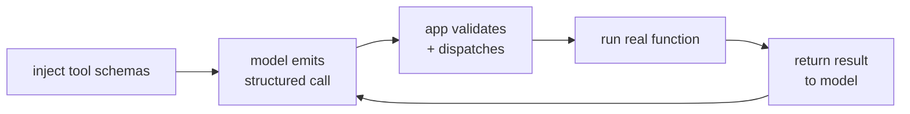

A model on its own can only produce text. To *act*, look up a live stock price, query
a database, send an email, it needs to call code, and the code lives in your
application, not in the model. **Tool use** (also called function calling) is the
protocol that bridges the two: you tell the model what functions exist, it emits a
structured request to call one, and your application runs it and returns the result.
The [mechanism](E/function-calling) was introduced from the model side; here we build
the application side, the part you own.

## The loop

Tool use is a four-step round trip, and the model never touches your code directly:



- **Inject schemas.** Along with the user's message, you put a machine-readable
  description of each available tool into the model's context: its name, what it does,
  and the parameters it takes. This is the model's entire knowledge of what it can do.
- **Model emits a call.** Instead of answering in prose, the model returns a
  *structured* object, a tool name and a set of argument values, signaling it wants
  that function run. Modern APIs guarantee this is well-formed JSON matching the
  schema.
- **Validate and dispatch.** Your application checks the call against the schema
  (known tool? required arguments present?) and routes it to the real function. This
  validation step is a security boundary, not a formality: the model's output is
  untrusted input.
- **Return the result.** The function's return value is fed back into the
  conversation, and the model continues with the result in hand.

The key shift is that the model does not *execute* anything; it *requests*. Your code
decides whether to honor the request. That separation is what makes a single tool
call safe, and it is the atom the next lesson assembles into an agent.

## Worked example

We define a small tool registry, generate the schemas to inject, dispatch a
well-formed call from the model, and confirm the validation layer rejects a
hallucinated tool and a call with a missing argument.

```python
def add(a, b): return a + b
def get_stock(ticker): return {"AAPL": 192.3, "GOOG": 141.8}.get(ticker)

# Registry: each tool pairs a schema (for the model) with an implementation (yours).
TOOLS = {
    "add":       {"fn": add,       "params": ["a", "b"],  "desc": "Add two numbers."},
    "get_stock": {"fn": get_stock, "params": ["ticker"],  "desc": "Get a stock price."},
}

def schemas():                                  # injected into the model's context
    return [{"name": n, "description": t["desc"], "parameters": t["params"]}
            for n, t in TOOLS.items()]

def dispatch(call):                             # validate, then run the real function
    name, args = call["name"], call["arguments"]
    if name not in TOOLS:
        raise ValueError(f"unknown tool '{name}'")
    missing = [p for p in TOOLS[name]["params"] if p not in args]
    if missing:
        raise ValueError(f"missing args {missing} for '{name}'")
    return TOOLS[name]["fn"](**args)

print("injected schemas:")
for s in schemas():
    print(" ", s)

# The model, shown the schemas, emits a STRUCTURED call rather than prose:
model_call = {"name": "get_stock", "arguments": {"ticker": "AAPL"}}
result = dispatch(model_call)
print("\ntool result fed back to model:", result)
assert result == 192.3

# The validation boundary rejects bad calls instead of executing them:
for bad in [{"name": "delete_db", "arguments": {}},
            {"name": "add", "arguments": {"a": 1}}]:
    try:
        dispatch(bad)
    except ValueError as e:
        print("rejected:", e)
```

The well-formed call runs and returns the price for the model to use, while the
hallucinated `delete_db` and the under-specified `add` are rejected at the boundary
before any code runs. One tool call answers one question; looping the model so it can
chain several calls toward a goal is the [ReAct loop](react-loop).
